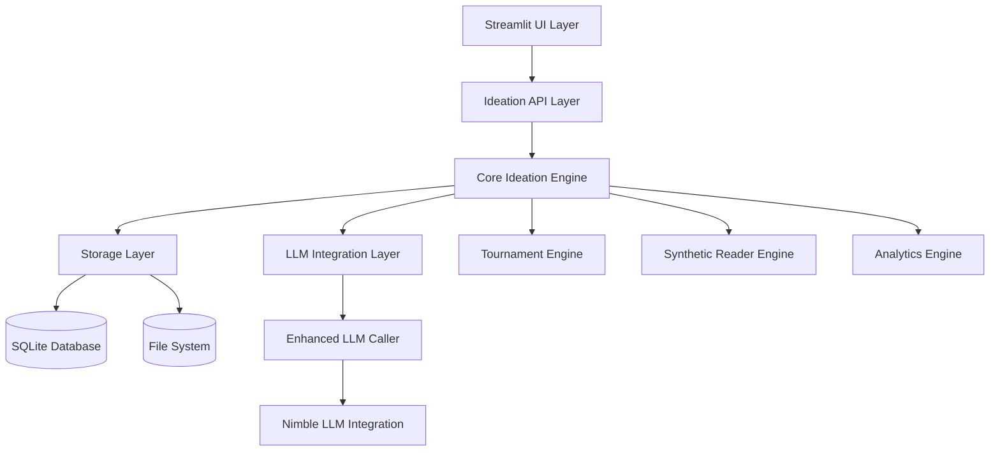

# Advanced Ideation Integration Design

## Overview

This design document outlines the technical approach for integrating advanced ideation capabilities from the `integrate_ideas` and `integrate_synthetic_readers` directories into the existing Codexes Factory platform. The integration will transform the current basic ideation system into a comprehensive, enterprise-level idea generation and validation platform while maintaining compatibility with the existing CodexMetadata architecture and LLM integration patterns.

The system will support stage/length-agnostic processing of creative content, from initial ideas to complete manuscripts, with tournament-based selection, synthetic reader evaluation, and collaborative workflows.

## Architecture

### High-Level Architecture



### Module Structure

The advanced ideation system will be organized as a new module within the existing Codexes Factory architecture:

```
src/codexes/modules/ideation/
├── __init__.py
├── core/
│   ├── __init__.py
│   ├── codex_object.py          # Base class for all creative content
│   ├── classification.py        # Content type classification
│   └── transformation.py        # Content transformation engine
├── tournament/
│   ├── __init__.py
│   ├── tournament_engine.py     # Tournament management
│   ├── bracket_generator.py     # Bracket creation and management
│   └── evaluation_engine.py     # LLM-powered evaluation
├── synthetic_readers/
│   ├── __init__.py
│   ├── reader_panel.py          # Synthetic reader panel management
│   ├── reader_persona.py        # Individual reader simulation
│   └── evaluation_aggregator.py # Results aggregation
├── series/
│   ├── __init__.py
│   ├── series_generator.py      # Series creation and management
│   └── consistency_tracker.py   # Cross-book consistency
├── elements/
│   ├── __init__.py
│   ├── element_extractor.py     # Story element extraction
│   └── recombination_engine.py  # Element recombination
├── batch/
│   ├── __init__.py
│   ├── batch_processor.py       # Batch processing engine
│   └── automation_scheduler.py  # Scheduled operations
├── prompts/
│   ├── __init__.py
│   ├── prompt_manager.py        # Prompt pack management
│   └── dynamic_prompting.py     # Context-aware prompting
├── longform/
│   ├── __init__.py
│   ├── development_pipeline.py  # Longform content development
│   └── manuscript_generator.py  # Manuscript structure creation
├── analytics/
│   ├── __init__.py
│   ├── pattern_analyzer.py      # Success pattern recognition
│   └── market_predictor.py      # Market trend analysis
├── collaboration/
│   ├── __init__.py
│   ├── session_manager.py       # Collaborative session management
│   └── contribution_tracker.py  # User contribution tracking
└── storage/
    ├── __init__.py
    ├── database_manager.py      # Database operations
    └── file_manager.py          # File system operations
```

## Components and Interfaces

### Core Components

#### 1. CodexObject Base Class

```python
@dataclass
class CodexObject:
    """Base class for all creative content objects in the ideation system."""
    
    # Core identifiers
    uuid: str = field(default_factory=lambda: str(uuid.uuid4()))
    object_type: str = "UNKNOWN"  # Idea, Synopsis, Outline, Draft, etc.
    title: str = ""
    content: str = ""
    
    # Classification and metadata
    genre: str = ""
    target_audience: str = ""
    development_stage: str = ""
    confidence_score: float = 0.0
    
    # Relationships
    parent_uuid: Optional[str] = None
    series_uuid: Optional[str] = None
    source_elements: List[str] = field(default_factory=list)
    
    # Processing metadata
    created_timestamp: str = field(default_factory=lambda: datetime.now().isoformat())
    last_modified: str = field(default_factory=lambda: datetime.now().isoformat())
    processing_history: List[Dict[str, Any]] = field(default_factory=list)
    
    # LLM interaction data
    llm_responses: Dict[str, Any] = field(default_factory=dict)
    
    def to_codex_metadata(self) -> CodexMetadata:
        """Convert to CodexMetadata for pipeline integration."""
        pass
    
    def from_codex_metadata(self, metadata: CodexMetadata) -> 'CodexObject':
        """Create from existing CodexMetadata."""
        pass
```

#### 2. Classification Engine

```python
class ContentClassifier:
    """Classifies content objects by type and development stage."""
    
    def __init__(self, llm_caller: EnhancedLLMCaller):
        self.llm_caller = llm_caller
        self.classification_prompts = self._load_classification_prompts()
    
    def classify_content(self, content: str) -> Dict[str, Any]:
        """Classify content type and development stage."""
        pass
    
    def assign_to_class(self, content: str, existing_classes: List[str]) -> str:
        """Assign content to existing class or UNKNOWN."""
        pass
```

#### 3. Tournament Engine

```python
class TournamentEngine:
    """Manages tournament-based idea selection."""
    
    def __init__(self, llm_caller: EnhancedLLMCaller):
        self.llm_caller = llm_caller
        self.bracket_generator = BracketGenerator()
        self.evaluation_engine = EvaluationEngine(llm_caller)
    
    def create_tournament(self, codex_objects: List[CodexObject], 
                         tournament_config: Dict[str, Any]) -> Tournament:
        """Create a new tournament with given objects."""
        pass
    
    def run_tournament(self, tournament: Tournament) -> TournamentResults:
        """Execute tournament matches and determine winners."""
        pass
```

#### 4. Synthetic Reader Panel

```python
class SyntheticReaderPanel:
    """Manages synthetic reader evaluation panels."""
    
    def __init__(self, llm_caller: EnhancedLLMCaller):
        self.llm_caller = llm_caller
        self.reader_factory = ReaderPersonaFactory()
    
    def create_panel(self, demographics: Dict[str, Any], 
                    panel_size: int) -> List[ReaderPersona]:
        """Create a diverse panel of synthetic readers."""
        pass
    
    def evaluate_content(self, codex_object: CodexObject, 
                        panel: List[ReaderPersona]) -> PanelResults:
        """Evaluate content with synthetic reader panel."""
        pass
```

### Integration Interfaces

#### 1. CodexMetadata Integration

The ideation system will integrate seamlessly with the existing CodexMetadata system:

```python
class IdeationMetadataAdapter:
    """Adapter for converting between CodexObject and CodexMetadata."""
    
    def codex_object_to_metadata(self, obj: CodexObject) -> CodexMetadata:
        """Convert CodexObject to CodexMetadata for pipeline processing."""
        metadata = CodexMetadata()
        metadata.title = obj.title
        metadata.summary_short = obj.content[:500] if len(obj.content) > 500 else obj.content
        metadata.summary_long = obj.content
        metadata.uuid = obj.uuid
        # Map additional fields based on object type
        return metadata
    
    def metadata_to_codex_object(self, metadata: CodexMetadata) -> CodexObject:
        """Convert CodexMetadata back to CodexObject."""
        pass
```

#### 2. LLM Integration

All LLM interactions will use the existing enhanced LLM caller:

```python
class IdeationLLMService:
    """Service layer for all ideation LLM interactions."""
    
    def __init__(self):
        self.llm_caller = enhanced_llm_caller
        self.prompt_manager = PromptManager()
    
    def generate_ideas(self, prompt_config: Dict[str, Any]) -> List[CodexObject]:
        """Generate ideas using configured prompts."""
        pass
    
    def evaluate_tournament_match(self, obj1: CodexObject, 
                                 obj2: CodexObject) -> TournamentMatchResult:
        """Evaluate tournament match between two objects."""
        pass
```

## Data Models

### Database Schema

The system will use SQLite for local storage with the following key tables:

```sql
-- Core content objects
CREATE TABLE codex_objects (
    uuid TEXT PRIMARY KEY,
    object_type TEXT NOT NULL,
    title TEXT,
    content TEXT,
    genre TEXT,
    target_audience TEXT,
    development_stage TEXT,
    confidence_score REAL,
    parent_uuid TEXT,
    series_uuid TEXT,
    created_timestamp TEXT,
    last_modified TEXT,
    metadata_json TEXT,
    FOREIGN KEY (parent_uuid) REFERENCES codex_objects(uuid),
    FOREIGN KEY (series_uuid) REFERENCES series(uuid)
);

-- Tournament management
CREATE TABLE tournaments (
    uuid TEXT PRIMARY KEY,
    name TEXT,
    tournament_type TEXT,
    status TEXT,
    config_json TEXT,
    created_timestamp TEXT,
    completed_timestamp TEXT
);

CREATE TABLE tournament_matches (
    uuid TEXT PRIMARY KEY,
    tournament_uuid TEXT,
    round_number INTEGER,
    match_number INTEGER,
    object1_uuid TEXT,
    object2_uuid TEXT,
    winner_uuid TEXT,
    evaluation_data TEXT,
    FOREIGN KEY (tournament_uuid) REFERENCES tournaments(uuid),
    FOREIGN KEY (object1_uuid) REFERENCES codex_objects(uuid),
    FOREIGN KEY (object2_uuid) REFERENCES codex_objects(uuid),
    FOREIGN KEY (winner_uuid) REFERENCES codex_objects(uuid)
);

-- Series management
CREATE TABLE series (
    uuid TEXT PRIMARY KEY,
    name TEXT,
    description TEXT,
    formulaicness_level REAL,
    franchise_mode BOOLEAN,
    consistency_rules TEXT,
    created_timestamp TEXT
);

-- Synthetic reader panels
CREATE TABLE reader_panels (
    uuid TEXT PRIMARY KEY,
    name TEXT,
    demographics_json TEXT,
    panel_size INTEGER,
    created_timestamp TEXT
);

CREATE TABLE reader_evaluations (
    uuid TEXT PRIMARY KEY,
    panel_uuid TEXT,
    object_uuid TEXT,
    reader_persona_json TEXT,
    evaluation_results TEXT,
    created_timestamp TEXT,
    FOREIGN KEY (panel_uuid) REFERENCES reader_panels(uuid),
    FOREIGN KEY (object_uuid) REFERENCES codex_objects(uuid)
);

-- Element extraction and recombination
CREATE TABLE story_elements (
    uuid TEXT PRIMARY KEY,
    element_type TEXT,
    name TEXT,
    description TEXT,
    source_object_uuid TEXT,
    extraction_confidence REAL,
    FOREIGN KEY (source_object_uuid) REFERENCES codex_objects(uuid)
);

-- Batch processing jobs
CREATE TABLE batch_jobs (
    uuid TEXT PRIMARY KEY,
    job_type TEXT,
    status TEXT,
    config_json TEXT,
    progress_data TEXT,
    created_timestamp TEXT,
    started_timestamp TEXT,
    completed_timestamp TEXT
);

-- Collaborative sessions
CREATE TABLE collaboration_sessions (
    uuid TEXT PRIMARY KEY,
    name TEXT,
    session_type TEXT,
    participants_json TEXT,
    status TEXT,
    created_timestamp TEXT,
    ended_timestamp TEXT
);
```

### File System Organization

```
data/ideation/
├── objects/                    # Individual CodexObject JSON files
│   ├── ideas/
│   ├── synopses/
│   ├── outlines/
│   └── drafts/
├── tournaments/               # Tournament results and brackets
│   ├── {tournament_uuid}/
│   │   ├── bracket.json
│   │   ├── results.json
│   │   └── matches/
├── series/                   # Series-related data
│   ├── {series_uuid}/
│   │   ├── series_config.json
│   │   └── consistency_reports/
├── synthetic_readers/        # Reader panel data
│   ├── panels/
│   └── evaluations/
├── batch_jobs/              # Batch processing artifacts
│   ├── {job_uuid}/
│   │   ├── config.json
│   │   ├── progress.log
│   │   └── results/
└── exports/                 # Exported data (CSV, JSON)
    ├── tournaments/
    ├── evaluations/
    └── analytics/
```

## Error Handling

### Retry Logic and Resilience

The system will implement comprehensive error handling following the existing patterns:

```python
class IdeationErrorHandler:
    """Centralized error handling for ideation operations."""
    
    def __init__(self):
        self.logger = logging.getLogger(__name__)
        self.retry_config = {
            'max_retries': 3,
            'base_delay': 1.0,
            'max_delay': 30.0
        }
    
    def handle_llm_error(self, error: Exception, operation: str) -> bool:
        """Handle LLM-related errors with appropriate retry logic."""
        pass
    
    def handle_database_error(self, error: Exception, operation: str) -> bool:
        """Handle database errors with transaction rollback."""
        pass
    
    def handle_file_system_error(self, error: Exception, operation: str) -> bool:
        """Handle file system errors with cleanup."""
        pass
```

### Graceful Degradation

- **LLM Failures**: Fall back to simpler evaluation methods or cached results
- **Database Errors**: Use file-based storage as backup
- **Network Issues**: Queue operations for retry when connectivity returns
- **Memory Constraints**: Implement streaming processing for large datasets

## Testing Strategy

### Unit Testing

```python
# Test structure following existing patterns
tests/modules/ideation/
├── test_core/
│   ├── test_codex_object.py
│   ├── test_classification.py
│   └── test_transformation.py
├── test_tournament/
│   ├── test_tournament_engine.py
│   ├── test_bracket_generator.py
│   └── test_evaluation_engine.py
├── test_synthetic_readers/
│   ├── test_reader_panel.py
│   ├── test_reader_persona.py
│   └── test_evaluation_aggregator.py
├── test_integration/
│   ├── test_metadata_adapter.py
│   └── test_llm_service.py
└── fixtures/
    ├── sample_codex_objects.json
    ├── tournament_configs.json
    └── reader_personas.json
```

### Integration Testing

- **End-to-End Workflows**: Test complete ideation pipelines
- **LLM Integration**: Mock LLM responses for consistent testing
- **Database Operations**: Test with temporary SQLite databases
- **File System Operations**: Use temporary directories for testing

### Performance Testing

- **Batch Processing**: Test with large datasets (1000+ objects)
- **Tournament Scaling**: Test tournaments with various sizes
- **Concurrent Operations**: Test multi-user collaborative sessions
- **Memory Usage**: Monitor memory consumption during processing

## Implementation Phases

### Phase 1: Core Infrastructure (Weeks 1-2)
- CodexObject base class and classification system
- Database schema and basic storage operations
- LLM integration adapter
- Basic Streamlit UI framework

### Phase 2: Tournament System (Weeks 3-4)
- Tournament engine and bracket generation
- LLM-powered evaluation system
- Results storage and visualization
- Tournament UI components

### Phase 3: Synthetic Readers (Weeks 5-6)
- Reader persona system
- Panel management and evaluation
- Results aggregation and analysis
- Reader panel UI

### Phase 4: Advanced Features (Weeks 7-8)
- Series generation and consistency tracking
- Element extraction and recombination
- Batch processing and automation
- Analytics and pattern recognition

### Phase 5: Collaboration and Polish (Weeks 9-10)
- Collaborative ideation workflows
- Advanced prompt management
- Longform development pipeline
- Performance optimization and testing

## Migration Strategy

### Data Migration

```python
class IdeationMigrator:
    """Handles migration of existing ideation data."""
    
    def migrate_existing_ideas(self, source_dir: str) -> List[CodexObject]:
        """Migrate ideas from integrate_ideas directory."""
        pass
    
    def migrate_reader_data(self, source_dir: str) -> List[ReaderPersona]:
        """Migrate synthetic reader data."""
        pass
    
    def migrate_prompt_packs(self, source_file: str) -> Dict[str, Any]:
        """Migrate existing prompt pack definitions."""
        pass
```

### Backward Compatibility

- Maintain existing file formats during transition
- Provide adapters for legacy data structures
- Support both old and new API endpoints during migration
- Gradual feature rollout with feature flags

## Security Considerations

### Data Protection
- Encrypt sensitive creative content at rest
- Implement access controls for collaborative sessions
- Audit logging for all content modifications
- Secure API endpoints with authentication

### LLM Security
- Sanitize inputs to prevent prompt injection
- Rate limiting for LLM calls
- Content filtering for inappropriate outputs
- Cost monitoring and budget controls

## Performance Optimization

### Caching Strategy
- Cache LLM responses for identical inputs
- Cache tournament results and evaluations
- Cache synthetic reader evaluations
- Implement cache invalidation policies

### Database Optimization
- Index frequently queried fields
- Implement connection pooling
- Use prepared statements for common queries
- Regular database maintenance and optimization

### Scalability Considerations
- Horizontal scaling for batch processing
- Queue-based processing for long-running operations
- Load balancing for collaborative sessions
- Resource monitoring and auto-scaling