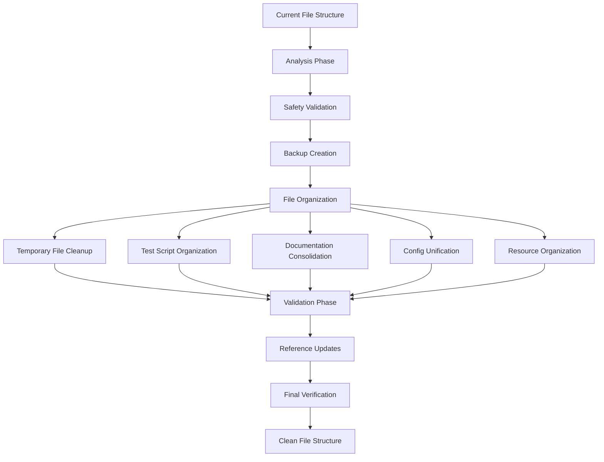

# Design Document

## Overview

This design addresses the file structure cleanup and organization for the Codexes Factory platform. The solution focuses on creating a clean, organized directory structure by safely removing temporary files, consolidating scattered test scripts, organizing documentation, unifying configuration directories, and properly organizing resource files. The design emphasizes safety through validation and backup mechanisms to prevent data loss during the cleanup process.

## Architecture

### High-Level Cleanup Strategy



### Safety-First Approach

The design prioritizes safety through:
- **Pre-cleanup Analysis**: Scan and categorize all files before moving
- **Dependency Mapping**: Identify file references and imports
- **Backup Strategy**: Create recovery points before major changes
- **Incremental Processing**: Handle one category at a time with validation
- **Reference Tracking**: Update all code and documentation references

## Components and Interfaces

### 1. File Analysis Engine

**Purpose**: Analyzes the current file structure and categorizes files for cleanup.

**Interface**:
```python
class FileAnalysisEngine:
    def scan_directory_structure(self, root_path: str) -> Dict[str, List[str]]
    def identify_temporary_files(self) -> List[str]
    def find_test_scripts(self) -> List[str]
    def locate_documentation_files(self) -> List[str]
    def find_configuration_files(self) -> Dict[str, List[str]]
    def identify_resource_files(self) -> Dict[str, List[str]]
    def analyze_file_references(self, file_path: str) -> List[str]
```

**Key Methods**:
- `scan_directory_structure()`: Creates comprehensive file inventory
- `identify_temporary_files()`: Finds exported configs, cache files, temp outputs
- `find_test_scripts()`: Locates test files outside tests/ directory
- `analyze_file_references()`: Maps dependencies and imports

### 2. Safety Validator

**Purpose**: Ensures file operations are safe and reversible.

**Interface**:
```python
class SafetyValidator:
    def validate_file_safety(self, file_path: str) -> bool
    def check_dependencies(self, file_path: str) -> List[str]
    def create_backup(self, files: List[str]) -> str
    def verify_move_safety(self, source: str, destination: str) -> bool
    def validate_reference_updates(self, updates: Dict[str, str]) -> bool
```

**Safety Checks**:
- Verify files are not currently in use
- Check for critical system files
- Validate destination directories exist
- Ensure no circular dependencies

### 3. Temporary File Cleaner

**Purpose**: Safely removes temporary and unnecessary files.

**Interface**:
```python
class TemporaryFileCleaner:
    def identify_temp_patterns(self) -> List[str]
    def categorize_temp_files(self) -> Dict[str, List[str]]
    def validate_removal_safety(self, files: List[str]) -> Dict[str, bool]
    def clean_temporary_files(self, files: List[str]) -> Dict[str, str]
    def update_gitignore(self, patterns: List[str]) -> None
```

**Target Files**:
- `exported_config_*.json` files
- `__pycache__/` directories
- `.DS_Store` files
- Temporary log files
- Build artifacts in root directory

### 4. Test Script Organizer

**Purpose**: Moves test scripts to appropriate locations in tests/ directory.

**Interface**:
```python
class TestScriptOrganizer:
    def find_misplaced_tests(self) -> List[str]
    def determine_test_category(self, test_file: str) -> str
    def move_test_file(self, source: str, destination: str) -> bool
    def update_test_imports(self, test_file: str) -> None
    def validate_test_execution(self, test_file: str) -> bool
```

**Organization Strategy**:
- Move root-level test files to `tests/`
- Categorize by functionality (integration, unit, etc.)
- Update import paths for moved files
- Preserve test execution capability

### 5. Documentation Consolidator

**Purpose**: Organizes all documentation into the docs/ directory structure.

**Interface**:
```python
class DocumentationConsolidator:
    def find_scattered_docs(self) -> List[str]
    def categorize_documentation(self, doc_files: List[str]) -> Dict[str, List[str]]
    def create_doc_hierarchy(self) -> Dict[str, str]
    def move_documentation(self, source: str, destination: str) -> bool
    def update_doc_references(self, updates: Dict[str, str]) -> None
```

**Documentation Categories**:
- API documentation
- User guides
- Implementation summaries
- Troubleshooting guides
- Configuration examples

### 6. Configuration Unifier

**Purpose**: Merges config and configs directories into a single config/ structure.

**Interface**:
```python
class ConfigurationUnifier:
    def analyze_config_directories(self) -> Dict[str, Dict[str, Any]]
    def identify_config_conflicts(self) -> List[Dict[str, str]]
    def merge_configurations(self) -> Dict[str, str]
    def update_config_references(self, path_mappings: Dict[str, str]) -> None
    def validate_config_integrity(self) -> bool
```

**Merge Strategy**:
- Preserve existing `config/` structure
- Move `configs/` contents to appropriate `config/` subdirectories
- Resolve naming conflicts
- Update all code references to new paths

### 7. Resource Organizer

**Purpose**: Organizes images and exported files into proper resource directories.

**Interface**:
```python
class ResourceOrganizer:
    def process_images_directory(self) -> Dict[str, str]
    def find_exported_files(self) -> List[str]
    def move_resources(self, mappings: Dict[str, str]) -> bool
    def update_resource_references(self, updates: Dict[str, str]) -> None
    def cleanup_empty_directories(self) -> List[str]
```

**Resource Organization**:
- Move `images/` contents to `resources/images/`
- Move exported configs to `exports/`
- Update all file references
- Remove empty source directories

## Data Models

### File Inventory

```python
@dataclass
class FileInventory:
    temporary_files: List[str]
    test_scripts: List[str]
    documentation_files: List[str]
    config_files: Dict[str, List[str]]
    resource_files: Dict[str, List[str]]
    reference_map: Dict[str, List[str]]
    safety_status: Dict[str, bool]
```

### Cleanup Operation

```python
@dataclass
class CleanupOperation:
    operation_type: str  # 'move', 'delete', 'merge'
    source_path: str
    destination_path: Optional[str]
    backup_path: Optional[str]
    dependencies: List[str]
    safety_validated: bool
    completed: bool
    rollback_info: Optional[Dict[str, Any]]
```

### Reference Update

```python
@dataclass
class ReferenceUpdate:
    file_path: str
    old_reference: str
    new_reference: str
    reference_type: str  # 'import', 'file_path', 'config_path'
    line_number: Optional[int]
    updated: bool
```

## Error Handling

### Error Categories

1. **File Safety Errors**:
   - Files in use or locked
   - Permission denied
   - Critical system files

2. **Dependency Errors**:
   - Broken imports after moves
   - Missing file references
   - Circular dependencies

3. **Configuration Errors**:
   - Config merge conflicts
   - Invalid configuration syntax
   - Missing required config values

4. **Reference Update Errors**:
   - Failed import path updates
   - Broken file references
   - Documentation link failures

### Recovery Mechanisms

```python
class CleanupErrorHandler:
    def handle_file_operation_error(self, operation: CleanupOperation) -> bool
    def rollback_operation(self, operation: CleanupOperation) -> bool
    def restore_from_backup(self, backup_path: str) -> bool
    def validate_system_integrity(self) -> Dict[str, bool]
    def generate_error_report(self, errors: List[Exception]) -> str
```

## Testing Strategy

### Pre-Cleanup Validation

1. **File Inventory Tests**:
   - Verify all files are catalogued
   - Validate file categorization
   - Test dependency mapping

2. **Safety Validation Tests**:
   - Test backup creation
   - Validate safety checks
   - Test rollback mechanisms

### Cleanup Operation Tests

1. **Temporary File Cleanup Tests**:
   - Test safe file removal
   - Validate gitignore updates
   - Test pattern matching

2. **File Organization Tests**:
   - Test file moves
   - Validate directory creation
   - Test reference updates

### Post-Cleanup Validation

1. **System Integrity Tests**:
   - Test all imports still work
   - Validate configuration loading
   - Test file references

2. **Functionality Tests**:
   - Run existing test suite
   - Test application startup
   - Validate all features work

## Implementation Phases

### Phase 1: Analysis and Safety Setup
- Implement file analysis engine
- Create safety validation system
- Generate comprehensive file inventory
- Create backup mechanisms

### Phase 2: Temporary File Cleanup
- Identify and categorize temporary files
- Implement safe removal with validation
- Update gitignore patterns
- Clean up build artifacts

### Phase 3: Test Script Organization
- Move test scripts to tests/ directory
- Update import paths and references
- Validate test execution
- Organize by test categories

### Phase 4: Documentation Consolidation
- Move documentation to docs/
- Create logical hierarchy
- Update all documentation references
- Validate link integrity

### Phase 5: Configuration Unification
- Merge config and configs directories
- Resolve conflicts and duplicates
- Update all configuration references
- Validate configuration loading

### Phase 6: Resource Organization
- Move images to resources/images/
- Create exports/ directory for exported files
- Update all resource references
- Clean up empty directories

### Phase 7: Final Validation
- Run comprehensive test suite
- Validate all functionality
- Generate cleanup report
- Document new structure