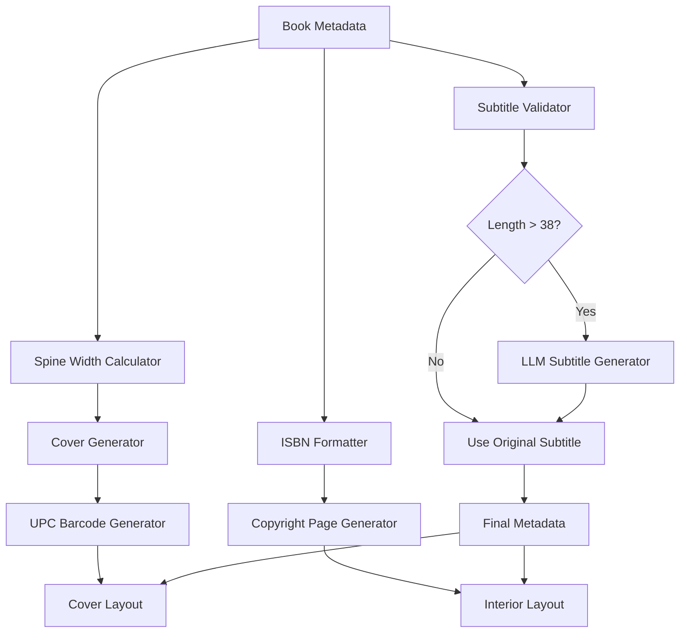

# Design Document

## Overview

This design addresses five critical fixes in the book production pipeline to ensure proper cover generation, interior layout, and metadata accuracy. The solution integrates with existing systems while implementing targeted fixes for UPC barcode placement, dotgrid positioning, ISBN formatting, subtitle validation, and spine width calculations.

## Architecture

### System Integration Points

The fixes integrate with the existing Codexes Factory architecture at these key points:

1. **Cover Generation Pipeline** (`src/codexes/modules/covers/`)
   - UPC barcode generation and placement
   - Spine width calculation integration

2. **Interior Layout System** (`imprints/{imprint}/template.tex`)
   - Dotgrid positioning adjustments
   - ISBN formatting on copyright page

3. **Metadata Processing** (`src/codexes/modules/metadata/`)
   - Subtitle validation and LLM replacement
   - Spine width calculation and distribution

4. **LLM Integration** (`nimble-llm-caller`)
   - Subtitle regeneration for xynapse_traces titles

### Data Flow



## Components and Interfaces

### 1. UPC Barcode Enhancement

**Component**: `ISBNBarcodeGenerator` (existing, enhancement needed)
**Location**: `src/codexes/modules/distribution/isbn_barcode_generator.py`

```python
class ISBNBarcodeGenerator:
    def generate_upc_barcode_with_positioning(self, isbn13: str, cover_specs: Dict) -> BarcodeResult:
        """Generate UPC-A barcode with proper positioning and safety spaces"""
        
    def calculate_barcode_position(self, cover_dimensions: Tuple[float, float]) -> Position:
        """Calculate barcode position maintaining current location with safety spaces"""
        
    def validate_safety_spaces(self, position: Position, barcode_size: Size) -> bool:
        """Ensure adequate safety spaces around barcode"""
```

### 2. Dotgrid Position Controller

**Component**: `DotgridLayoutManager` (new)
**Location**: `src/codexes/modules/prepress/dotgrid_layout_manager.py`

```python
class DotgridLayoutManager:
    def calculate_dotgrid_position(self, page_specs: PageSpecs) -> Position:
        """Calculate dotgrid position with 0.5in minimum spacing from header"""
        
    def update_template_positioning(self, template_path: str, position: Position) -> None:
        """Update LaTeX template with new dotgrid positioning"""
        
    def validate_spacing_requirements(self, position: Position, page_specs: PageSpecs) -> bool:
        """Validate spacing meets minimum requirements"""
```

### 3. ISBN Formatter

**Component**: `ISBNFormatter` (new)
**Location**: `src/codexes/modules/metadata/isbn_formatter.py`

```python
class ISBNFormatter:
    def format_isbn_13_hyphenated(self, isbn13: str) -> str:
        """Format ISBN-13 with proper hyphenation and check digit"""
        
    def validate_isbn_format(self, isbn: str) -> bool:
        """Validate ISBN format and check digit"""
        
    def generate_copyright_page_isbn(self, isbn13: str) -> str:
        """Generate properly formatted ISBN for copyright page display"""
```

### 4. Subtitle Validator and LLM Replacer

**Component**: `SubtitleValidator` (new)
**Location**: `src/codexes/modules/metadata/subtitle_validator.py`

```python
class SubtitleValidator:
    def __init__(self, llm_caller: LLMCaller):
        self.llm_caller = llm_caller
        self.xynapse_char_limit = 38
        
    def validate_subtitle_length(self, subtitle: str, imprint: str) -> ValidationResult:
        """Validate subtitle length against imprint-specific limits"""
        
    def generate_replacement_subtitle(self, original_subtitle: str, book_metadata: Dict) -> str:
        """Generate replacement subtitle using nimble-llm-caller"""
        
    def process_xynapse_subtitle(self, subtitle: str, book_metadata: Dict) -> str:
        """Process xynapse_traces subtitle with length validation and replacement"""
```

### 5. Enhanced Spine Width Calculator

**Component**: `SpineWidthCalculator` (enhancement of existing)
**Location**: `src/codexes/modules/covers/spine_width_calculator.py`

```python
class SpineWidthCalculator:
    def calculate_spine_width_from_lookup(self, page_count: int, paper_type: str = "Standard perfect 70") -> float:
        """Calculate spine width using SpineWidthLookup.xlsx logic"""
        
    def validate_calculation(self, spine_width: float, page_count: int) -> bool:
        """Validate calculated spine width against expected ranges"""
        
    def distribute_spine_width(self, spine_width: float, metadata: Dict, cover_generator: Any) -> None:
        """Distribute spine width to metadata and cover creator components"""
```

## Data Models

### BarcodeResult
```python
@dataclass
class BarcodeResult:
    barcode_data: bytes
    position: Position
    safety_spaces: SafetySpaces
    format_type: str = "UPC-A"
```

### Position
```python
@dataclass
class Position:
    x: float
    y: float
    unit: str = "inches"
```

### ValidationResult
```python
@dataclass
class ValidationResult:
    is_valid: bool
    current_length: int
    max_length: int
    needs_replacement: bool
    error_message: Optional[str] = None
```

### PageSpecs
```python
@dataclass
class PageSpecs:
    width: float
    height: float
    header_height: float
    footer_height: float
    margin_top: float
    margin_bottom: float
```

## Error Handling

### 1. Spine Width Calculation Errors
- **Fallback Strategy**: Use safe default spine width if lookup fails
- **Logging**: Log calculation errors with book metadata context
- **Validation**: Validate calculated values against reasonable ranges

### 2. LLM Subtitle Generation Errors
- **Retry Logic**: Implement exponential backoff for LLM calls
- **Fallback Strategy**: Truncate original subtitle if LLM fails
- **Validation**: Ensure generated subtitle meets length requirements

### 3. Barcode Generation Errors
- **Fallback Strategy**: Generate placeholder barcode with error indication
- **Validation**: Validate ISBN format before barcode generation
- **Safety Checks**: Ensure barcode positioning doesn't overlap other elements

### 4. Template Modification Errors
- **Backup Strategy**: Create backup of original template before modification
- **Validation**: Validate LaTeX syntax after template updates
- **Recovery**: Restore from backup if template becomes invalid

## Testing Strategy

### Unit Tests
1. **Spine Width Calculator Tests**
   - Test lookup table integration
   - Test edge cases (very low/high page counts)
   - Test error handling for missing lookup data

2. **Subtitle Validator Tests**
   - Test length validation for different imprints
   - Test LLM integration with mock responses
   - Test fallback behavior on LLM failures

3. **ISBN Formatter Tests**
   - Test hyphenation rules for different ISBN ranges
   - Test check digit validation
   - Test copyright page formatting

4. **Barcode Generator Tests**
   - Test UPC-A format generation
   - Test positioning calculations
   - Test safety space validation

### Integration Tests
1. **End-to-End Pipeline Tests**
   - Test complete book generation with all fixes applied
   - Test xynapse_traces specific subtitle handling
   - Test spine width propagation to cover generation

2. **Template Integration Tests**
   - Test dotgrid positioning in different imprint templates
   - Test ISBN display on copyright pages
   - Test barcode placement on covers

### Performance Tests
1. **LLM Call Optimization**
   - Test subtitle generation response times
   - Test retry logic performance
   - Test batch processing capabilities

2. **Spine Width Lookup Performance**
   - Test lookup table query performance
   - Test caching effectiveness
   - Test concurrent access handling

## Configuration

### LLM Configuration
```json
{
  "subtitle_generation": {
    "model": "gpt-4",
    "max_tokens": 100,
    "temperature": 0.7,
    "retry_attempts": 3,
    "timeout_seconds": 30
  }
}
```

### Imprint-Specific Configuration
```json
{
  "xynapse_traces": {
    "subtitle_max_length": 38,
    "enable_llm_replacement": true,
    "dotgrid_spacing_inches": 0.5
  }
}
```

### Spine Width Configuration
```json
{
  "spine_width": {
    "lookup_file": "resources/SpineWidthLookup.xlsx",
    "default_paper_type": "Standard perfect 70",
    "fallback_width": 0.25
  }
}
```