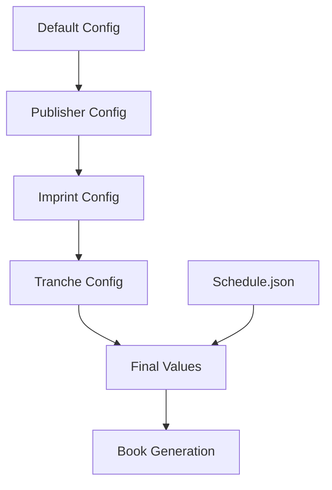

# Frontmatter and Backmatter Generation - Design Document

## Overview

This design implements a robust system for frontmatter and backmatter generation with strict configuration hierarchy enforcement and regression prevention measures.

## Architecture

### Configuration Hierarchy System



### Section Classification

**Frontmatter (Generated via Reprompting):**
- Publisher's Note (`storefront_get_en_motivation`)
- Foreword (new reprompt key needed)
- Glossary (generated from pilsa_glossary.json)

**Backmatter (Generated via BackmatterProcessor):**
- Mnemonics (enhanced processing + fallback)
- Bibliography (LOCKED - memoir class hangparas)

## Components and Interfaces

### 1. Configuration Hierarchy Enforcer

```python
class ConfigurationHierarchyEnforcer:
    def apply_hierarchy(self, default, publisher, imprint, tranche, schedule=None):
        """Apply strict hierarchy: default < publisher < imprint < tranche"""
        
    def enforce_schedule_overrides(self, config, schedule_data):
        """Schedule.json values always win"""
        
    def enforce_tranche_overrides(self, config, tranche_data):
        """Tranche author/imprint always win"""
```

### 2. Frontmatter Generator (Reprompting System)

```python
class FrontmatterGenerator:
    def generate_publishers_note(self, book_data, config):
        """100% LLM generated, no boilerplate"""
        
    def generate_foreword(self, book_data, config):
        """Clean Korean formatting, no markdown"""
        
    def generate_glossary(self, glossary_data, config):
        """Proper formatting, no numbering issues"""
```

### 3. Regression Prevention System

```python
class RegressionPrevention:
    def validate_bibliography_format(self, latex_output):
        """Ensure memoir class hangparas format is preserved"""
        
    def validate_configuration_hierarchy(self, final_config):
        """Ensure hierarchy is properly applied"""
        
    def validate_content_presence(self, build_dir):
        """Ensure all sections appear in final document"""
```

## Implementation Details

### Configuration Hierarchy Enforcement

```python
def apply_configuration_hierarchy(default, publisher, imprint, tranche, schedule=None):
    """
    Apply strict hierarchy with tranche winning
    """
    config = {}
    
    # Layer 1: Default
    config.update(default)
    
    # Layer 2: Publisher  
    config.update(publisher)
    
    # Layer 3: Imprint
    config.update(imprint)
    
    # Layer 4: Tranche (wins all conflicts)
    config.update(tranche)
    
    # Special overrides
    if schedule:
        if 'subtitle' in schedule:
            config['subtitle'] = schedule['subtitle']  # Always wins
    
    if tranche:
        if 'author' in tranche:
            config['author'] = tranche['author']  # Always wins
        if 'imprint' in tranche:
            config['imprint'] = tranche['imprint']  # Always wins
    
    return config
```

### Foreword Prompt Improvement

```python
FOREWORD_PROMPT = """
Write a scholarly foreword (300-400 words) about pilsa, the Korean tradition of mindful transcription.

CRITICAL FORMATTING REQUIREMENTS:
- Use proper LaTeX commands for Korean terms: \\korean{필사} not *pilsa*
- No markdown syntax in output (no *italics* or **bold**)
- Use \\textit{pilsa} for English italics
- Use \\korean{한글} for Korean text

Cover:
- Origins in Korean scholarly practices
- Role in Buddhist and Confucian education  
- Decline during modernization
- Revival in digital age
- Connection to modern reader experience

Return clean LaTeX-formatted text with proper Korean character handling.
"""
```

### Glossary Formatting Fix

```python
def format_glossary_chapter_header():
    """Fix glossary numbering issue"""
    return "\\chapter*{Glossary}\n\\addcontentsline{toc}{chapter}{Glossary}\n"

def format_glossary_entry(korean, english, definition):
    """Proper leading and spacing"""
    return f"""\\textbf{{\\korean{{{korean}}}}} \\textit{{{english}}}
{definition}

\\vspace{{6pt}}
"""
```

### Publisher's Note Cleanup

```python
def generate_publishers_note_clean(book_data, config):
    """
    Generate 100% LLM content with no boilerplate
    """
    # Remove any boilerplate attachment
    # Use only LLM-generated content from storefront_get_en_motivation
    return llm_generated_content  # No additional text
```

## Data Models

### Configuration Schema

```python
@dataclass
class BookConfiguration:
    # Hierarchy levels
    default_config: Dict[str, Any]
    publisher_config: Dict[str, Any] 
    imprint_config: Dict[str, Any]
    tranche_config: Dict[str, Any]
    schedule_overrides: Dict[str, Any]
    
    # Final resolved values
    final_config: Dict[str, Any]
    
    # Validation
    hierarchy_applied: bool
    isbn_on_copyright: bool
    logo_font_correct: bool
```

### Section Classification

```python
@dataclass
class DocumentSection:
    name: str
    section_type: str  # 'frontmatter' or 'backmatter'
    generation_method: str  # 'reprompting' or 'processor'
    prompt_key: Optional[str]
    required: bool
    locked: bool  # For regression prevention
```

## Error Handling

### Configuration Conflicts
- Log hierarchy application
- Validate final values match expected hierarchy
- Alert on unexpected overrides

### Content Generation Failures
- Fallback mechanisms for each section
- Clear error messages with context
- Graceful degradation

### Regression Detection
- Validate bibliography format hasn't changed
- Check all required sections are present
- Verify formatting quality

## Testing Strategy

### Configuration Hierarchy Tests
- Test each hierarchy level override
- Validate schedule.json subtitle override
- Verify tranche author/imprint override
- Check ISBN appears on copyright page

### Content Generation Tests  
- Test all frontmatter sections appear
- Test all backmatter sections appear
- Validate formatting quality
- Check for markdown leakage

### Regression Prevention Tests
- Lock bibliography format validation
- Test configuration hierarchy enforcement
- Validate content presence in final document

## Regression Prevention Strategy

### 1. Component Locking
- Bibliography formatting: LOCKED (memoir class)
- Configuration hierarchy: ENFORCED
- Section presence: VALIDATED

### 2. Validation Gates
- Pre-generation: validate configuration
- Post-generation: validate content presence
- Pre-compilation: validate formatting

### 3. Stability Measures
- Immutable components marked clearly
- Change impact analysis required
- Regression test suite mandatory

## Migration Strategy

### Phase 1: Lock Stable Components
- Mark bibliography as DO NOT CHANGE
- Implement configuration hierarchy enforcement
- Add validation gates

### Phase 2: Fix Regressions
- Fix glossary numbering and overprinting
- Clean up publisher's note boilerplate
- Improve foreword Korean formatting
- Ensure mnemonics appear

### Phase 3: Prevent Future Regressions
- Implement comprehensive validation
- Add automated regression tests
- Document locked components clearly