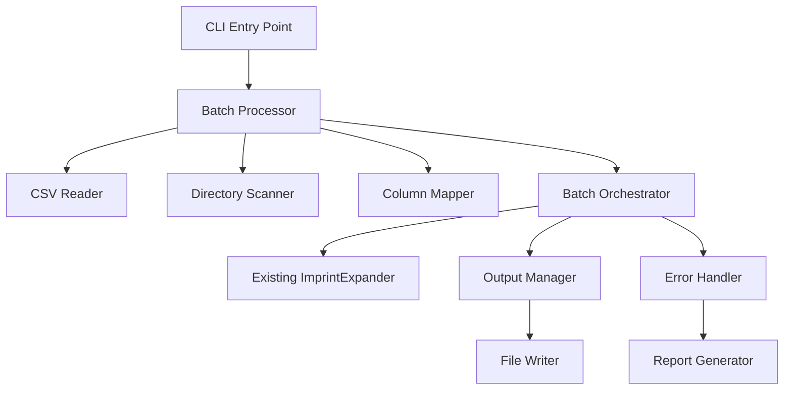

# Design Document

## Overview

The Imprint CSV Batch Processor extends the existing `expand_imprint_cli.py` tool to support batch processing of imprint concepts from CSV files and directory scanning. The design leverages the existing `ImprintExpander` and `EnhancedImprintExpander` classes while adding new components for CSV processing, directory scanning, and batch orchestration.

## Architecture

### High-Level Architecture



### Component Relationships

The design follows a modular approach where:
- **BatchProcessor** serves as the main coordinator
- **CSVReader** handles CSV file parsing and validation
- **DirectoryScanner** discovers and processes multiple CSV files
- **ColumnMapper** provides flexible column mapping capabilities
- **BatchOrchestrator** manages the processing pipeline for multiple imprints
- **OutputManager** handles file organization and naming strategies
- **ErrorHandler** provides comprehensive error handling and reporting

## Components and Interfaces

### 1. BatchProcessor (Main Coordinator)

```python
class BatchProcessor:
    def __init__(self, llm_caller: LLMCaller, config: BatchConfig):
        self.llm_caller = llm_caller
        self.config = config
        self.csv_reader = CSVReader(config.column_mapping)
        self.directory_scanner = DirectoryScanner()
        self.orchestrator = BatchOrchestrator(llm_caller, config)
        self.error_handler = ErrorHandler()
    
    def process_csv_file(self, csv_path: Path) -> BatchResult
    def process_directory(self, directory_path: Path) -> BatchResult
    def process_single_file(self, text_path: Path) -> BatchResult  # Backward compatibility
```

### 2. CSVReader (CSV Processing)

```python
class CSVReader:
    def __init__(self, column_mapping: Optional[Dict[str, str]] = None):
        self.column_mapping = column_mapping or {}
    
    def read_csv(self, csv_path: Path) -> List[ImprintRow]
    def validate_columns(self, df: pd.DataFrame) -> ValidationResult
    def map_columns(self, df: pd.DataFrame) -> pd.DataFrame
    def extract_imprint_concepts(self, df: pd.DataFrame) -> List[ImprintRow]
```

### 3. DirectoryScanner (Directory Processing)

```python
class DirectoryScanner:
    def scan_directory(self, directory_path: Path) -> List[Path]
    def filter_csv_files(self, file_paths: List[Path]) -> List[Path]
    def create_processing_plan(self, csv_files: List[Path]) -> ProcessingPlan
```

### 4. BatchOrchestrator (Processing Pipeline)

```python
class BatchOrchestrator:
    def __init__(self, llm_caller: LLMCaller, config: BatchConfig):
        self.expander = self._create_expander(llm_caller)
        self.output_manager = OutputManager(config.output_config)
        self.config = config
    
    def process_batch(self, imprint_rows: List[ImprintRow]) -> BatchResult
    def process_single_imprint(self, row: ImprintRow) -> ImprintResult
    def apply_attribute_filtering(self, expanded_imprint: ExpandedImprint) -> ExpandedImprint
```

### 5. OutputManager (File Organization)

```python
class OutputManager:
    def __init__(self, output_config: OutputConfig):
        self.config = output_config
    
    def generate_output_path(self, imprint_name: str, source_info: SourceInfo) -> Path
    def write_imprint_result(self, result: ImprintResult, output_path: Path) -> None
    def create_index_file(self, batch_result: BatchResult) -> Path
    def ensure_unique_naming(self, base_path: Path) -> Path
```

### 6. ErrorHandler (Error Management)

```python
class ErrorHandler:
    def __init__(self):
        self.errors: List[ProcessingError] = []
        self.warnings: List[ProcessingWarning] = []
    
    def handle_error(self, error: Exception, context: ProcessingContext) -> None
    def handle_warning(self, warning: str, context: ProcessingContext) -> None
    def generate_error_report(self) -> ErrorReport
    def should_continue_processing(self, error: Exception) -> bool
```

## Data Models

### Configuration Models

```python
@dataclass
class BatchConfig:
    column_mapping: Dict[str, str]
    attributes: Optional[List[str]]
    subattributes: Optional[List[str]]
    output_config: OutputConfig
    error_handling: ErrorHandlingConfig
    processing_options: ProcessingOptions

@dataclass
class OutputConfig:
    base_directory: Path
    naming_strategy: str  # 'imprint_name', 'row_number', 'hybrid'
    organization_strategy: str  # 'flat', 'by_source', 'by_imprint'
    create_index: bool = True

@dataclass
class ProcessingOptions:
    parallel_processing: bool = False
    max_workers: int = 4
    continue_on_error: bool = True
    validate_output: bool = True
```

### Processing Models

```python
@dataclass
class ImprintRow:
    row_number: int
    imprint_concept: str
    source_file: Path
    additional_data: Dict[str, Any]
    mapped_columns: Dict[str, str]

@dataclass
class ImprintResult:
    row: ImprintRow
    expanded_imprint: Optional[ExpandedImprint]
    success: bool
    error: Optional[Exception]
    processing_time: float
    output_path: Optional[Path]

@dataclass
class BatchResult:
    source_files: List[Path]
    total_processed: int
    successful: int
    failed: int
    results: List[ImprintResult]
    errors: List[ProcessingError]
    processing_time: float
    index_file: Optional[Path]
```

## Error Handling

### Error Categories

1. **Critical Errors** (Stop processing):
   - Invalid CSV format
   - Missing required columns after mapping
   - LLM service unavailable
   - Output directory not writable

2. **Row-Level Errors** (Continue processing):
   - Empty imprint concept
   - LLM processing failure for specific row
   - Output file write failure

3. **Warnings** (Log and continue):
   - Missing optional columns
   - Attribute filtering removed all content
   - Output file naming conflicts resolved

### Error Recovery Strategies

```python
class ErrorRecoveryStrategy:
    def handle_csv_parsing_error(self, error: Exception, file_path: Path) -> RecoveryAction
    def handle_llm_processing_error(self, error: Exception, row: ImprintRow) -> RecoveryAction
    def handle_output_error(self, error: Exception, result: ImprintResult) -> RecoveryAction
```

## Testing Strategy

### Unit Tests

1. **CSVReader Tests**:
   - Valid CSV parsing
   - Column mapping functionality
   - Error handling for malformed CSV
   - Validation of required columns

2. **DirectoryScanner Tests**:
   - Directory traversal
   - CSV file filtering
   - Processing plan generation

3. **BatchOrchestrator Tests**:
   - Single imprint processing
   - Attribute filtering
   - Error propagation

4. **OutputManager Tests**:
   - Path generation strategies
   - File naming conflicts
   - Index file creation

### Integration Tests

1. **End-to-End Processing**:
   - Single CSV file processing
   - Directory batch processing
   - Mixed file type handling

2. **Error Scenarios**:
   - Malformed CSV files
   - LLM service failures
   - File system errors

3. **Backward Compatibility**:
   - Single file processing
   - CLI argument compatibility
   - Output format consistency

### Performance Tests

1. **Scalability Tests**:
   - Large CSV files (1000+ rows)
   - Multiple CSV files processing
   - Memory usage monitoring

2. **LLM Integration Tests**:
   - Rate limiting handling
   - Retry mechanism validation
   - Cost optimization verification

## Implementation Phases

### Phase 1: Core Infrastructure
- Implement BatchProcessor and CSVReader
- Add basic column mapping support
- Create data models and configuration system

### Phase 2: Batch Processing
- Implement BatchOrchestrator
- Add directory scanning capabilities
- Integrate with existing ImprintExpander

### Phase 3: Advanced Features
- Add attribute/subattribute filtering
- Implement flexible output organization
- Add comprehensive error handling

### Phase 4: CLI Integration
- Update CLI interface for new options
- Ensure backward compatibility
- Add comprehensive help and examples

### Phase 5: Testing and Documentation
- Complete test suite implementation
- Performance optimization
- User documentation and examples