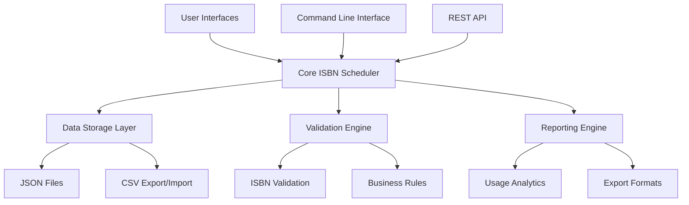
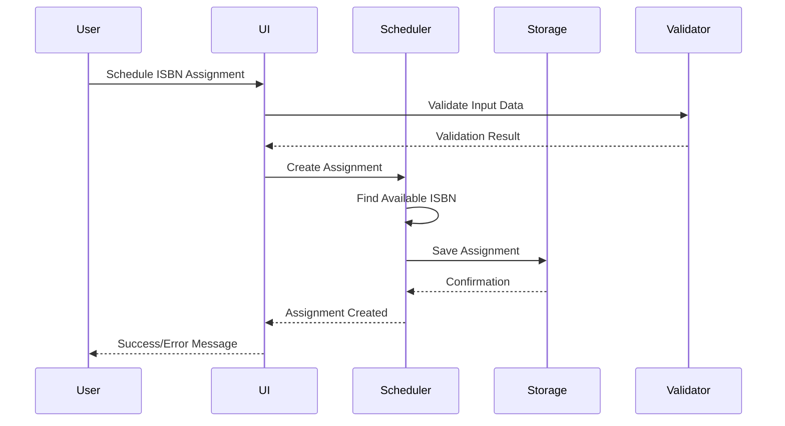

# Design Document

## Overview

The ISBN Schedule Assignment system is designed as a comprehensive solution for managing ISBN allocation across publishing schedules. The system follows a modular architecture with clear separation between data management, business logic, user interfaces, and external integrations. The design emphasizes data integrity, scalability, and ease of use while providing both programmatic and interactive access methods.

## Architecture

### System Components



### Data Flow



## Components and Interfaces

### Core ISBN Scheduler (`isbn_scheduler.py`)

The central component that manages all ISBN operations and maintains system state.

**Key Classes:**
- `ISBNScheduler`: Main orchestrator class
- `ISBNAssignment`: Data model for individual assignments
- `ISBNBlock`: Data model for ISBN blocks/ranges
- `ISBNStatus`: Enumeration of assignment statuses

**Primary Methods:**
```python
class ISBNScheduler:
    def add_isbn_block(prefix: str, start: int, end: int, publisher_code: str) -> str
    def schedule_isbn_assignment(title: str, book_id: str, date: str, **kwargs) -> Optional[str]
    def assign_isbn_now(isbn: str) -> bool
    def reserve_isbn(isbn: str, reason: str) -> bool
    def get_scheduled_assignments(start_date: str, end_date: str) -> List[ISBNAssignment]
    def get_isbn_availability_report() -> Dict[str, Any]
    def bulk_schedule_from_csv(csv_file: str) -> int
```

### Streamlit User Interface (`12_ISBN_Schedule_Manager.py`)

Interactive web-based interface providing comprehensive ISBN management capabilities.

**Page Structure:**
- **Dashboard**: Overview metrics and upcoming assignments
- **Schedule Assignment**: Form-based ISBN scheduling
- **View Assignments**: Filterable assignment list with management actions
- **Manage ISBN Blocks**: Block creation and utilization monitoring
- **Reports**: Analytics and export functionality
- **Bulk Operations**: CSV upload and batch processing

**Key Features:**
- Real-time data updates with session state management
- Interactive filtering and search capabilities
- Visual charts and metrics display
- Export functionality for reports and data
- Form validation and error handling

### Command Line Interface (`isbn_schedule_cli.py`)

Comprehensive CLI tool for automation and scripting integration.

**Available Commands:**
```bash
# Block management
python isbn_schedule_cli.py add-block --prefix 978 --publisher-code 123456 --start 1000 --end 1999

# Assignment scheduling
python isbn_schedule_cli.py schedule --title "My Book" --book-id book_1 --date 2024-12-01

# Assignment management
python isbn_schedule_cli.py assign --isbn 9781234567890
python isbn_schedule_cli.py reserve --isbn 9781234567890 --reason "Special project"

# Reporting and listing
python isbn_schedule_cli.py list --upcoming 30
python isbn_schedule_cli.py report --format json

# Bulk operations
python isbn_schedule_cli.py bulk --csv-file assignments.csv
```

### Data Storage Layer

**Primary Storage Format**: JSON files for structured data persistence
- `configs/isbn_schedule.json`: Main schedule data file
- Atomic write operations to prevent data corruption
- Automatic backup creation before modifications
- Schema versioning for future compatibility

**Data Structure:**
```json
{
  "assignments": {
    "isbn": {
      "isbn": "string",
      "book_title": "string",
      "book_id": "string",
      "scheduled_date": "YYYY-MM-DD",
      "status": "scheduled|assigned|reserved|published",
      "assigned_date": "ISO datetime",
      "imprint": "string",
      "publisher": "string",
      "format": "paperback|hardcover|ebook",
      "priority": 1,
      "notes": "string"
    }
  },
  "isbn_blocks": {
    "block_id": {
      "prefix": "978",
      "start_number": 1000,
      "end_number": 1999,
      "publisher_code": "123456",
      "imprint_code": "optional",
      "total_count": 1000,
      "used_count": 0,
      "reserved_count": 0
    }
  },
  "last_updated": "ISO datetime",
  "version": "1.0"
}
```

## Data Models

### ISBNAssignment Model

```python
@dataclass
class ISBNAssignment:
    isbn: str                    # The assigned ISBN-13
    book_title: str             # Book title
    book_id: str                # Unique book identifier
    scheduled_date: str         # YYYY-MM-DD format
    assigned_date: Optional[str] # ISO datetime when assigned
    status: str                 # Current assignment status
    imprint: str                # Publishing imprint
    publisher: str              # Publisher name
    format: str                 # Book format (paperback/hardcover/ebook)
    notes: str                  # Additional notes
    priority: int               # Priority level (1=high, 2=medium, 3=low)
```

### ISBNBlock Model

```python
@dataclass
class ISBNBlock:
    prefix: str          # ISBN prefix (usually 978 or 979)
    start_number: int    # Starting number in range
    end_number: int      # Ending number in range
    publisher_code: str  # Publisher identifier code
    imprint_code: str    # Optional imprint identifier
    total_count: int     # Total ISBNs in block
    used_count: int      # Number of ISBNs assigned
    reserved_count: int  # Number of ISBNs reserved
```

### Status Enumeration

```python
class ISBNStatus(Enum):
    AVAILABLE = "available"    # ISBN exists but not scheduled
    SCHEDULED = "scheduled"    # ISBN scheduled for future assignment
    ASSIGNED = "assigned"      # ISBN assigned and ready for use
    PUBLISHED = "published"    # ISBN used in published book
    RESERVED = "reserved"      # ISBN reserved for special use
```

## Error Handling

### Validation Strategy

**Input Validation:**
- ISBN format validation with check digit verification
- Date format validation (YYYY-MM-DD)
- Required field validation
- Business rule validation (e.g., end_number > start_number)

**Data Integrity:**
- Atomic operations for critical data modifications
- Transaction-like behavior for multi-step operations
- Rollback capability for failed operations
- Duplicate prevention mechanisms

**Error Recovery:**
- Graceful degradation when data files are corrupted
- Automatic backup restoration options
- Clear error messages with suggested remediation
- Logging of all error conditions for debugging

### Exception Hierarchy

```python
class ISBNSchedulerError(Exception):
    """Base exception for ISBN scheduler operations"""
    pass

class ISBNNotFoundError(ISBNSchedulerError):
    """Raised when requested ISBN doesn't exist"""
    pass

class ISBNUnavailableError(ISBNSchedulerError):
    """Raised when no ISBNs are available for assignment"""
    pass

class InvalidISBNFormatError(ISBNSchedulerError):
    """Raised when ISBN format is invalid"""
    pass

class DataCorruptionError(ISBNSchedulerError):
    """Raised when data file corruption is detected"""
    pass
```

## Testing Strategy

### Unit Testing Approach

**Core Functionality Tests:**
- ISBN block creation and management
- Assignment scheduling and status transitions
- Data persistence and loading
- ISBN formatting and validation
- Error handling and edge cases

**Test Coverage Requirements:**
- Minimum 90% code coverage for core scheduler
- 100% coverage for critical data operations
- Comprehensive edge case testing
- Performance testing for large datasets

**Test Data Management:**
- Isolated test environments with temporary files
- Comprehensive test fixtures for various scenarios
- Mock external dependencies
- Automated test data cleanup

### Integration Testing

**Component Integration:**
- Streamlit UI with core scheduler
- CLI tool with core scheduler
- Data persistence across sessions
- Bulk operations with large datasets

**End-to-End Workflows:**
- Complete assignment lifecycle (schedule → assign → publish)
- Multi-user scenarios with concurrent access
- Error recovery and data consistency
- Export/import functionality

### Performance Testing

**Scalability Targets:**
- Support for 10,000+ ISBN assignments
- Sub-second response times for common operations
- Efficient memory usage for large datasets
- Acceptable performance with 100+ concurrent users

## Security Considerations

### Data Protection

**File System Security:**
- Appropriate file permissions for data files
- Protection against unauthorized access
- Secure temporary file handling
- Data sanitization for exports

**Input Validation:**
- SQL injection prevention (though not using SQL)
- Path traversal prevention for file operations
- Input sanitization for all user data
- Rate limiting for bulk operations

### Access Control

**User Authentication:**
- Integration with existing Codexes Factory auth system
- Role-based access control (admin, editor, viewer)
- Session management for web interface
- API key authentication for programmatic access

## Integration Points

### Codexes Factory Integration

**Metadata Integration:**
- Automatic ISBN assignment during book pipeline
- Integration with `CodexMetadata` objects
- LSI CSV generation with assigned ISBNs
- Cover generation with ISBN barcodes

**Configuration Integration:**
- Use existing multi-level configuration system
- Imprint-specific ISBN block management
- Publisher-specific assignment rules
- Integration with existing logging infrastructure

### External System Integration

**ISBN Registration Authorities:**
- Support for different ISBN agency formats
- Validation against official ISBN databases
- Integration with ISBN purchase workflows
- Compliance with international ISBN standards

**Publishing Platforms:**
- IngramSpark LSI integration
- Amazon KDP integration
- Direct publisher platform connections
- Automated submission workflows

## Deployment Considerations

### File Structure

```
src/codexes/modules/distribution/
├── isbn_scheduler.py              # Core scheduler implementation
├── isbn_validator.py              # ISBN validation utilities
└── isbn_barcode_generator.py      # Barcode generation (existing)

src/codexes/pages/
└── 12_ISBN_Schedule_Manager.py    # Streamlit interface

tools/
└── isbn_schedule_cli.py           # Command line interface

tests/
├── test_isbn_scheduler.py         # Unit tests
├── test_isbn_cli.py              # CLI tests
└── test_isbn_ui.py               # UI tests

configs/
└── isbn_schedule.json            # Data storage file
```

### Configuration Requirements

**Environment Variables:**
- `ISBN_SCHEDULE_FILE`: Path to schedule data file
- `ISBN_BACKUP_DIR`: Directory for automatic backups
- `ISBN_LOG_LEVEL`: Logging verbosity level

**Dependencies:**
- No additional external dependencies required
- Uses existing Codexes Factory infrastructure
- Compatible with current Python 3.12+ requirements

### Monitoring and Maintenance

**Operational Monitoring:**
- ISBN utilization tracking
- Assignment success/failure rates
- System performance metrics
- Data file size and growth monitoring

**Maintenance Tasks:**
- Regular data backup verification
- ISBN block utilization analysis
- Performance optimization reviews
- Security audit compliance