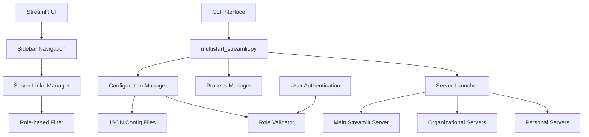

# Design Document

## Overview

The Multi-Organizational Streamlit Server Management system extends the current single-server architecture to support multiple independent Streamlit instances. The design implements role-based access control, configuration management, and a unified launcher utility while maintaining the existing subprocess-based server management approach.

## Architecture

### High-Level Architecture



### Component Relationships

The design follows a modular approach where:
- **Configuration Manager** handles JSON config loading and validation
- **Server Launcher** manages subprocess creation for multiple servers
- **Process Manager** monitors and controls running server processes
- **Sidebar Navigation** displays role-appropriate server links
- **CLI Interface** provides administrative control over server operations

## Components and Interfaces

### 1. Configuration Manager

```python
class ServerConfigManager:
    def __init__(self, config_dir: Path = Path("configs/servers")):
        self.config_dir = config_dir
        self.configs: Dict[str, ServerConfig] = {}
    
    def load_configurations(self) -> Dict[str, ServerConfig]
    def validate_configuration(self, config: ServerConfig) -> ValidationResult
    def get_servers_for_role(self, role: UserRole) -> List[ServerConfig]
    def reload_configurations(self) -> None
```

### 2. Multi-Server Launcher

```python
class MultiStreamlitLauncher:
    def __init__(self, config_manager: ServerConfigManager):
        self.config_manager = config_manager
        self.processes: Dict[str, subprocess.Popen] = {}
        self.status_monitor = ServerStatusMonitor()
    
    def launch_servers(self, server_filter: ServerFilter = None) -> LaunchResult
    def launch_single_server(self, server_config: ServerConfig) -> subprocess.Popen
    def stop_servers(self, server_names: List[str] = None) -> None
    def get_server_status(self) -> Dict[str, ServerStatus]
    def restart_server(self, server_name: str) -> bool
```

### 3. Sidebar Navigation Manager

```python
class SidebarServerManager:
    def __init__(self, config_manager: ServerConfigManager):
        self.config_manager = config_manager
        self.status_checker = ServerStatusChecker()
    
    def render_server_links(self, user_role: UserRole) -> None
    def check_server_availability(self, server_config: ServerConfig) -> bool
    def generate_server_link(self, server_config: ServerConfig) -> str
    def organize_servers_by_type(self, servers: List[ServerConfig]) -> Dict[str, List[ServerConfig]]
```

### 4. CLI Command Handler

```python
class MultiStartCLI:
    def __init__(self):
        self.launcher = MultiStreamlitLauncher()
        self.config_manager = ServerConfigManager()
    
    def parse_arguments(self) -> argparse.Namespace
    def handle_list_servers(self) -> None
    def handle_launch_with_filters(self, args: argparse.Namespace) -> None
    def handle_server_management(self, args: argparse.Namespace) -> None
```

## Data Models

### Configuration Models

```python
@dataclass
class ServerConfig:
    name: str
    display_name: str
    description: str
    port: int
    script_path: Path
    environment: Dict[str, str]
    roles: List[UserRole]
    organization: Optional[str]
    user_id: Optional[str]
    enabled: bool = True
    auto_start: bool = True
    health_check_url: Optional[str] = None
    
    def to_dict(self) -> Dict[str, Any]
    def from_dict(cls, data: Dict[str, Any]) -> 'ServerConfig'
    def validate(self) -> List[str]

@dataclass
class LaunchResult:
    successful_servers: List[str]
    failed_servers: List[str]
    errors: Dict[str, str]
    total_launched: int
    
@dataclass
class ServerStatus:
    name: str
    running: bool
    port: int
    pid: Optional[int]
    uptime: Optional[float]
    last_health_check: Optional[datetime]
    health_status: str
```

### User Role Models

```python
class UserRole(Enum):
    ADMIN = "admin"
    MULTI_ORGANIZATIONAL = "multi_organizational"
    PERSONAL = "personal"
    STANDARD = "standard"

@dataclass
class UserContext:
    user_id: str
    roles: List[UserRole]
    organization: Optional[str]
    permissions: List[str]
```

## Configuration File Structure

### Server Configuration JSON

```json
{
  "servers": {
    "main": {
      "name": "main",
      "display_name": "Codexes Factory Main",
      "description": "Main Codexes Factory application",
      "port": 8501,
      "script_path": "src/codexes/pages/codexes_factory_ui_home.py",
      "environment": {
        "STREAMLIT_SERVER_PORT": "8501",
        "STREAMLIT_SERVER_ADDRESS": "localhost"
      },
      "roles": ["admin", "multi_organizational", "personal", "standard"],
      "organization": null,
      "user_id": null,
      "enabled": true,
      "auto_start": true,
      "health_check_url": "http://localhost:8501/health"
    },
    "xtuff_ai": {
      "name": "xtuff_ai",
      "display_name": "XTuff.AI Platform",
      "description": "XTuff.AI organizational instance",
      "port": 8502,
      "script_path": "external/xtuff/app.py",
      "environment": {
        "STREAMLIT_SERVER_PORT": "8502",
        "ORG_NAME": "xtuff.ai"
      },
      "roles": ["multi_organizational"],
      "organization": "xtuff.ai",
      "user_id": null,
      "enabled": true,
      "auto_start": true,
      "health_check_url": "http://localhost:8502/health"
    },
    "personal_dev": {
      "name": "personal_dev",
      "display_name": "Personal Development Server",
      "description": "User's personal development instance",
      "port": 8503,
      "script_path": "personal/dev_app.py",
      "environment": {
        "STREAMLIT_SERVER_PORT": "8503",
        "USER_MODE": "personal"
      },
      "roles": ["personal"],
      "organization": null,
      "user_id": "user123",
      "enabled": true,
      "auto_start": false,
      "health_check_url": "http://localhost:8503/health"
    }
  },
  "global_settings": {
    "health_check_interval": 30,
    "startup_timeout": 60,
    "log_level": "INFO",
    "max_concurrent_starts": 5
  }
}
```

## Security Considerations

### Role-Based Access Control

1. **Server Visibility**: Users only see servers matching their roles
2. **Configuration Access**: Server configs include role restrictions
3. **Process Isolation**: Each server runs in its own subprocess with limited permissions
4. **Health Check Security**: Health check endpoints require authentication

### Configuration Security

1. **File Permissions**: Configuration files have restricted read/write access
2. **Environment Variables**: Sensitive data stored in environment variables, not config files
3. **Validation**: All configurations validated before use
4. **Audit Logging**: All configuration changes and server operations logged

## Integration Points

### Existing System Integration

1. **start_streamlit.sh**: Replaced by multistart_streamlit.py in daily use
2. **Streamlit UI**: Enhanced with sidebar server navigation
3. **User Authentication**: Integrated with existing user role system
4. **Logging System**: Uses existing logging infrastructure

### New Integration Requirements

1. **Health Monitoring**: New health check system for multiple servers
2. **Process Management**: Enhanced process monitoring and control
3. **Configuration Management**: New JSON-based configuration system
4. **CLI Tools**: New command-line interface for server management

## Performance Considerations

### Resource Management

1. **Memory Usage**: Each server runs independently, monitor total memory usage
2. **Port Management**: Automatic port allocation and conflict detection
3. **CPU Usage**: Staggered server startup to reduce CPU spikes
4. **Network Resources**: Monitor network connections and bandwidth

### Scalability

1. **Server Limits**: Configurable maximum number of concurrent servers
2. **Health Checks**: Efficient health checking without overwhelming servers
3. **Configuration Loading**: Lazy loading of configurations to improve startup time
4. **UI Performance**: Efficient sidebar rendering even with many servers

## Error Handling

### Server Launch Failures

1. **Port Conflicts**: Automatic port reassignment or clear error messages
2. **Missing Scripts**: Validation of script paths before launch
3. **Permission Issues**: Clear error messages for permission problems
4. **Resource Exhaustion**: Graceful handling of resource limits

### Runtime Error Handling

1. **Server Crashes**: Automatic restart capabilities with configurable retry limits
2. **Health Check Failures**: Graceful degradation and user notification
3. **Configuration Errors**: Hot-reload with rollback on invalid configurations
4. **Network Issues**: Retry mechanisms for network-related failures

## Implementation Phases

### Phase 1: Core Infrastructure
- Implement ServerConfigManager and basic JSON configuration loading
- Create MultiStreamlitLauncher with subprocess management
- Add basic CLI interface for server management

### Phase 2: UI Integration
- Enhance sidebar navigation with server links
- Implement role-based server filtering
- Add server status indicators and health checks

### Phase 3: Advanced Features
- Add hot-reloading of configurations
- Implement advanced CLI features (filtering, status monitoring)
- Add comprehensive error handling and recovery

### Phase 4: Security and Monitoring
- Implement comprehensive role-based access control
- Add audit logging and security monitoring
- Performance optimization and resource management

### Phase 5: Testing and Documentation
- Comprehensive test suite for all components
- User documentation and administration guides
- Performance testing and optimization