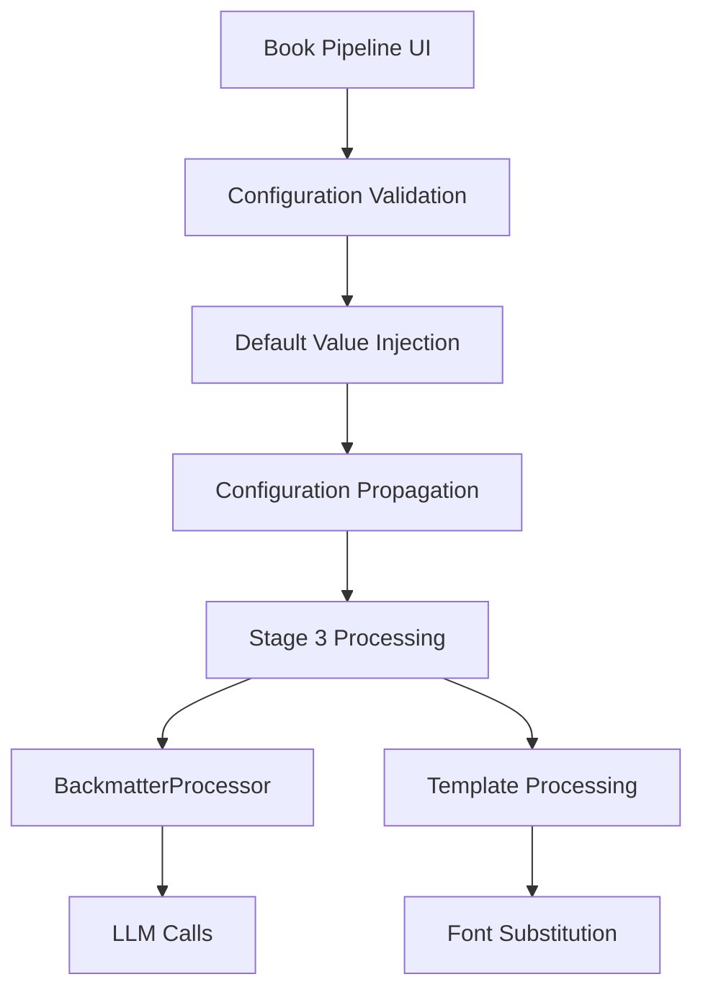

# Pipeline Configuration Fixes - Design Document

## Overview

This design addresses critical configuration issues in the book production pipeline, ensuring consistent defaults, proper LLM configuration propagation, and accurate font rendering.

## Architecture

### Configuration Flow



### Component Modifications

#### 1. Book Pipeline UI (10_Book_Pipeline.py)
- **Default Values**: Update default configuration dictionary
- **Validation**: Add validation for required fields
- **UI Display**: Ensure defaults are visible in form fields

#### 2. BackmatterProcessor (backmatter_processor.py)
- **Configuration Injection**: Accept and use pipeline LLM configuration
- **Default Handling**: Use sensible defaults when no config provided
- **Logging**: Log model usage for transparency

#### 3. Prepress Processing (xynapse_traces/prepress.py)
- **Configuration Propagation**: Pass LLM config to BackmatterProcessor
- **Template Variables**: Inject font configuration into templates
- **Error Handling**: Provide clear errors for configuration issues

#### 4. LaTeX Template (xynapse_traces/template.tex)
- **Font Variables**: Replace hardcoded fonts with template variables
- **Fallback Handling**: Provide sensible defaults for missing fonts

## Implementation Details

### Default Configuration Values

```python
DEFAULT_CONFIG = {
    'lightning_source_account': '6024045',
    'language_code': 'eng',
    'field_reports': 'HTML',
    'llm_config': {
        'model': 'gpt-4o-mini',
        'temperature': 0.7,
        'max_tokens': 2000
    }
}
```

### Font Configuration Variables

```python
FONT_TEMPLATE_VARS = {
    'korean_font': 'Apple Myungjo',
    'body_font': 'Adobe Caslon Pro', 
    'heading_font': 'Adobe Caslon Pro',
    'quotations_font': 'Adobe Caslon Pro',
    'mnemonics_font': 'Adobe Caslon Pro'
}
```

## Components and Interfaces

### 1. Configuration Manager Interface

```python
class ConfigurationManager:
    def apply_defaults(self, config: Dict) -> Dict
    def validate_config(self, config: Dict) -> ValidationResult
    def propagate_config(self, config: Dict) -> Dict
```

### 2. Template Processor Interface

```python
class TemplateProcessor:
    def inject_font_variables(self, template_vars: Dict, config: Dict) -> Dict
    def process_template(self, template_path: str, variables: Dict) -> str
    def validate_template_variables(self, variables: Dict) -> ValidationResult
```

## Data Models

### Configuration Schema

```python
@dataclass
class PipelineConfig:
    lightning_source_account: str = "6024045"
    language_code: str = "eng"
    field_reports: str = "HTML"
    llm_config: Dict[str, Any] = field(default_factory=lambda: {
        'model': 'gpt-4o-mini',
        'temperature': 0.7,
        'max_tokens': 2000
    })
    fonts: Dict[str, str] = field(default_factory=lambda: {
        'korean': 'Apple Myungjo',
        'body': 'Adobe Caslon Pro',
        'heading': 'Adobe Caslon Pro',
        'quotations': 'Adobe Caslon Pro',
        'mnemonics': 'Adobe Caslon Pro'
    })
```

## Error Handling

### Configuration Errors

1. **Missing Required Fields**: Provide clear error messages with suggested defaults
2. **Invalid Values**: Show allowed values and current invalid value
3. **Font Not Found**: Suggest alternative fonts or fallback to system defaults
4. **LLM Configuration Issues**: Validate model availability and API keys

## Testing Strategy

### Unit Tests

1. **Default Value Application**: Test that defaults are correctly applied
2. **Configuration Validation**: Test validation rules and error messages
3. **Template Variable Injection**: Test font variable substitution
4. **LLM Configuration Propagation**: Test config passing to processors

### Integration Tests

1. **End-to-End Pipeline**: Test complete pipeline with various configurations
2. **Font Rendering**: Test that configured fonts appear in generated PDFs
3. **LLM Model Usage**: Test that correct models are used in processing
4. **Error Recovery**: Test graceful handling of invalid configurations