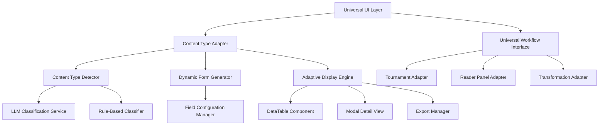
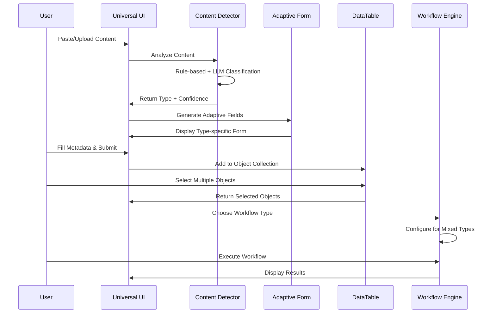

# Stage-Agnostic UI Implementation Design

## Overview

This design document outlines the technical approach for implementing truly stage/length-agnostic user interfaces for the Advanced Ideation System. The current implementation has hardcoded forms and displays that are specific to content types, but the system should provide universal, adaptive interfaces that work seamlessly with any CodexObject type or development stage.

The design focuses on creating intelligent, adaptive UI components that automatically adjust to content types while maintaining usability and providing efficient workflows for both single objects and large datasets.

## Architecture

### UI Component Architecture



### Streamlit UI Layout Design

```mermaid
graph TD
    A[Stage-Agnostic UI Main Page] --> B[Universal Content Input Section]
    A --> C[Content Management Section]
    A --> D[Workflow Operations Section]
    
    B --> B1[Content Text Area<br/>Auto-detecting placeholder]
    B --> B2[Detection Results Display<br/>Type + Confidence + Override]
    B --> B3[Adaptive Form Fields<br/>Dynamic based on detected type]
    B --> B4[Create CodexObject Button]
    
    C --> C1[Content Filter & Search<br/>Type, Genre, Date filters]
    C --> C2[Multi-Object DataTable<br/>Sortable, selectable, paginated]
    C --> C3[Bulk Actions<br/>Select All, Export, Delete]
    C --> C4[Detail View Modals<br/>Expandable content preview]
    
    D --> D1[Workflow Selection<br/>Tournament, Reader Panel, Transform]
    D --> D2[Mixed-Type Handling<br/>Adaptive configuration UI]
    D --> D3[Batch Processing<br/>Progress tracking & results]
    D --> D4[Results Display<br/>Type-aware result formatting]
    
    style A fill:#e1f5fe
    style B fill:#f3e5f5
    style C fill:#e8f5e8
    style D fill:#fff3e0
```



### UI Flow Diagram



### Visual Mockup of Main Interface

```
┌─────────────────────────────────────────────────────────────────────────────┐
│ 🎯 Stage-Agnostic Content Management                                        │
├─────────────────────────────────────────────────────────────────────────────┤
│                                                                             │
│ 📝 Universal Content Input                                                  │
│ Input Method: ⚪ Text Input  ⚫ File Upload  ⚪ Directory Browse             │
│                                                                             │
│ 📁 File Upload Interface                                                    │
│ Supported: .txt, .docx, .pdf, .md, .zip (archives)                        │
│ ┌─────────────────────────────────────────────────────────────────────────┐ │
│ │ 📎 Drag & drop files here or click to browse                           │ │
│ │                                                                         │ │
│ │ Selected Files:                                                         │ │
│ │ • story_ideas.txt (2.3 KB)                                             │ │
│ │ • manuscripts.zip (15.7 MB) - Contains 5 files                        │ │
│ │ • synopsis.docx (45.2 KB)                                              │ │
│ │                                                                         │ │
│ └─────────────────────────────────────────────────────────────────────────┘ │
│                                                                             │
│ 🔍 Detection Results (3 files processed)                                   │
│ ℹ️  story_ideas.txt: **Idea** (confidence: 92%)      ☑️ Override          │
│ ℹ️  chapter1.txt: **Draft** (confidence: 88%)        ☑️ Override          │
│ ℹ️  synopsis.docx: **Synopsis** (confidence: 95%)    ☑️ Override          │
│                                                                             │
│ 📋 Batch Metadata Configuration                                            │
│ Apply to all: Genre[Fantasy ▼] Audience[Young Adult ▼] Tags[+Add]         │
│ Individual overrides available per file                                    │
│                                                                             │
│                                [Create CodexObjects (3)]                    │
│                                                                             │
├─────────────────────────────────────────────────────────────────────────────┤
│                                                                             │
│ 📚 Content Management                                                       │
│ Filters: Type[All ▼] Genre[All ▼] Date[Last 30 days ▼] 🔍[Search...]      │
│                                                                             │
│ ┌─────────────────────────────────────────────────────────────────────────┐ │
│ │☑️│Title              │Type     │Genre   │Words│Created  │Actions        │ │
│ │──┼───────────────────┼─────────┼────────┼─────┼─────────┼───────────────│ │
│ │☑️│Time Travel Story  │Idea     │Sci-Fi  │25   │2025-01-15│👁️ 📝 🗑️      │ │
│ │☑️│Dragon Quest       │Synopsis │Fantasy │450  │2025-01-14│👁️ 📝 🗑️      │ │
│ │☑️│Mystery Novel      │Outline  │Mystery │1200 │2025-01-13│👁️ 📝 🗑️      │ │
│ │☑️│Romance Draft      │Draft    │Romance │5000 │2025-01-12│👁️ 📝 🗑️      │ │
│ └─────────────────────────────────────────────────────────────────────────┘ │
│                                                                             │
│ Selected: 4 objects (2 Ideas, 1 Synopsis, 1 Outline)                      │
│ [📤 Export] [🔄 Transform] [🏆 Tournament] [👥 Reader Panel]                │
│                                                                             │
├─────────────────────────────────────────────────────────────────────────────┤
│                                                                             │
│ ⚙️ Workflow Operations                                                      │
│ Content Source: ⚪ Selected Objects  ⚫ File Upload  ⚪ Directory  ⚪ Text   │
│                                                                             │
│ 📁 Workflow File Input                                                      │
│ ┌─────────────────────────────────────────────────────────────────────────┐ │
│ │ 📎 Upload files for workflow processing                                 │ │
│ │ • evaluation_batch.zip (25.3 MB) - 12 files                           │ │
│ │ • additional_ideas.txt (5.7 KB)                                        │ │
│ └─────────────────────────────────────────────────────────────────────────┘ │
│                                                                             │
│ Selected Workflow: [Tournament ▼]                                          │
│                                                                             │
│ ⚠️ Tournament includes 4 different content types from uploaded files.      │
│    Evaluation will be adapted for fair comparison.                         │
│                                                                             │
│ Mixed Type Evaluation: [Adaptive ▼]                                        │
│                                                                             │
│ 📊 Evaluation Criteria:                                                     │
│ Originality: ████████░░ 80%                                               │
│ Marketability: ██████░░░░ 60%                                             │
│ Execution: ████░░░░░░ 40%                                                  │
│ Appeal: ██████████ 100%                                                    │
│                                                                             │
│                                    [🚀 Run Tournament]                      │
│                                                                             │
└─────────────────────────────────────────────────────────────────────────────┘
```

### Directory Browse Interface Mockup

```
┌─────────────────────────────────────────────────────────────────────────────┐
│ 📁 Directory Browse Interface                                               │
├─────────────────────────────────────────────────────────────────────────────┤
│                                                                             │
│ 📝 Universal Content Input - Directory Browse                              │
│ Input Method: ⚪ Text Input  ⚪ File Upload  ⚫ Directory Browse             │
│                                                                             │
│ 🗂️ Available Directories                                                    │
│ Select Directory: [data/ ▼]                                                │
│                                                                             │
│ 📋 Files in data/ directory:                                               │
│ ┌─────────────────────────────────────────────────────────────────────────┐ │
│ │ ☑️ manuscripts/                                                         │ │
│ │   ☑️ fantasy_novel_draft.txt (125 KB)                                  │ │
│ │   ☑️ sci_fi_outline.md (15 KB)                                         │ │
│ │   ☑️ romance_synopsis.docx (8 KB)                                      │ │
│ │ ☑️ ideas/                                                               │ │
│ │   ☑️ story_concepts.txt (3 KB)                                         │ │
│ │   ☑️ character_sketches.md (7 KB)                                      │ │
│ │ ☑️ completed/                                                           │ │
│ │   ☑️ published_novel.pdf (2.1 MB)                                      │ │
│ │   ☑️ short_stories.txt (45 KB)                                         │ │
│ └─────────────────────────────────────────────────────────────────────────┘ │
│                                                                             │
│ Selected: 7 files from data/ (Total: 2.3 MB)                              │
│                                                                             │
│ 🔍 Batch Processing Options                                                 │
│ ☑️ Auto-detect content types                                               │
│ ☑️ Apply consistent metadata                                               │
│ ☑️ Preserve directory structure in titles                                  │
│                                                                             │
│                            [Process Selected Files]                         │
│                                                                             │
└─────────────────────────────────────────────────────────────────────────────┘
```

### Transformation Interface Mockup

```
┌─────────────────────────────────────────────────────────────────────────────┐
│ 🔄 Content Transformation Interface                                         │
├─────────────────────────────────────────────────────────────────────────────┤
│                                                                             │
│ Content Source: ⚪ Selected Objects  ⚫ File Upload  ⚪ Directory  ⚪ Text   │
│                                                                             │
│ 📁 Transformation File Input                                                │
│ ┌─────────────────────────────────────────────────────────────────────────┐ │
│ │ 📎 Upload files for transformation                                      │ │
│ │ • ideas_collection.zip (8.5 MB) - 15 idea files                       │ │
│ │ • synopsis_draft.docx (12 KB)                                          │ │
│ └─────────────────────────────────────────────────────────────────────────┘ │
│                                                                             │
│ 📋 Source Objects (16 files detected)                                      │
│ • story_idea_001.txt (Idea) → Outline                                     │
│ • story_idea_002.txt (Idea) → Outline                                     │
│ • synopsis_draft.docx (Synopsis) → Treatment                              │
│ • [13 more files...]                                                       │
│                                                                             │
│ 🎯 Transformation Settings                                                  │
│ Transform to: [Outline ▼]                                                  │
│ Approach: [Planning ▼] ℹ️ Top-down structured approach                     │
│ Parameter: [Expand ▼] ℹ️ Add detail and depth                             │
│                                                                             │
│ 📝 Custom Instructions (optional)                                          │
│ ┌─────────────────────────────────────────────────────────────────────────┐ │
│ │ Focus on character development and world-building details               │ │
│ └─────────────────────────────────────────────────────────────────────────┘ │
│                                                                             │
│ 🔮 Transformation Preview                                                   │
│ ┌─────────────────────────────────────────────────────────────────────────┐ │
│ │ The following fields will be generated/modified:                       │ │
│ │ • Chapter structure                                                     │ │
│ │ • Scene breakdowns                                                      │ │
│ │ • Character arcs                                                        │ │
│ │ • Plot progression                                                      │ │
│ │ • Pacing notes                                                          │ │
│ └─────────────────────────────────────────────────────────────────────────┘ │
│                                                                             │
│                                [🚀 Transform Content]                       │
│                                                                             │
├─────────────────────────────────────────────────────────────────────────────┤
│                                                                             │
│ 📊 Transformation Results                                                   │
│                                                                             │
│ ✅ Time Travel Story → Time Travel Story (Outline)                         │
│ ┌─────────────────────────────────────────────────────────────────────────┐ │
│ │ Chapter 1: The Discovery                                               │ │
│ │   Scene 1.1: Protagonist finds the device                             │ │
│ │   Scene 1.2: First accidental jump                                    │ │
│ │ Chapter 2: Understanding the Rules                                     │ │
│ │   Scene 2.1: Experimenting with time travel                           │ │
│ │   Scene 2.2: Discovering the consequences                             │ │
│ │ [Show More...]                                                         │ │
│ └─────────────────────────────────────────────────────────────────────────┘ │
│                                                                             │
│ ✅ Dragon Quest → Dragon Quest (Outline)                                   │
│ ┌─────────────────────────────────────────────────────────────────────────┐ │
│ │ Act I: The Call to Adventure                                           │ │
│ │   Chapter 1: The Peaceful Village                                     │ │
│ │   Chapter 2: The Dragon's Threat                                      │ │
│ │ Act II: The Journey                                                    │ │
│ │   Chapter 3: Gathering Allies                                         │ │
│ │   Chapter 4: Trials and Tribulations                                  │ │
│ │ [Show More...]                                                         │ │
│ └─────────────────────────────────────────────────────────────────────────┘ │
│                                                                             │
│ [💾 Save Results] [📤 Export] [🔄 Transform Again]                          │
│                                                                             │
└─────────────────────────────────────────────────────────────────────────────┘
```

### Progressive Enhancement Example

```
┌─────────────────────────────────────────────────────────────────────────────┐
│ 📈 Progressive Enhancement Based on Content Maturity                        │
├─────────────────────────────────────────────────────────────────────────────┤
│                                                                             │
│ Early Stage (Idea/Logline) - Simplified Interface:                         │
│ ┌─────────────────────────────────────────────────────────────────────────┐ │
│ │ 💡 Basic Development Tools                                              │ │
│ │ • Expand to Synopsis                                                    │ │
│ │ • Generate Variations                                                   │ │
│ │ • Basic Tournament Entry                                                │ │
│ │ • Genre Classification                                                  │ │
│ └─────────────────────────────────────────────────────────────────────────┘ │
│                                                                             │
│ Intermediate Stage (Synopsis/Outline) - Enhanced Interface:                 │
│ ┌─────────────────────────────────────────────────────────────────────────┐ │
│ │ 📖 Structural Development Tools                                         │ │
│ │ • Plot Structure Analysis                                               │ │
│ │ • Character Arc Development                                             │ │
│ │ • Scene Planning                                                        │ │
│ │ • Reader Panel Evaluation                                               │ │
│ │ • Series Planning                                                       │ │
│ └─────────────────────────────────────────────────────────────────────────┘ │
│                                                                             │
│ Advanced Stage (Draft/Manuscript) - Full Interface:                        │
│ ┌─────────────────────────────────────────────────────────────────────────┐ │
│ │ ✍️ Advanced Editing & Publishing Tools                                  │ │
│ │ • Revision Tracking                                                     │ │
│ │ • Style Analysis                                                        │ │
│ │ • Publication Preparation                                               │ │
│ │ • Market Analysis                                                       │ │
│ │ • Professional Reader Panels                                           │ │
│ │ • Distribution Planning                                                 │ │
│ └─────────────────────────────────────────────────────────────────────────┘ │
│                                                                             │
└─────────────────────────────────────────────────────────────────────────────┘
```

### Component Structure

```
src/codexes/modules/ideation/ui/
├── __init__.py
├── components/
│   ├── __init__.py
│   ├── universal_input.py        # Universal content input component
│   ├── adaptive_form.py          # Dynamic form that adapts to content type
│   ├── content_detector.py       # Automatic content type detection
│   ├── object_datatable.py       # Efficient multi-object display
│   ├── workflow_selector.py      # Universal workflow selection
│   ├── transformation_interface.py # Content transformation UI
│   ├── content_filter.py         # Content filtering and selection
│   ├── help_system.py            # Contextual help and guidance
│   └── model_selector.py         # Standardized model selection component
├── adapters/
│   ├── __init__.py
│   ├── form_adapter.py           # Adapts forms to content types
│   ├── display_adapter.py        # Adapts displays to content types
│   ├── workflow_adapter.py       # Adapts workflows to handle mixed types
│   └── export_adapter.py         # Type-aware export functionality
├── field_configs/
│   ├── __init__.py
│   ├── idea_fields.py            # Field configurations for ideas
│   ├── synopsis_fields.py        # Field configurations for synopses
│   ├── outline_fields.py         # Field configurations for outlines
│   ├── draft_fields.py           # Field configurations for drafts
│   └── universal_fields.py       # Fields that apply to all types
├── cli/
│   ├── __init__.py
│   ├── cli_main.py               # Main CLI entry point
│   ├── content_commands.py       # CLI commands for content operations
│   ├── workflow_commands.py      # CLI commands for workflow operations
│   └── batch_commands.py         # CLI commands for batch processing
├── config/
│   ├── __init__.py
│   ├── model_config.py           # Model configuration management
│   └── default_models.json       # Default model list configuration
└── utils/
    ├── __init__.py
    ├── content_analysis.py       # Content analysis utilities
    ├── type_detection.py         # Type detection algorithms
    ├── ui_helpers.py             # Common UI helper functions
    └── state_manager.py          # UI state management
```

## Components and Interfaces

### 1. Universal Content Input Component

```python
class UniversalContentInput:
    """Universal content input component that adapts to any content type."""
    
    def __init__(self):
        self.content_detector = ContentTypeDetector()
        self.form_adapter = FormAdapter()
        self.field_configs = self._load_field_configs()
        self.file_handler = FileHandler()
        self.allowed_directories = ['data/', 'output/']
        self.supported_formats = ['.txt', '.docx', '.pdf', '.md', '.rtf']
    
    def render_input_interface(self) -> List[CodexObject]:
        """Render the universal input interface with multiple input methods."""
        st.subheader("📝 Universal Content Input")
        
        # Input method selection
        input_method = st.radio(
            "Choose input method:",
            options=["Text Input", "File Upload", "Directory Browse"],
            horizontal=True,
            help="Select how you want to provide content"
        )
        
        content_items = []
        
        if input_method == "Text Input":
            content_items = self._render_text_input()
        elif input_method == "File Upload":
            content_items = self._render_file_upload()
        elif input_method == "Directory Browse":
            content_items = self._render_directory_browse()
        
        return content_items
    
    def _render_text_input(self) -> List[CodexObject]:
        """Render text input interface for large documents."""
        content = st.text_area(
            "Content", 
            placeholder="Enter any creative content: ideas, synopses, outlines, drafts...",
            height=300,
            max_chars=None,  # Allow very large documents
            help="The system will automatically detect your content type and adapt the form accordingly. Supports very large documents."
        )
        
        if content:
            return self._process_content_items([("Pasted Content", content)])
        return []
    
    def _render_file_upload(self) -> List[CodexObject]:
        """Render file upload interface supporting multiple formats."""
        st.write("**Supported formats:** .txt, .docx, .pdf, .md, .rtf, .zip (archives)")
        
        uploaded_files = st.file_uploader(
            "Upload files or archives",
            type=['txt', 'docx', 'pdf', 'md', 'rtf', 'zip'],
            accept_multiple_files=True,
            help="Upload individual files or ZIP archives containing multiple documents"
        )
        
        if uploaded_files:
            content_items = []
            for uploaded_file in uploaded_files:
                if uploaded_file.name.endswith('.zip'):
                    # Handle ZIP archives
                    zip_contents = self.file_handler.extract_zip_contents(uploaded_file)
                    content_items.extend(zip_contents)
                else:
                    # Handle individual files
                    content = self.file_handler.extract_content(uploaded_file)
                    content_items.append((uploaded_file.name, content))
            
            return self._process_content_items(content_items)
        return []
    
    def _render_directory_browse(self) -> List[CodexObject]:
        """Render directory browser for data/ and output/ directories."""
        st.write("**Browse directories:** data/, output/")
        
        selected_directory = st.selectbox(
            "Select directory:",
            options=self.allowed_directories,
            help="Choose a directory to browse for content files"
        )
        
        if selected_directory:
            # Get files from selected directory
            available_files = self.file_handler.list_directory_files(
                selected_directory, 
                self.supported_formats
            )
            
            if available_files:
                selected_files = st.multiselect(
                    f"Select files from {selected_directory}:",
                    options=available_files,
                    help="Choose one or more files to process"
                )
                
                if selected_files:
                    content_items = []
                    for file_path in selected_files:
                        content = self.file_handler.read_file(file_path)
                        content_items.append((file_path, content))
                    
                    return self._process_content_items(content_items)
            else:
                st.info(f"No supported files found in {selected_directory}")
        
        return []
    
    def _process_content_items(self, content_items: List[Tuple[str, str]]) -> List[CodexObject]:
        """Process multiple content items and create CodexObjects."""
        processed_objects = []
        
        for filename, content in content_items:
            if content.strip():  # Only process non-empty content
                # Automatic content type detection
                detected_type, confidence = self.content_detector.detect_type(content)
                
                # Show detection results
                col1, col2 = st.columns([3, 1])
                with col1:
                    st.info(f"**{filename}**: {detected_type.value.title()} (confidence: {confidence:.1%})")
                with col2:
                    manual_override = st.checkbox(f"Override", key=f"override_{filename}")
                
                # Allow manual type selection if needed
                if manual_override or confidence < 0.7:
                    content_type = st.selectbox(
                        f"Content Type for {filename}:",
                        options=list(CodexObjectType),
                        index=list(CodexObjectType).index(detected_type),
                        format_func=lambda x: x.value.title(),
                        key=f"type_{filename}"
                    )
                else:
                    content_type = detected_type
                
                # Render adaptive form based on content type
                metadata = self.form_adapter.render_adaptive_form(content_type, content, key_suffix=filename)
                
                # Create CodexObject
                codex_obj = self._create_codex_object(content, content_type, metadata, filename)
                processed_objects.append(codex_obj)
        
        if processed_objects and st.button("Create CodexObjects", type="primary"):
            return processed_objects
        
        return []
        
        if content:
            # Automatic content type detection
            detected_type, confidence = self.content_detector.detect_type(content)
            
            # Show detection results with override option
            col1, col2 = st.columns([3, 1])
            with col1:
                st.info(f"Detected type: **{detected_type.value}** (confidence: {confidence:.1%})")
            with col2:
                manual_override = st.checkbox("Manual override")
            
            # Allow manual type selection if needed
            if manual_override or confidence < 0.7:
                content_type = st.selectbox(
                    "Content Type",
                    options=list(CodexObjectType),
                    index=list(CodexObjectType).index(detected_type),
                    format_func=lambda x: x.value.title()
                )
            else:
                content_type = detected_type
            
            # Render adaptive form based on content type
            metadata = self.form_adapter.render_adaptive_form(content_type, content)
            
            # Create and return CodexObject
            if st.button("Create CodexObject", type="primary"):
                return self._create_codex_object(content, content_type, metadata)
        
        return None
    
    def _create_codex_object(self, content: str, content_type: CodexObjectType, 
                           metadata: Dict[str, Any]) -> CodexObject:
        """Create a CodexObject from input data."""
        return CodexObject(
            content=content,
            object_type=content_type,
            title=metadata.get('title', ''),
            genre=metadata.get('genre', ''),
            target_audience=metadata.get('target_audience', ''),
            tags=metadata.get('tags', []),
            **metadata
        )
```

### 2. Adaptive Form Generator

```python
class FormAdapter:
    """Adapts form fields based on content type."""
    
    def __init__(self):
        self.field_configs = self._load_field_configurations()
    
    def render_adaptive_form(self, content_type: CodexObjectType, 
                           content: str) -> Dict[str, Any]:
        """Render form fields appropriate for the content type."""
        config = self.field_configs.get(content_type, self.field_configs['universal'])
        metadata = {}
        
        # Always show core fields
        metadata['title'] = st.text_input(
            "Title", 
            value=self._suggest_title(content),
            help=config['title']['help']
        )
        
        # Show type-specific fields
        if config.get('show_genre', True):
            metadata['genre'] = st.selectbox(
                "Genre",
                options=config['genre']['options'],
                help=config['genre']['help']
            )
        
        if config.get('show_audience', True):
            metadata['target_audience'] = st.selectbox(
                "Target Audience",
                options=config['audience']['options'],
                help=config['audience']['help']
            )
        
        # Type-specific advanced fields
        if content_type in [CodexObjectType.SYNOPSIS, CodexObjectType.OUTLINE]:
            metadata['plot_structure'] = st.text_area(
                "Plot Structure",
                help="Describe the main plot points and structure"
            )
        
        if content_type in [CodexObjectType.DRAFT, CodexObjectType.MANUSCRIPT]:
            col1, col2 = st.columns(2)
            with col1:
                metadata['word_count'] = st.number_input(
                    "Word Count", 
                    min_value=0, 
                    value=len(content.split())
                )
            with col2:
                metadata['completion_status'] = st.selectbox(
                    "Completion Status",
                    options=["First Draft", "Revised Draft", "Final Draft", "Complete"]
                )
        
        # Universal fields
        metadata['tags'] = st.multiselect(
            "Tags",
            options=self._get_suggested_tags(content, content_type),
            help="Add tags to help categorize and find this content"
        )
        
        return metadata
    
    def _load_field_configurations(self) -> Dict[str, Dict[str, Any]]:
        """Load field configurations for each content type."""
        return {
            CodexObjectType.IDEA: {
                'title': {'help': 'A catchy title for your idea'},
                'genre': {
                    'options': ['Fantasy', 'Science Fiction', 'Romance', 'Mystery', 'Thriller', 'Literary Fiction'],
                    'help': 'Primary genre for this idea'
                },
                'audience': {
                    'options': ['Young Adult', 'Adult', 'Middle Grade', 'General'],
                    'help': 'Target reading audience'
                },
                'show_genre': True,
                'show_audience': True
            },
            CodexObjectType.SYNOPSIS: {
                'title': {'help': 'Working title for your story'},
                'genre': {
                    'options': ['Fantasy', 'Science Fiction', 'Romance', 'Mystery', 'Thriller', 'Literary Fiction'],
                    'help': 'Primary genre classification'
                },
                'audience': {
                    'options': ['Young Adult', 'Adult', 'Middle Grade', 'General'],
                    'help': 'Target reading audience'
                },
                'show_genre': True,
                'show_audience': True,
                'show_structure': True
            },
            # ... other type configurations
            'universal': {
                'title': {'help': 'Title for this content'},
                'genre': {
                    'options': ['General Fiction', 'Non-Fiction', 'Poetry', 'Other'],
                    'help': 'Content category'
                },
                'audience': {
                    'options': ['General', 'Adult', 'Young Adult'],
                    'help': 'Intended audience'
                },
                'show_genre': True,
                'show_audience': True
            }
        }
```

### 3. Content Type Detector

```python
class ContentTypeDetector:
    """Automatically detects content type from text analysis."""
    
    def __init__(self):
        self.llm_classifier = IdeationLLMService()
        self.rule_classifier = RuleBasedClassifier()
    
    def detect_type(self, content: str) -> Tuple[CodexObjectType, float]:
        """Detect content type with confidence score."""
        # Quick rule-based classification first
        rule_result = self.rule_classifier.classify(content)
        
        # If rule-based is confident, use it
        if rule_result['confidence'] > 0.8:
            return rule_result['type'], rule_result['confidence']
        
        # Otherwise, use LLM classification
        llm_result = self._llm_classify(content)
        
        # Combine results for final decision
        return self._combine_classifications(rule_result, llm_result)
    
    def _llm_classify(self, content: str) -> Dict[str, Any]:
        """Use LLM to classify content type."""
        prompt = f"""Analyze this creative content and classify it:

Content: {content[:1000]}...

Classify as one of:
- IDEA: Basic concept or premise (usually 1-3 sentences)
- LOGLINE: One-sentence story summary
- SUMMARY: Brief story overview (1-2 paragraphs)
- SYNOPSIS: Detailed story summary (multiple paragraphs)
- OUTLINE: Structured story breakdown with scenes/chapters
- DRAFT: Partial or complete manuscript text
- MANUSCRIPT: Complete story text

Respond with: TYPE|CONFIDENCE (0.0-1.0)|REASONING"""
        
        response = self.llm_classifier.classify_content(prompt)
        return self._parse_llm_response(response)

class RuleBasedClassifier:
    """Rule-based content type classification."""
    
    def classify(self, content: str) -> Dict[str, Any]:
        """Classify content using rules."""
        word_count = len(content.split())
        line_count = len(content.split('\n'))
        
        # Very short content
        if word_count < 10:
            return {'type': CodexObjectType.LOGLINE, 'confidence': 0.7}
        
        # Short content
        elif word_count < 50:
            return {'type': CodexObjectType.IDEA, 'confidence': 0.8}
        
        # Medium content
        elif word_count < 500:
            if self._has_outline_structure(content):
                return {'type': CodexObjectType.OUTLINE, 'confidence': 0.9}
            else:
                return {'type': CodexObjectType.SUMMARY, 'confidence': 0.7}
        
        # Long content
        elif word_count < 2000:
            if self._has_outline_structure(content):
                return {'type': CodexObjectType.OUTLINE, 'confidence': 0.8}
            else:
                return {'type': CodexObjectType.SYNOPSIS, 'confidence': 0.7}
        
        # Very long content
        else:
            if self._has_narrative_structure(content):
                return {'type': CodexObjectType.MANUSCRIPT, 'confidence': 0.8}
            else:
                return {'type': CodexObjectType.DRAFT, 'confidence': 0.6}
    
    def _has_outline_structure(self, content: str) -> bool:
        """Check if content has outline-like structure."""
        # Look for numbered lists, bullet points, chapter markers
        patterns = [r'^\d+\.', r'^-\s', r'^•\s', r'^Chapter \d+', r'^Scene \d+']
        for pattern in patterns:
            if re.search(pattern, content, re.MULTILINE):
                return True
        return False
    
    def _has_narrative_structure(self, content: str) -> bool:
        """Check if content has narrative prose structure."""
        # Look for dialogue, paragraphs, narrative indicators
        has_dialogue = '"' in content and content.count('"') > 2
        has_paragraphs = content.count('\n\n') > 3
        return has_dialogue or has_paragraphs
```

### 4. Multi-Object DataTable Display

```python
class ObjectDataTable:
    """Efficient display component for multiple CodexObjects."""
    
    def __init__(self):
        self.display_configs = self._load_display_configs()
    
    def render_object_table(self, objects: List[CodexObject], 
                          allow_selection: bool = True) -> List[CodexObject]:
        """Render objects in an efficient, scannable table format."""
        if not objects:
            st.info("No objects to display")
            return []
        
        # Convert objects to DataFrame for display
        df_data = []
        for obj in objects:
            df_data.append({
                'Select': False if allow_selection else None,
                'Title': obj.title[:50] + '...' if len(obj.title) > 50 else obj.title,
                'Type': obj.object_type.value.title(),
                'Genre': obj.genre,
                'Word Count': obj.word_count,
                'Created': obj.created_timestamp[:10],  # Just date
                'UUID': obj.uuid
            })
        
        df = pd.DataFrame(df_data)
        
        # Configure column display
        column_config = {
            'Title': st.column_config.TextColumn('Title', width='large'),
            'Type': st.column_config.TextColumn('Type', width='small'),
            'Genre': st.column_config.TextColumn('Genre', width='medium'),
            'Word Count': st.column_config.NumberColumn('Words', width='small'),
            'Created': st.column_config.DateColumn('Created', width='small'),
            'UUID': None  # Hide UUID column
        }
        
        if allow_selection:
            column_config['Select'] = st.column_config.CheckboxColumn('Select', width='small')
        
        # Display the data editor
        edited_df = st.data_editor(
            df,
            column_config=column_config,
            hide_index=True,
            use_container_width=True,
            height=400,
            key=f"object_table_{hash(str([obj.uuid for obj in objects]))}"
        )
        
        # Handle row selection for detailed view
        if st.button("View Selected Details", disabled=not allow_selection):
            selected_rows = edited_df[edited_df['Select'] == True]
            if not selected_rows.empty:
                self._show_detailed_view(objects, selected_rows['UUID'].tolist())
        
        # Return selected objects if selection is enabled
        if allow_selection:
            selected_uuids = edited_df[edited_df['Select'] == True]['UUID'].tolist()
            return [obj for obj in objects if obj.uuid in selected_uuids]
        
        return objects
    
    def _show_detailed_view(self, objects: List[CodexObject], selected_uuids: List[str]):
        """Show detailed view of selected objects."""
        selected_objects = [obj for obj in objects if obj.uuid in selected_uuids]
        
        for obj in selected_objects:
            with st.expander(f"📄 {obj.title} ({obj.object_type.value.title()})", expanded=True):
                col1, col2 = st.columns([2, 1])
                
                with col1:
                    st.write("**Content:**")
                    st.write(obj.content)
                
                with col2:
                    st.write("**Metadata:**")
                    st.write(f"**Type:** {obj.object_type.value.title()}")
                    st.write(f"**Genre:** {obj.genre}")
                    st.write(f"**Word Count:** {obj.word_count}")
                    st.write(f"**Created:** {obj.created_timestamp[:10]}")
                    if obj.tags:
                        st.write(f"**Tags:** {', '.join(obj.tags)}")
```

### 5. Universal Workflow Interface

```python
class UniversalWorkflowInterface:
    """Universal interface for submitting any CodexObject to any workflow."""
    
    def __init__(self):
        self.workflow_adapters = {
            'tournament': TournamentAdapter(),
            'reader_panel': ReaderPanelAdapter(),
            'transformation': TransformationAdapter(),
            'series_generation': SeriesAdapter(),
            'element_extraction': ElementAdapter()
        }
        self.file_handler = FileHandler()
        self.allowed_directories = ['data/', 'output/']
    
    def render_workflow_selector(self, selected_objects: List[CodexObject] = None):
        """Render workflow selection interface with multiple input methods."""
        st.subheader("⚙️ Workflow Operations")
        
        # Input method for workflow
        input_method = st.radio(
            "Content source for workflow:",
            options=["Selected Objects", "File Upload", "Directory Browse", "Text Input"],
            horizontal=True,
            help="Choose how to provide content for the workflow"
        )
        
        workflow_objects = []
        
        if input_method == "Selected Objects":
            if not selected_objects:
                st.warning("Please select objects from the content management section")
                return
            workflow_objects = selected_objects
        elif input_method == "File Upload":
            workflow_objects = self._render_workflow_file_upload()
        elif input_method == "Directory Browse":
            workflow_objects = self._render_workflow_directory_browse()
        elif input_method == "Text Input":
            workflow_objects = self._render_workflow_text_input()
        
        if not workflow_objects:
            return
        
        # Show selected objects summary
        self._show_selection_summary(workflow_objects)
        
        # Workflow selection
        workflow = st.selectbox(
            "Select Workflow",
            options=list(self.workflow_adapters.keys()),
            format_func=lambda x: x.replace('_', ' ').title(),
            help="All workflows support mixed content types"
        )
        
        # Render workflow-specific configuration
        adapter = self.workflow_adapters[workflow]
        config = adapter.render_configuration_ui(selected_objects)
        
        # Execute workflow
        if st.button(f"Run {workflow.replace('_', ' ').title()}", type="primary"):
            with st.spinner(f"Running {workflow}..."):
                results = adapter.execute_workflow(selected_objects, config)
                self._display_workflow_results(workflow, results)
    
    def _show_selection_summary(self, objects: List[CodexObject]):
        """Show summary of selected objects."""
        type_counts = {}
        for obj in objects:
            type_name = obj.object_type.value
            type_counts[type_name] = type_counts.get(type_name, 0) + 1
        
        st.info(f"Selected {len(objects)} objects: " + 
                ", ".join([f"{count} {type_name}" for type_name, count in type_counts.items()]))
    
    def _render_workflow_file_upload(self) -> List[CodexObject]:
        """Render file upload for workflow input."""
        st.write("**Upload files for workflow processing**")
        
        uploaded_files = st.file_uploader(
            "Upload files or archives for workflow",
            type=['txt', 'docx', 'pdf', 'md', 'rtf', 'zip'],
            accept_multiple_files=True,
            key="workflow_upload",
            help="Upload files to process in the selected workflow"
        )
        
        if uploaded_files:
            content_detector = ContentTypeDetector()
            objects = []
            
            for uploaded_file in uploaded_files:
                if uploaded_file.name.endswith('.zip'):
                    zip_contents = self.file_handler.extract_zip_contents(uploaded_file)
                    for filename, content in zip_contents:
                        detected_type, _ = content_detector.detect_type(content)
                        obj = CodexObject(
                            content=content,
                            object_type=detected_type,
                            title=filename
                        )
                        objects.append(obj)
                else:
                    content = self.file_handler.extract_content(uploaded_file)
                    detected_type, _ = content_detector.detect_type(content)
                    obj = CodexObject(
                        content=content,
                        object_type=detected_type,
                        title=uploaded_file.name
                    )
                    objects.append(obj)
            
            return objects
        return []
    
    def _render_workflow_directory_browse(self) -> List[CodexObject]:
        """Render directory browser for workflow input."""
        st.write("**Browse directories for workflow content**")
        
        selected_directory = st.selectbox(
            "Select directory for workflow:",
            options=self.allowed_directories,
            key="workflow_directory",
            help="Choose a directory to browse for workflow content"
        )
        
        if selected_directory:
            available_files = self.file_handler.list_directory_files(
                selected_directory, 
                ['.txt', '.docx', '.pdf', '.md', '.rtf']
            )
            
            if available_files:
                selected_files = st.multiselect(
                    f"Select files from {selected_directory} for workflow:",
                    options=available_files,
                    key="workflow_files",
                    help="Choose files to process in the workflow"
                )
                
                if selected_files:
                    content_detector = ContentTypeDetector()
                    objects = []
                    
                    for file_path in selected_files:
                        content = self.file_handler.read_file(file_path)
                        detected_type, _ = content_detector.detect_type(content)
                        obj = CodexObject(
                            content=content,
                            object_type=detected_type,
                            title=file_path
                        )
                        objects.append(obj)
                    
                    return objects
            else:
                st.info(f"No supported files found in {selected_directory}")
        
        return []
    
    def _render_workflow_text_input(self) -> List[CodexObject]:
        """Render text input for workflow."""
        st.write("**Enter content directly for workflow processing**")
        
        content = st.text_area(
            "Content for workflow:",
            placeholder="Enter content to process in the workflow...",
            height=200,
            key="workflow_text",
            help="Enter content directly to process in the selected workflow"
        )
        
        if content.strip():
            content_detector = ContentTypeDetector()
            detected_type, _ = content_detector.detect_type(content)
            
            obj = CodexObject(
                content=content,
                object_type=detected_type,
                title="Direct Input"
            )
            return [obj]
        
        return []

class TournamentAdapter:
    """Adapter for running tournaments with mixed content types."""
    
    def render_configuration_ui(self, objects: List[CodexObject]) -> Dict[str, Any]:
        """Render tournament configuration UI."""
        config = {}
        
        # Tournament settings
        config['tournament_name'] = st.text_input("Tournament Name", value="Mixed Content Tournament")
        
        # Evaluation criteria for mixed types
        st.write("**Evaluation Criteria** (will be adapted for each content type)")
        config['criteria'] = {
            'originality': st.slider("Originality Weight", 0.0, 1.0, 0.3),
            'marketability': st.slider("Marketability Weight", 0.0, 1.0, 0.3),
            'execution': st.slider("Execution Potential Weight", 0.0, 1.0, 0.2),
            'appeal': st.slider("Emotional Appeal Weight", 0.0, 1.0, 0.2)
        }
        
        # Mixed-type handling
        type_variety = len(set(obj.object_type for obj in objects))
        if type_variety > 1:
            st.warning(f"Tournament includes {type_variety} different content types. "
                      "Evaluation will be adapted for fair comparison.")
            config['mixed_type_mode'] = st.selectbox(
                "Mixed Type Evaluation",
                options=['adaptive', 'normalize', 'separate_brackets'],
                help="How to handle different content types in evaluation"
            )
        
        return config
    
    def execute_workflow(self, objects: List[CodexObject], config: Dict[str, Any]) -> Dict[str, Any]:
        """Execute tournament workflow."""
        # Implementation would create and run tournament
        # This is a placeholder for the actual tournament execution
        return {
            'tournament_id': 'tournament_123',
            'status': 'completed',
            'winner': objects[0],  # Placeholder
            'results': 'Tournament results would be here'
        }

### 6. Content Transformation Interface

```python
class TransformationInterface:
    """Interface for transforming CodexObjects between types."""
    
    def __init__(self):
        self.transformation_engine = TransformationEngine()
        self.available_types = [
            CodexObjectType.IDEA, CodexObjectType.BOOK_IDEA, 
            CodexObjectType.IDEA_WITH_FIELDS, CodexObjectType.SYNOPSIS,
            CodexObjectType.TREATMENT, CodexObjectType.OUTLINE,
            CodexObjectType.DRAFT, CodexObjectType.MANUSCRIPT
        ]
        self.transformation_approaches = ['planning', 'gardening']
        self.transformation_parameters = ['expand', 'condense']
        self.file_handler = FileHandler()
        self.allowed_directories = ['data/', 'output/']
    
    def render_transformation_ui(self, source_objects: List[CodexObject] = None):
        """Render transformation interface with multiple input methods."""
        st.subheader("🔄 Content Transformation")
        
        # Input method for transformation
        input_method = st.radio(
            "Content source for transformation:",
            options=["Selected Objects", "File Upload", "Directory Browse", "Text Input"],
            horizontal=True,
            key="transform_input_method",
            help="Choose how to provide content for transformation"
        )
        
        transformation_objects = []
        
        if input_method == "Selected Objects":
            if not source_objects:
                st.warning("Please select objects from the content management section")
                return
            transformation_objects = source_objects
        elif input_method == "File Upload":
            transformation_objects = self._render_transformation_file_upload()
        elif input_method == "Directory Browse":
            transformation_objects = self._render_transformation_directory_browse()
        elif input_method == "Text Input":
            transformation_objects = self._render_transformation_text_input()
        
        if not transformation_objects:
            return
        
        # Show source objects
        st.write("**Source Objects:**")
        for obj in transformation_objects:
            st.write(f"- {obj.title} ({obj.object_type.value.title()})")
        
        # Target type selection
        target_type = st.selectbox(
            "Transform to:",
            options=self.available_types,
            format_func=lambda x: x.value.title(),
            help="Select the target content type for transformation"
        )
        
        # Transformation approach
        approach = st.selectbox(
            "Transformation Approach:",
            options=self.transformation_approaches,
            format_func=lambda x: x.title(),
            help="Planning: top-down structured approach, Gardening: bottom-up organic approach"
        )
        
        # Transformation parameters
        parameter = st.selectbox(
            "Transformation Parameter:",
            options=self.transformation_parameters,
            format_func=lambda x: x.title(),
            help="Expand: add detail and depth, Condense: summarize and focus"
        )
        
        # Custom instructions
        custom_instructions = st.text_area(
            "Custom Instructions (optional):",
            help="Additional guidance for the transformation process"
        )
        
        # Execute transformation
        if st.button("Transform Content", type="primary"):
            with st.spinner("Transforming content..."):
                results = self._execute_transformation(
                    transformation_objects, target_type, approach, parameter, custom_instructions
                )
                self._display_transformation_results(results)
    
    def _render_transformation_file_upload(self) -> List[CodexObject]:
        """Render file upload for transformation input."""
        st.write("**Upload files for transformation**")
        
        uploaded_files = st.file_uploader(
            "Upload files or archives for transformation",
            type=['txt', 'docx', 'pdf', 'md', 'rtf', 'zip'],
            accept_multiple_files=True,
            key="transform_upload",
            help="Upload files to transform to different content types"
        )
        
        if uploaded_files:
            content_detector = ContentTypeDetector()
            objects = []
            
            for uploaded_file in uploaded_files:
                if uploaded_file.name.endswith('.zip'):
                    zip_contents = self.file_handler.extract_zip_contents(uploaded_file)
                    for filename, content in zip_contents:
                        detected_type, _ = content_detector.detect_type(content)
                        obj = CodexObject(
                            content=content,
                            object_type=detected_type,
                            title=filename
                        )
                        objects.append(obj)
                else:
                    content = self.file_handler.extract_content(uploaded_file)
                    detected_type, _ = content_detector.detect_type(content)
                    obj = CodexObject(
                        content=content,
                        object_type=detected_type,
                        title=uploaded_file.name
                    )
                    objects.append(obj)
            
            return objects
        return []
    
    def _render_transformation_directory_browse(self) -> List[CodexObject]:
        """Render directory browser for transformation input."""
        st.write("**Browse directories for transformation content**")
        
        selected_directory = st.selectbox(
            "Select directory for transformation:",
            options=self.allowed_directories,
            key="transform_directory",
            help="Choose a directory to browse for transformation content"
        )
        
        if selected_directory:
            available_files = self.file_handler.list_directory_files(
                selected_directory, 
                ['.txt', '.docx', '.pdf', '.md', '.rtf']
            )
            
            if available_files:
                selected_files = st.multiselect(
                    f"Select files from {selected_directory} for transformation:",
                    options=available_files,
                    key="transform_files",
                    help="Choose files to transform"
                )
                
                if selected_files:
                    content_detector = ContentTypeDetector()
                    objects = []
                    
                    for file_path in selected_files:
                        content = self.file_handler.read_file(file_path)
                        detected_type, _ = content_detector.detect_type(content)
                        obj = CodexObject(
                            content=content,
                            object_type=detected_type,
                            title=file_path
                        )
                        objects.append(obj)
                    
                    return objects
            else:
                st.info(f"No supported files found in {selected_directory}")
        
        return []
    
    def _render_transformation_text_input(self) -> List[CodexObject]:
        """Render text input for transformation."""
        st.write("**Enter content directly for transformation**")
        
        content = st.text_area(
            "Content to transform:",
            placeholder="Enter content to transform to a different type...",
            height=200,
            key="transform_text",
            help="Enter content directly to transform to a different content type"
        )
        
        if content.strip():
            content_detector = ContentTypeDetector()
            detected_type, _ = content_detector.detect_type(content)
            
            obj = CodexObject(
                content=content,
                object_type=detected_type,
                title="Direct Input"
            )
            return [obj]
        
        return []
    
    def _execute_transformation(self, source_objects: List[CodexObject], 
                              target_type: CodexObjectType, approach: str,
                              parameter: str, instructions: str) -> List[CodexObject]:
        """Execute the transformation process."""
        transformed_objects = []
        for obj in source_objects:
            transformed = self.transformation_engine.transform(
                source=obj,
                target_type=target_type,
                approach=approach,
                parameter=parameter,
                custom_instructions=instructions
            )
            transformed_objects.append(transformed)
        return transformed_objects

### 7. Command Line Interface

```python
class StageAgnosticCLI:
    """Command line interface for stage-agnostic operations."""
    
    def __init__(self):
        self.content_detector = ContentTypeDetector()
        self.transformation_engine = TransformationEngine()
        self.workflow_manager = UniversalWorkflowInterface()
    
    def detect_content_type(self, file_path: str, output_format: str = 'json') -> None:
        """CLI command to detect content type from file."""
        try:
            with open(file_path, 'r', encoding='utf-8') as f:
                content = f.read()
            
            detected_type, confidence = self.content_detector.detect_type(content)
            
            result = {
                'file_path': file_path,
                'detected_type': detected_type.value,
                'confidence': confidence,
                'word_count': len(content.split()),
                'timestamp': datetime.now().isoformat()
            }
            
            if output_format.lower() == 'json':
                print(json.dumps(result, indent=2))
            elif output_format.lower() == 'csv':
                print(f"{file_path},{detected_type.value},{confidence},{len(content.split())}")
            else:
                print(f"File: {file_path}")
                print(f"Type: {detected_type.value} (confidence: {confidence:.1%})")
                print(f"Word count: {len(content.split())}")
                
        except Exception as e:
            print(f"Error processing {file_path}: {e}", file=sys.stderr)
            sys.exit(1)
    
    def batch_transform(self, input_dir: str, target_type: str, 
                       approach: str = 'planning', parameter: str = 'expand',
                       output_dir: str = None) -> None:
        """CLI command for batch transformation of content."""
        try:
            input_path = Path(input_dir)
            output_path = Path(output_dir) if output_dir else input_path / 'transformed'
            output_path.mkdir(exist_ok=True)
            
            target_type_enum = CodexObjectType(target_type.upper())
            
            for file_path in input_path.glob('*.txt'):
                with open(file_path, 'r', encoding='utf-8') as f:
                    content = f.read()
                
                # Create source CodexObject
                source_type, _ = self.content_detector.detect_type(content)
                source_obj = CodexObject(
                    content=content,
                    object_type=source_type,
                    title=file_path.stem
                )
                
                # Transform
                transformed = self.transformation_engine.transform(
                    source=source_obj,
                    target_type=target_type_enum,
                    approach=approach,
                    parameter=parameter
                )
                
                # Save result
                output_file = output_path / f"{file_path.stem}_{target_type.lower()}.txt"
                with open(output_file, 'w', encoding='utf-8') as f:
                    f.write(transformed.content)
                
                print(f"Transformed {file_path.name} -> {output_file.name}")
                
        except Exception as e:
            print(f"Error in batch transformation: {e}", file=sys.stderr)
            sys.exit(1)
    
    def run_workflow(self, workflow_type: str, input_files: List[str], 
                    config_file: str = None) -> None:
        """CLI command to run workflows on content files."""
        try:
            # Load objects from files
            objects = []
            for file_path in input_files:
                with open(file_path, 'r', encoding='utf-8') as f:
                    content = f.read()
                
                content_type, _ = self.content_detector.detect_type(content)
                obj = CodexObject(
                    content=content,
                    object_type=content_type,
                    title=Path(file_path).stem
                )
                objects.append(obj)
            
            # Load configuration if provided
            config = {}
            if config_file:
                with open(config_file, 'r', encoding='utf-8') as f:
                    config = json.load(f)
            
            # Execute workflow
            adapter = self.workflow_manager.workflow_adapters.get(workflow_type)
            if not adapter:
                print(f"Unknown workflow type: {workflow_type}", file=sys.stderr)
                sys.exit(1)
            
            results = adapter.execute_workflow(objects, config)
            print(json.dumps(results, indent=2, default=str))
            
        except Exception as e:
            print(f"Error running workflow: {e}", file=sys.stderr)
            sys.exit(1)

# CLI entry point
def main():
    """Main CLI entry point."""
    import argparse
    
    parser = argparse.ArgumentParser(description='Stage-Agnostic UI CLI')
    subparsers = parser.add_subparsers(dest='command', help='Available commands')
    
    # Detect command
    detect_parser = subparsers.add_parser('detect', help='Detect content type')
    detect_parser.add_argument('file', help='File to analyze')
    detect_parser.add_argument('--format', choices=['json', 'csv', 'text'], 
                              default='text', help='Output format')
    
    # Transform command
    transform_parser = subparsers.add_parser('transform', help='Transform content')
    transform_parser.add_argument('input_dir', help='Input directory')
    transform_parser.add_argument('target_type', help='Target content type')
    transform_parser.add_argument('--approach', choices=['planning', 'gardening'], 
                                 default='planning', help='Transformation approach')
    transform_parser.add_argument('--parameter', choices=['expand', 'condense'], 
                                 default='expand', help='Transformation parameter')
    transform_parser.add_argument('--output-dir', help='Output directory')
    
    # Workflow command
    workflow_parser = subparsers.add_parser('workflow', help='Run workflow')
    workflow_parser.add_argument('workflow_type', help='Type of workflow to run')
    workflow_parser.add_argument('files', nargs='+', help='Input files')
    workflow_parser.add_argument('--config', help='Configuration file')
    
    args = parser.parse_args()
    cli = StageAgnosticCLI()
    
    if args.command == 'detect':
        cli.detect_content_type(args.file, args.format)
    elif args.command == 'transform':
        cli.batch_transform(args.input_dir, args.target_type, 
                           args.approach, args.parameter, args.output_dir)
    elif args.command == 'workflow':
        cli.run_workflow(args.workflow_type, args.files, args.config)
    else:
        parser.print_help()

if __name__ == '__main__':
    main()
```

### 8. Model Configuration System

```python
class ModelConfigManager:
    """Manages standardized model list and selection across components."""
    
    def __init__(self):
        self.default_models = [
            "ollama/mistral",
            "ollama/deepseek-r1:latest", 
            "gemini/gemini-2.5-flash",
            "gemini/gemini-2.5-pro",
            "openai/gpt-5-mini",
            "xai/grok-3-latest",
            "anthropic/claude-4",
            "ollama/gpt-oss:20b",
            "ollama/gemma3:270m"
        ]
        self.component_overrides = {}
    
    def get_available_models(self, component_name: str = None) -> List[str]:
        """Get available models for a component, with optional overrides."""
        if component_name and component_name in self.component_overrides:
            return self.component_overrides[component_name]
        return self.default_models
    
    def set_component_override(self, component_name: str, models: List[str]):
        """Set model override for a specific component."""
        self.component_overrides[component_name] = models
    
    def validate_model(self, model_name: str) -> bool:
        """Validate that a model is available and accessible."""
        # Implementation would check model availability
        return model_name in self.default_models
    
    def render_model_selector(self, component_name: str, key: str = None) -> str:
        """Render a standardized model selection interface."""
        available_models = self.get_available_models(component_name)
        
        selected_model = st.selectbox(
            "Select Model:",
            options=available_models,
            index=0,
            key=key or f"{component_name}_model_selector",
            help="Choose the LLM model for this operation"
        )
        
        # Show model info if available
        if selected_model:
            model_info = self._get_model_info(selected_model)
            if model_info:
                st.caption(f"ℹ️ {model_info}")
        
        return selected_model
    
    def _get_model_info(self, model_name: str) -> str:
        """Get descriptive information about a model."""
        model_descriptions = {
            "ollama/mistral": "Fast, efficient model good for general tasks",
            "ollama/deepseek-r1:latest": "Advanced reasoning model for complex analysis",
            "gemini/gemini-2.5-flash": "Google's fast model for quick responses",
            "gemini/gemini-2.5-pro": "Google's most capable model for complex tasks",
            "openai/gpt-5-mini": "OpenAI's efficient model for most tasks",
            "xai/grok-3-latest": "xAI's latest model with strong reasoning",
            "anthropic/claude-4": "Anthropic's advanced model for detailed analysis",
            "ollama/gpt-oss:20b": "Open source GPT model for privacy-focused use",
            "ollama/gemma3:270m": "Lightweight model for simple tasks"
        }
        return model_descriptions.get(model_name, "")

class ModelSelector:
    """Reusable model selection component."""
    
    def __init__(self, config_manager: ModelConfigManager):
        self.config_manager = config_manager
    
    def render(self, component_name: str, label: str = "Model:", 
               key: str = None, help_text: str = None) -> str:
        """Render model selector with custom label and help text."""
        available_models = self.config_manager.get_available_models(component_name)
        
        return st.selectbox(
            label,
            options=available_models,
            index=0,
            key=key or f"{component_name}_model",
            help=help_text or "Select the LLM model to use for this operation"
        )
```

### 9. File Handler Component

```python
class FileHandler:
    """Handles file operations for various input methods."""
    
    def __init__(self):
        self.supported_formats = ['.txt', '.docx', '.pdf', '.md']
        self.max_file_size = 100 * 1024 * 1024  # 100MB limit
    
    def extract_content(self, uploaded_file) -> str:
        """Extract text content from uploaded file."""
        try:
            file_extension = Path(uploaded_file.name).suffix.lower()
            
            if file_extension == '.txt' or file_extension == '.md':
                return uploaded_file.read().decode('utf-8')
            elif file_extension == '.docx':
                return self._extract_docx_content(uploaded_file)
            elif file_extension == '.pdf':
                return self._extract_pdf_content(uploaded_file)

            else:
                raise ValueError(f"Unsupported file format: {file_extension}")
                
        except Exception as e:
            st.error(f"Error reading file {uploaded_file.name}: {e}")
            return ""
    
    def extract_zip_contents(self, zip_file) -> List[Tuple[str, str]]:
        """Extract contents from ZIP archive."""
        import zipfile
        import io
        
        contents = []
        try:
            with zipfile.ZipFile(io.BytesIO(zip_file.read())) as zip_ref:
                for file_info in zip_ref.filelist:
                    if not file_info.is_dir():
                        file_extension = Path(file_info.filename).suffix.lower()
                        if file_extension in self.supported_formats:
                            with zip_ref.open(file_info) as file:
                                if file_extension in ['.txt', '.md']:
                                    content = file.read().decode('utf-8')
                                else:
                                    # For other formats, would need specific extraction
                                    content = file.read().decode('utf-8', errors='ignore')
                                contents.append((file_info.filename, content))
        except Exception as e:
            st.error(f"Error extracting ZIP file: {e}")
        
        return contents
    
    def list_directory_files(self, directory: str, extensions: List[str]) -> List[str]:
        """List files in directory with specified extensions."""
        try:
            directory_path = Path(directory)
            if not directory_path.exists():
                return []
            
            files = []
            for ext in extensions:
                files.extend(directory_path.glob(f"**/*{ext}"))
            
            return [str(f.relative_to(directory_path)) for f in files]
        except Exception as e:
            st.error(f"Error listing directory {directory}: {e}")
            return []
    
    def read_file(self, file_path: str) -> str:
        """Read content from file path."""
        try:
            with open(file_path, 'r', encoding='utf-8') as f:
                return f.read()
        except Exception as e:
            st.error(f"Error reading file {file_path}: {e}")
            return ""
    
    def _extract_docx_content(self, file) -> str:
        """Extract text from DOCX file."""
        try:
            import docx
            doc = docx.Document(file)
            return '\n'.join([paragraph.text for paragraph in doc.paragraphs])
        except ImportError:
            st.error("python-docx package required for DOCX support")
            return ""
        except Exception as e:
            st.error(f"Error reading DOCX file: {e}")
            return ""
    
    def _extract_pdf_content(self, file) -> str:
        """Extract text from PDF file."""
        try:
            import PyPDF2
            pdf_reader = PyPDF2.PdfReader(file)
            text = ""
            for page in pdf_reader.pages:
                text += page.extract_text() + "\n"
            return text
        except ImportError:
            st.error("PyPDF2 package required for PDF support")
            return ""
        except Exception as e:
            st.error(f"Error reading PDF file: {e}")
            return ""
    


## Data Models

### Field Configuration Schema

```python
@dataclass
class FieldConfig:
    """Configuration for form fields based on content type."""
    field_name: str
    field_type: str  # 'text', 'select', 'multiselect', 'number', 'textarea'
    label: str
    help_text: str
    required: bool = False
    options: List[str] = field(default_factory=list)
    default_value: Any = None
    validation_rules: Dict[str, Any] = field(default_factory=dict)
    show_for_types: List[CodexObjectType] = field(default_factory=list)
    hide_for_types: List[CodexObjectType] = field(default_factory=list)

@dataclass
class DisplayConfig:
    """Configuration for displaying objects of different types."""
    object_type: CodexObjectType
    table_columns: List[str]
    detail_fields: List[str]
    summary_template: str
    icon: str
    color: str
```

### UI State Management

```python
class UIStateManager:
    """Manages UI state across different components."""
    
    def __init__(self):
        self.session_key = "ideation_ui_state"
        self._initialize_state()
    
    def _initialize_state(self):
        """Initialize session state variables."""
        if self.session_key not in st.session_state:
            st.session_state[self.session_key] = {
                'selected_objects': [],
                'current_workflow': None,
                'filter_settings': {},
                'view_mode': 'table',
                'last_detection_results': {}
            }
    
    def get_selected_objects(self) -> List[CodexObject]:
        """Get currently selected objects."""
        return st.session_state[self.session_key]['selected_objects']
    
    def set_selected_objects(self, objects: List[CodexObject]):
        """Set selected objects."""
        st.session_state[self.session_key]['selected_objects'] = objects
    
    def get_filter_settings(self) -> Dict[str, Any]:
        """Get current filter settings."""
        return st.session_state[self.session_key]['filter_settings']
```

## Error Handling

### Content Type Detection Errors

```python
class ContentDetectionError(Exception):
    """Raised when content type detection fails."""
    pass

class FormValidationError(Exception):
    """Raised when form validation fails."""
    pass

def handle_detection_error(content: str, error: Exception) -> CodexObjectType:
    """Handle content detection errors gracefully."""
    logger.warning(f"Content detection failed: {error}")
    
    # Fall back to simple heuristics
    word_count = len(content.split())
    if word_count < 20:
        return CodexObjectType.IDEA
    elif word_count < 200:
        return CodexObjectType.SUMMARY
    else:
        return CodexObjectType.UNKNOWN
```

## Testing Strategy

### Component Testing

```python
# Test universal input component
def test_universal_input_adapts_to_content():
    """Test that input component adapts to different content types."""
    input_component = UniversalContentInput()
    
    # Test with different content types
    idea_content = "A story about time travel"
    synopsis_content = "In a world where time travel is possible..."
    
    idea_type, confidence = input_component.content_detector.detect_type(idea_content)
    assert idea_type == CodexObjectType.IDEA
    
    synopsis_type, confidence = input_component.content_detector.detect_type(synopsis_content)
    assert synopsis_type == CodexObjectType.SYNOPSIS

# Test multi-object display
def test_object_datatable_handles_mixed_types():
    """Test that datatable handles mixed content types."""
    objects = [
        CodexObject(object_type=CodexObjectType.IDEA, title="Test Idea"),
        CodexObject(object_type=CodexObjectType.SYNOPSIS, title="Test Synopsis")
    ]
    
    datatable = ObjectDataTable()
    # Test would verify proper display of mixed types
```

## Implementation Plan

### Phase 1: Core Components (Week 1)
- Universal content input component
- Content type detector (rule-based + LLM)
- Adaptive form generator
- Basic field configurations

### Phase 2: Display Components (Week 2)
- Multi-object DataTable component
- Detailed view modals
- Selection and filtering interfaces
- Export functionality

### Phase 3: Workflow Integration (Week 3)
- Universal workflow interface
- Workflow adapters for existing systems
- Mixed-type handling logic
- Configuration UIs

### Phase 4: Advanced Features (Week 4)
- Progressive enhancement based on content maturity
- Contextual help and guidance
- Performance optimization
- Comprehensive testing

## Migration Strategy

### Gradual Rollout
1. **Phase 1**: Deploy universal input alongside existing forms
2. **Phase 2**: Replace object displays with new DataTable component
3. **Phase 3**: Integrate workflow interfaces
4. **Phase 4**: Remove old hardcoded forms and displays

### Backward Compatibility
- Maintain existing API endpoints during transition
- Provide data migration utilities for existing objects
- Support both old and new UI patterns during rollout
- Feature flags for gradual activation

## Performance Considerations

### Large Dataset Handling
- Virtual scrolling for tables with 1000+ objects
- Lazy loading of object details
- Efficient filtering and search algorithms
- Pagination for very large datasets

### Content Type Detection Optimization
- Cache detection results to avoid repeated LLM calls
- Use rule-based classification for obvious cases
- Batch processing for multiple objects
- Background processing for large uploads

### UI Responsiveness
- Debounced input handling
- Progressive loading of form fields
- Optimistic UI updates
- Efficient state management

## Integration with Existing Systems

### LLM Integration
- All LLM calls must use the `enhanced_llm_caller.py` from `src/codexes/core/`
- Content type detection will leverage existing `IdeationLLMService`
- Transformation operations will use existing prompt templates from `prompts/` directory
- All LLM interactions must be logged for monitoring and debugging

### Database Integration
- CodexObjects will be stored using existing `DatabaseManager` from ideation module
- UI state will be persisted in session storage and optionally in database
- Content transformations will maintain lineage tracking through existing storage system

### Configuration Management
- Field configurations will use multi-level config system from `configs/` directory
- UI preferences will be stored in user-specific configuration files
- Transformation settings will be configurable per imprint/publisher

### Existing Module Integration
- Tournament functionality will integrate with existing `tournament_engine.py`
- Reader panels will use existing `reader_panel.py` and `synthetic_readers/` modules
- Series generation will leverage existing `series_generator.py`
- Element extraction will use existing `element_extractor.py` and related modules

### Imprint-Ideation Bridge Integration

```python
class ImprintIdeationBridge:
    """Required bridge between Imprint system and Ideation system with selectable integration modes."""
    
    def __init__(self):
        # Core components are always available
        self.imprint_loader = ImprintConfigLoader()
        self.metadata_mapper = MetadataMapper()
        self.content_validator = ContentValidator()
        
        # User-selectable modes
        self.imprint_driven_mode = False
        self.ideation_to_imprint_mode = False
        self.bidirectional_sync_mode = False
        self.imprint_aware_generation_mode = False
    
    def create_imprint_driven_ideation(self, imprint_name: str, 
                                     ideation_parameters: Dict[str, Any]) -> List[CodexObject]:
        """Create ideation content driven by imprint specifications (user-selectable feature)."""
        if not self.imprint_driven_mode:
            raise ValueError("Imprint-driven ideation mode is not enabled")
        # Load imprint configuration and constraints
        imprint_config = self.imprint_loader.load_imprint_config(imprint_name)
        
        # Extract ideation parameters from imprint
        ideation_context = {
            'genre_preferences': imprint_config.get('preferred_genres', []),
            'target_audience': imprint_config.get('target_audience', 'General'),
            'style_guidelines': imprint_config.get('style_guide', {}),
            'thematic_focus': imprint_config.get('themes', []),
            'market_positioning': imprint_config.get('market_focus', {}),
            'brand_voice': imprint_config.get('brand_voice', {})
        }
        
        # Generate content using imprint-aware prompts
        ideation_service = IdeationLLMService()
        generated_objects = ideation_service.generate_imprint_aligned_content(
            imprint_context, 
            ideation_parameters
        )
        
        # Apply imprint branding and validation
        validated_objects = []
        for obj in generated_objects:
            if self.content_validator.validate_against_imprint(obj, imprint_config):
                branded_obj = self._apply_imprint_branding(obj, imprint_config)
                validated_objects.append(branded_obj)
        
        return validated_objects
    
    def convert_ideation_to_imprint_ready(self, codex_objects: List[CodexObject], 
                                        target_imprint: str) -> List[CodexMetadata]:
        """Convert ideation outputs to imprint-ready book metadata (user-selectable feature)."""
        if not self.ideation_to_imprint_mode:
            raise ValueError("Ideation-to-imprint mode is not enabled")
        imprint_config = self.imprint_loader.load_imprint_config(target_imprint)
        converted_metadata = []
        
        for obj in codex_objects:
            # Map CodexObject to CodexMetadata
            metadata = self.metadata_mapper.codex_object_to_metadata(obj)
            
            # Apply imprint-specific formatting and requirements
            imprint_metadata = self._apply_imprint_requirements(metadata, imprint_config)
            
            # Validate against imprint publishing standards
            if self.content_validator.validate_metadata_for_imprint(imprint_metadata, imprint_config):
                converted_metadata.append(imprint_metadata)
        
        return converted_metadata
    
    def extract_imprint_inspiration(self, imprint_name: str, 
                                  book_titles: List[str] = None) -> Dict[str, Any]:
        """Extract ideation inspiration from existing imprint books (user-selectable feature)."""
        if not self.bidirectional_sync_mode:
            raise ValueError("Bidirectional sync mode is not enabled")
        imprint_books = self._get_imprint_books(imprint_name, book_titles)
        
        inspiration_data = {
            'common_themes': self._extract_themes(imprint_books),
            'genre_patterns': self._analyze_genre_distribution(imprint_books),
            'style_characteristics': self._analyze_writing_style(imprint_books),
            'market_performance': self._analyze_market_data(imprint_books),
            'audience_preferences': self._extract_audience_data(imprint_books)
        }
        
        return inspiration_data

class MetadataMapper:
    """Maps between CodexObject and CodexMetadata formats."""
    
    def codex_object_to_metadata(self, codex_object: CodexObject) -> CodexMetadata:
        """Convert CodexObject to CodexMetadata format."""
        return CodexMetadata(
            title=codex_object.title,
            genre=codex_object.genre,
            target_audience=codex_object.target_audience,
            content_type=codex_object.object_type.value,
            word_count=codex_object.word_count,
            tags=codex_object.tags,
            synopsis=codex_object.content if codex_object.object_type == CodexObjectType.SYNOPSIS else "",
            # Map other relevant fields
        )
    
    def metadata_to_codex_object(self, metadata: CodexMetadata) -> CodexObject:
        """Convert CodexMetadata to CodexObject format."""
        return CodexObject(
            title=metadata.title,
            content=metadata.synopsis or metadata.description,
            object_type=CodexObjectType(metadata.content_type),
            genre=metadata.genre,
            target_audience=metadata.target_audience,
            tags=metadata.tags,
            word_count=metadata.word_count
        )

class ImprintAwareUniversalInput(UniversalContentInput):
    """Universal input component with selectable imprint integration modes."""
    
    def __init__(self, imprint_bridge: ImprintIdeationBridge):
        super().__init__()
        self.imprint_bridge = imprint_bridge  # Always available
        self.selected_imprint = None
    
    def render_imprint_selection(self):
        """Render imprint selection interface with mode toggles."""
        available_imprints = self._get_available_imprints()
        
        # Imprint selection
        self.selected_imprint = st.selectbox(
            "Select Imprint Context:",
            options=['None'] + available_imprints,
            help="Choose an imprint for integration features"
        )
        
        if self.selected_imprint and self.selected_imprint != 'None':
            # Show integration mode toggles
            st.write("**Integration Modes:**")
            col1, col2 = st.columns(2)
            
            with col1:
                self.imprint_bridge.imprint_driven_mode = st.checkbox(
                    "Imprint-driven Ideation",
                    value=self.imprint_bridge.imprint_driven_mode,
                    help="Use imprint guidelines to drive content generation"
                )
                self.imprint_bridge.bidirectional_sync_mode = st.checkbox(
                    "Bidirectional Sync",
                    value=self.imprint_bridge.bidirectional_sync_mode,
                    help="Sync metadata between ideation and imprint systems"
                )
            
            with col2:
                self.imprint_bridge.ideation_to_imprint_mode = st.checkbox(
                    "Export to Imprint Pipeline",
                    value=self.imprint_bridge.ideation_to_imprint_mode,
                    help="Export ideation outputs to book production pipeline"
                )
                self.imprint_bridge.imprint_aware_generation_mode = st.checkbox(
                    "Imprint-aware Generation",
                    value=self.imprint_bridge.imprint_aware_generation_mode,
                    help="Apply imprint branding and validation to generated content"
                )
            
            # Show imprint-specific guidance if any mode is enabled
            if any([self.imprint_bridge.imprint_driven_mode, 
                   self.imprint_bridge.ideation_to_imprint_mode,
                   self.imprint_bridge.bidirectional_sync_mode,
                   self.imprint_bridge.imprint_aware_generation_mode]):
                imprint_info = self.imprint_bridge.create_imprint_aware_ui(self.selected_imprint)
                self._display_imprint_guidance(imprint_info)
    
    def render_input_interface(self) -> List[CodexObject]:
        """Enhanced input interface with selectable imprint integration modes."""
        # Always render imprint selection (bridge is always available)
        self.render_imprint_selection()
        
        # Get base content input
        content_objects = super().render_input_interface()
        
        # Apply imprint-specific processing based on selected modes
        if (self.selected_imprint and self.selected_imprint != 'None' and content_objects):
            processed_objects = content_objects
            
            # Apply imprint-aware validation if enabled
            if self.imprint_bridge.imprint_aware_generation_mode:
                validated_objects = []
                for obj in processed_objects:
                    if self.imprint_bridge.content_validator.validate_against_imprint(
                        obj, self.imprint_bridge.imprint_loader.load_imprint_config(self.selected_imprint)
                    ):
                        validated_objects.append(obj)
                    else:
                        st.warning(f"Content '{obj.title}' does not meet {self.selected_imprint} standards")
                processed_objects = validated_objects
            
            # Show export options if ideation-to-imprint mode is enabled
            if self.imprint_bridge.ideation_to_imprint_mode and processed_objects:
                if st.button("Export to Imprint Pipeline"):
                    metadata_objects = self.imprint_bridge.convert_ideation_to_imprint_ready(
                        processed_objects, self.selected_imprint
                    )
                    st.success(f"Exported {len(metadata_objects)} objects to {self.selected_imprint} pipeline")
            
            return processed_objects
        
        return content_objects
```