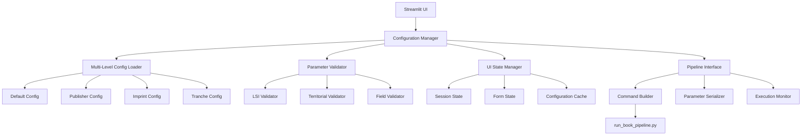

# Design Document

## Overview

The Streamlit UI Configuration Enhancement design creates a comprehensive interface for managing the multi-level configuration system in Codexes Factory. The design focuses on enhancing the existing Book Pipeline page and related UI components to support all current parameters while maintaining usability and performance.

## Architecture

### Enhanced UI Architecture



## Components and Interfaces

### 1. Enhanced Configuration Manager

**Purpose**: Central component for managing multi-level configurations and UI state

**Key Features**:
- Load and merge configurations from all levels
- Validate configuration parameters
- Handle configuration inheritance and overrides
- Manage UI state and form data

**Implementation**:
```python
class EnhancedConfigurationManager:
    def __init__(self):
        self.config_loader = MultiLevelConfigLoader()
        self.validator = ConfigurationValidator()
        self.ui_state = UIStateManager()
    
    def load_available_configs(self) -> Dict[str, List[str]]
    def merge_configurations(self, publisher: str, imprint: str, tranche: str) -> Dict[str, Any]
    def validate_configuration(self, config: Dict[str, Any]) -> ValidationResult
    def get_parameter_groups(self) -> Dict[str, List[str]]
    def save_configuration_snapshot(self, config: Dict[str, Any]) -> str
```

### 2. Dynamic Configuration Loader

**Purpose**: Scan and load configuration files from the file system

**Key Features**:
- Scan configs/ directory for available configurations
- Load and parse JSON configuration files
- Handle configuration file validation
- Provide fallback for missing configurations

**Implementation**:
```python
class DynamicConfigurationLoader:
    def scan_publishers(self) -> List[str]
    def scan_imprints(self, publisher: str = None) -> List[str]
    def scan_tranches(self, imprint: str = None) -> List[str]
    def load_configuration_file(self, config_type: str, name: str) -> Dict[str, Any]
    def validate_configuration_structure(self, config: Dict[str, Any], config_type: str) -> bool
```

### 3. Parameter Group Manager

**Purpose**: Organize parameters into logical groups for UI presentation

**Key Features**:
- Group related parameters together
- Handle parameter dependencies and visibility
- Provide parameter metadata (help text, validation rules)
- Support dynamic parameter groups based on configuration

**Parameter Groups**:
- **Core Settings**: Basic publishing information (publisher, imprint, tranche)
- **LSI Configuration**: Lightning Source specific settings, field mappings
- **Territorial Pricing**: Multi-currency pricing and discounts
- **Physical Specifications**: Trim size, page count, binding options
- **Metadata Defaults**: BISAC, Thema, contributor information
- **Distribution Settings**: Submission methods, carton quantities
- **Pipeline Control**: Stage selection, book selection, execution options
- **LLM & AI Configuration**: Model parameters, retry settings, field completion rules
- **Debug & Monitoring**: Debug settings, logging, validation rules, performance monitoring
- **Complete Configuration Preview**: Mandatory final configuration inspection before submission

**Implementation**:
```python
class ParameterGroupManager:
    def get_parameter_groups(self) -> Dict[str, ParameterGroup]
    def get_group_parameters(self, group_name: str) -> List[Parameter]
    def validate_parameter_dependencies(self, params: Dict[str, Any]) -> List[str]
    def get_parameter_help_text(self, param_name: str) -> str
```

### 4. Enhanced UI Components

**Purpose**: Streamlit components for configuration management with complete parameter inspection

**Key Features**:
- Configuration selection dropdowns with dynamic loading
- Parameter input widgets with validation
- Expandable parameter groups with display mode controls (Simple/Advanced/Expert)
- **Mandatory complete configuration preview before submission**
- Real-time validation feedback
- Command-line preview showing exact parameters being passed
- Configuration comparison and diff viewing

**Implementation**:
```python
class ConfigurationUI:
    def render_configuration_selector(self) -> Tuple[str, str, str]
    def render_parameter_group(self, group: ParameterGroup, display_mode: str) -> Dict[str, Any]
    def render_complete_configuration_preview(self, config: Dict[str, Any]) -> None
    def render_command_line_preview(self, command: List[str]) -> None
    def render_validation_results(self, results: ValidationResult) -> None
    def render_parameter_inspector(self, config: Dict[str, Any]) -> None
    def render_configuration_diff(self, config1: Dict, config2: Dict) -> None
    def render_execution_monitor(self, process: subprocess.Popen) -> None
```

### 5. Configuration Validator

**Purpose**: Validate configuration parameters and combinations

**Key Features**:
- Real-time parameter validation
- Cross-parameter dependency checking
- LSI-specific validation rules
- Territorial pricing validation

**Implementation**:
```python
class ConfigurationValidator:
    def validate_lsi_parameters(self, config: Dict[str, Any]) -> ValidationResult
    def validate_territorial_pricing(self, config: Dict[str, Any]) -> ValidationResult
    def validate_physical_specifications(self, config: Dict[str, Any]) -> ValidationResult
    def validate_parameter_dependencies(self, config: Dict[str, Any]) -> ValidationResult
```

### 6. Command Builder and Serializer

**Purpose**: Convert UI configuration to command-line arguments

**Key Features**:
- Build command-line arguments from UI state
- Handle complex parameter serialization
- Support file uploads and temporary file management
- Generate audit-ready command logs

**Implementation**:
```python
class CommandBuilder:
    def build_pipeline_command(self, config: Dict[str, Any]) -> List[str]
    def serialize_complex_parameters(self, params: Dict[str, Any]) -> Dict[str, str]
    def handle_file_uploads(self, files: Dict[str, Any]) -> Dict[str, str]
    def generate_command_audit_log(self, command: List[str]) -> str
```

## Data Models

### Configuration Parameter
```python
@dataclass
class ConfigurationParameter:
    name: str
    display_name: str
    parameter_type: str  # text, number, select, multiselect, file, checkbox
    default_value: Any
    help_text: str
    validation_rules: List[str]
    dependencies: List[str]
    group: str
    required: bool = False
    options: List[str] = None
```

### Parameter Group
```python
@dataclass
class ParameterGroup:
    name: str
    display_name: str
    description: str
    parameters: List[ConfigurationParameter]
    expanded_by_default: bool = False
    dependencies: List[str] = None
```

### Configuration State
```python
@dataclass
class ConfigurationState:
    publisher: str
    imprint: str
    tranche: str
    parameters: Dict[str, Any]
    validation_results: ValidationResult
    last_updated: datetime
    configuration_hash: str
```

### Validation Result
```python
@dataclass
class ValidationResult:
    is_valid: bool
    errors: List[ValidationError]
    warnings: List[ValidationWarning]
    parameter_status: Dict[str, str]  # parameter_name -> status
```

## User Interface Design

### Enhanced Book Pipeline Page Layout

```
┌─────────────────────────────────────────────────────────────┐
│ 🚀 Book Production Pipeline                                  │
├─────────────────────────────────────────────────────────────┤
│ Configuration Selection                                      │
│ ┌─────────────┬─────────────┬─────────────┬─────────────┐   │
│ │ Publisher   │ Imprint     │ Tranche     │ Load Config │   │
│ │ [Dropdown]  │ [Dropdown]  │ [Dropdown]  │ [Button]    │   │
│ └─────────────┴─────────────┴─────────────┴─────────────┘   │
├─────────────────────────────────────────────────────────────┤
│ Display Mode: [Simple] [Advanced] [Expert]                  │
├─────────────────────────────────────────────────────────────┤
│ ▼ Core Settings                                             │
│   ├ Schedule File: [File Upload/Select]                     │
│   ├ Primary Model: [Dropdown]                               │
│   └ Verifier Model: [Dropdown]                              │
├─────────────────────────────────────────────────────────────┤
│ ▼ Pipeline Stages                                           │
│   ├ Start Stage: [Dropdown]                                 │
│   ├ End Stage: [Dropdown]                                   │
│   └ Stage Options: [Checkboxes]                             │
├─────────────────────────────────────────────────────────────┤
│ ▼ LSI Configuration                                         │
│   ├ Lightning Source Account: [Text Input]                  │
│   ├ Territorial Pricing: [Expandable Table]                 │
│   ├ Physical Specifications: [Form Fields]                  │
│   ├ Field Overrides: [Key-Value Editor]                     │
│   └ Field Mapping Strategies: [Advanced Config]             │
├─────────────────────────────────────────────────────────────┤
│ ▼ LLM & AI Configuration                                    │
│   ├ Model Parameters: [JSON Editor]                         │
│   ├ Retry Configuration: [Number Inputs]                    │
│   ├ Monitoring Settings: [Checkboxes]                       │
│   └ Field Completion Rules: [Rule Editor]                   │
├─────────────────────────────────────────────────────────────┤
│ ▼ Debug & Monitoring                                        │
│   ├ Debug Settings: [Checkboxes]                            │
│   ├ Logging Options: [Multi-select]                         │
│   ├ Validation Rules: [Rule Editor]                         │
│   └ Performance Monitoring: [Toggles]                       │
├─────────────────────────────────────────────────────────────┤
│ ▼ Complete Configuration Preview (MANDATORY)                │
│   ├ Final Merged Configuration: [JSON Viewer]               │
│   ├ Command Line Preview: [Code Block]                      │
│   ├ Parameter Count: [Summary Stats]                        │
│   └ Configuration Hash: [Verification]                      │
├─────────────────────────────────────────────────────────────┤
│ ▼ Pre-Submission Validation                                 │
│   ├ Configuration Validation: [Status Grid]                 │
│   ├ Parameter Dependencies: [Dependency Tree]               │
│   ├ LSI Compliance Check: [Compliance Report]               │
│   └ Execution Readiness: [Go/No-Go Status]                  │
├─────────────────────────────────────────────────────────────┤
│ [Run Pipeline] [Save Configuration] [Export Configuration]  │
│ [Download Config Snapshot] [Compare with Previous]          │
└─────────────────────────────────────────────────────────────┘
```

### Configuration Management Page

```
┌─────────────────────────────────────────────────────────────┐
│ ⚙️ Configuration Management                                  │
├─────────────────────────────────────────────────────────────┤
│ Configuration Type: [Publisher] [Imprint] [Tranche]         │
├─────────────────────────────────────────────────────────────┤
│ Available Configurations:                                   │
│ ┌─────────────────────────────────────────────────────────┐ │
│ │ ├ Publishers/                                           │ │
│ │ │ ├ nimble_books.json                                   │ │
│ │ │ └ academic_publishers_inc.json                        │ │
│ │ ├ Imprints/                                             │ │
│ │ │ ├ xynapse_traces.json                                 │ │
│ │ │ └ tech_books_press.json                               │ │
│ │ └ Tranches/                                             │ │
│ │   └ xynapse_tranche_1.json                              │ │
│ └─────────────────────────────────────────────────────────┘ │
├─────────────────────────────────────────────────────────────┤
│ Actions:                                                    │
│ [Upload New] [Download Template] [Edit Selected] [Delete]   │
├─────────────────────────────────────────────────────────────┤
│ Configuration Editor: [JSON Editor with Validation]         │
└─────────────────────────────────────────────────────────────┘
```

## Implementation Strategy

### Phase 1: Core Configuration Management
1. **Enhanced Configuration Loader**: Extend existing configuration loading to support all parameter types
2. **Parameter Group Organization**: Organize existing parameters into logical groups
3. **Dynamic Configuration Discovery**: Implement scanning of configuration directories
4. **Basic Validation**: Add real-time validation for core parameters

### Phase 2: UI Enhancement
1. **Expandable Parameter Groups**: Replace flat form with organized, expandable sections
2. **Configuration Selection**: Add publisher/imprint/tranche selection dropdowns
3. **Parameter Widgets**: Implement appropriate input widgets for different parameter types
4. **Validation Feedback**: Add real-time validation feedback and error highlighting

### Phase 3: Advanced Features
1. **Configuration Preview**: Add configuration preview and comparison functionality
2. **File Management**: Implement configuration file upload/download
3. **Audit Trail**: Add configuration history and audit logging
4. **Batch Operations**: Support batch configuration and execution

### Phase 4: Advanced Features Integration (Core Requirement 10)
1. **Advanced LLM Configuration**: Full LLM parameter management with model selection, retry parameters, and monitoring settings
2. **Field Mapping Configuration**: UI for configuring custom field mapping strategies
3. **Validation Rule Management**: Custom validation rule configuration and testing
4. **Debug and Monitoring Dashboard**: Advanced debugging modes, detailed logging options, and real-time monitoring

## Error Handling

### Configuration Loading Errors
- **Missing Configuration Files**: Provide clear error messages and fallback to defaults
- **Invalid JSON Structure**: Show JSON validation errors with line numbers
- **Parameter Validation Errors**: Highlight invalid parameters with specific error messages
- **Configuration Conflicts**: Show inheritance chain and conflict resolution

### UI State Management
- **Session State Persistence**: Maintain form state across page refreshes
- **Configuration Caching**: Cache loaded configurations to improve performance
- **Error Recovery**: Graceful handling of UI errors with user-friendly messages
- **Validation State**: Maintain validation state and provide real-time feedback

## Testing Strategy

### Component Testing
- Test configuration loading and merging logic
- Test parameter validation rules
- Test UI component rendering and interaction
- Test command building and serialization

### Integration Testing
- Test end-to-end configuration flow from UI to pipeline execution
- Test configuration file management (upload/download)
- Test multi-level configuration inheritance
- Test validation across different configuration combinations

### User Experience Testing
- Test UI responsiveness and performance with large configurations
- Test form usability and parameter organization
- Test error handling and user feedback
- Test configuration preview and comparison features

## Performance Considerations

### Configuration Loading
- **Lazy Loading**: Load configurations only when needed
- **Caching Strategy**: Cache frequently accessed configurations
- **Background Loading**: Load available configurations in background
- **Incremental Updates**: Update only changed configurations

### UI Responsiveness
- **Progressive Rendering**: Render parameter groups progressively
- **Debounced Validation**: Debounce real-time validation to avoid excessive calls
- **Efficient State Management**: Optimize Streamlit session state usage
- **Minimal Re-renders**: Minimize unnecessary UI re-renders

## Security Considerations

### Configuration File Security
- **Input Validation**: Validate all uploaded configuration files
- **Path Traversal Protection**: Prevent directory traversal attacks
- **File Size Limits**: Limit configuration file sizes
- **Content Sanitization**: Sanitize configuration content before processing

### Parameter Security
- **Input Sanitization**: Sanitize all user inputs
- **Command Injection Prevention**: Prevent command injection in pipeline execution
- **Sensitive Data Handling**: Secure handling of API keys and credentials
- **Access Control**: Implement appropriate access controls for configuration management