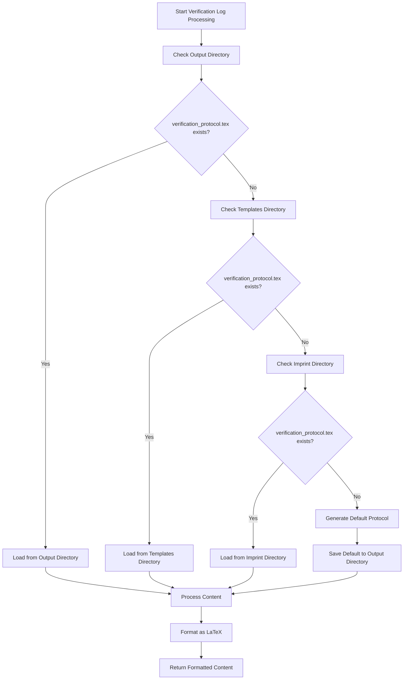
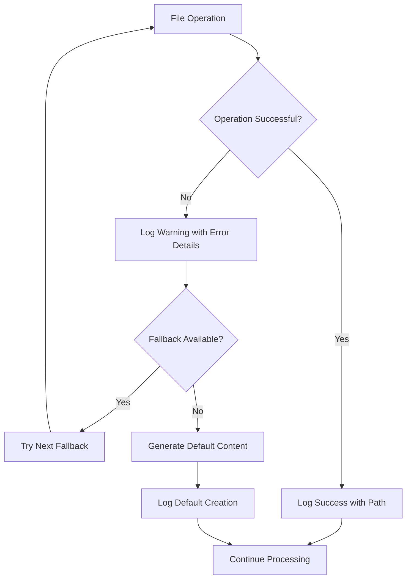

# Verification Load File Fix - Design Document

## Overview

This design implements a robust verification protocol file loading system with intelligent fallback mechanisms, comprehensive error handling, and automatic default content generation for the backmatter processor.

## Architecture

### File Loading Strategy



### Error Handling Flow



## Components and Interfaces

### 1. Enhanced Verification Protocol Loader

```python
class VerificationProtocolLoader:
    """Handles loading verification protocol files with robust fallback mechanisms."""
    
    def __init__(self, output_dir: Path, templates_dir: Optional[Path] = None, 
                 imprint_dir: Optional[Path] = None):
        self.output_dir = Path(output_dir)
        self.templates_dir = Path(templates_dir) if templates_dir else None
        self.imprint_dir = Path(imprint_dir) if imprint_dir else None
        self.logger = logging.getLogger(__name__)
    
    def load_verification_protocol(self) -> str:
        """Load verification protocol with intelligent fallback."""
        
    def _try_load_from_path(self, path: Path) -> Optional[str]:
        """Attempt to load content from specific path."""
        
    def _create_default_protocol(self, verification_stats: Dict) -> str:
        """Create comprehensive default verification protocol."""
        
    def _save_default_protocol(self, content: str) -> bool:
        """Save default protocol to output directory for future use."""
```

### 2. Verification Statistics Calculator

```python
class VerificationStatsCalculator:
    """Calculates verification statistics for inclusion in protocol."""
    
    def calculate_stats(self, quotes: List[Dict]) -> Dict[str, Any]:
        """Calculate comprehensive verification statistics."""
        
    def format_stats_for_latex(self, stats: Dict) -> str:
        """Format statistics for LaTeX inclusion."""
```

### 3. Default Protocol Generator

```python
class DefaultProtocolGenerator:
    """Generates comprehensive default verification protocols."""
    
    def generate_protocol(self, stats: Dict, metadata: Dict) -> str:
        """Generate complete default verification protocol."""
        
    def _generate_header_section(self, metadata: Dict) -> str:
        """Generate protocol header with metadata."""
        
    def _generate_statistics_section(self, stats: Dict) -> str:
        """Generate verification statistics section."""
        
    def _generate_process_section(self, metadata: Dict) -> str:
        """Generate process documentation section."""
```

## Data Models

### Verification Protocol Configuration

```python
@dataclass
class VerificationProtocolConfig:
    """Configuration for verification protocol loading and generation."""
    output_dir: Path
    templates_dir: Optional[Path] = None
    imprint_dir: Optional[Path] = None
    auto_create_default: bool = True
    save_default: bool = True
    include_statistics: bool = True
    include_timestamps: bool = True
```

### Verification Statistics

```python
@dataclass
class VerificationStats:
    """Statistics about the verification process."""
    total_quotes: int
    verified_quotes: int
    unverified_quotes: int
    verification_percentage: float
    sources_count: int
    unique_authors: int
    processing_timestamp: datetime
    verification_complete: bool
```

### Protocol Content Structure

```python
@dataclass
class ProtocolContent:
    """Structure for verification protocol content."""
    header: str
    introduction: str
    statistics_section: str
    process_section: str
    verification_details: str
    footer: str
    full_content: str
```

## Implementation Details

### Enhanced File Loading Logic

```python
def load_verification_protocol(self) -> str:
    """Load verification protocol with comprehensive fallback strategy."""
    
    # Define search paths in priority order
    search_paths = [
        (self.output_dir / "verification_protocol.tex", "output directory"),
        (self.templates_dir / "verification_protocol.tex" if self.templates_dir else None, "templates directory"),
        (self.imprint_dir / "verification_protocol.tex" if self.imprint_dir else None, "imprint directory")
    ]
    
    # Filter out None paths
    search_paths = [(path, desc) for path, desc in search_paths if path is not None]
    
    # Try each path in order
    for path, description in search_paths:
        try:
            if path.exists():
                content = self._try_load_from_path(path)
                if content:
                    self.logger.info(f"✅ Successfully loaded verification protocol from {description}: {path}")
                    return content
                else:
                    self.logger.warning(f"⚠️ Found verification protocol file but failed to read content: {path}")
            else:
                self.logger.debug(f"🔍 Verification protocol not found in {description}: {path}")
        except Exception as e:
            self.logger.warning(f"⚠️ Error checking verification protocol in {description}: {e}")
    
    # No file found, create default
    self.logger.info("📝 No verification protocol found in any location. Creating default protocol.")
    return self._create_default_protocol()
```

### Default Protocol Generation

```python
def _create_default_protocol(self) -> str:
    """Create comprehensive default verification protocol."""
    from datetime import datetime
    
    current_time = datetime.now()
    timestamp = current_time.strftime("%Y-%m-%d %H:%M:%S")
    
    # Calculate verification statistics if quotes are available
    stats = self._calculate_verification_stats() if hasattr(self, 'quotes') else {}
    
    protocol_content = f"""% Verification Protocol
% Generated automatically on {timestamp}

\\section{{Verification Protocol}}

This document provides a comprehensive record of the verification process for all quotations included in this collection.

\\subsection{{Processing Overview}}

\\begin{{itemize}}
    \\item Processing Date: {timestamp}
    \\item Verification System: Automated Publishing Pipeline
    \\item Protocol Version: 2.0
    \\item Status: {"Complete" if stats.get('verification_complete', False) else "In Progress"}
\\end{{itemize}}

\\subsection{{Verification Statistics}}

\\begin{{itemize}}
    \\item Total Quotations: {stats.get('total_quotes', 'N/A')}
    \\item Verified Quotations: {stats.get('verified_quotes', 'N/A')}
    \\item Verification Rate: {stats.get('verification_percentage', 'N/A')}\\%
    \\item Unique Sources: {stats.get('sources_count', 'N/A')}
    \\item Unique Authors: {stats.get('unique_authors', 'N/A')}
\\end{{itemize}}

\\subsection{{Verification Process}}

The verification process includes the following steps:

\\begin{{enumerate}}
    \\item Source Authentication: Each quotation is traced to its original source
    \\item Accuracy Verification: Quotation text is compared against authoritative sources
    \\item Attribution Validation: Author and publication details are confirmed
    \\item Context Review: Quotations are reviewed for appropriate context
    \\item Final Approval: Verified quotations are marked for inclusion
\\end{{enumerate}}

\\subsection{{Quality Assurance}}

\\begin{{itemize}}
    \\item All quotations undergo multi-stage verification
    \\item Sources are cross-referenced with authoritative databases
    \\item Publication details are validated through ISBN lookup
    \\item Editorial review ensures accuracy and appropriateness
\\end{{itemize}}

\\subsection{{Documentation Standards}}

This verification log follows academic standards for source documentation and maintains a complete audit trail of the verification process.

% End of verification protocol
"""
    
    # Save the default protocol for future use
    try:
        protocol_path = self.output_dir / "verification_protocol.tex"
        self.output_dir.mkdir(parents=True, exist_ok=True)
        
        with open(protocol_path, 'w', encoding='utf-8') as f:
            f.write(protocol_content)
        
        self.logger.info(f"💾 Saved default verification protocol to: {protocol_path}")
    except Exception as e:
        self.logger.warning(f"⚠️ Could not save default verification protocol: {e}")
    
    return protocol_content
```

### Statistics Integration

```python
def _calculate_verification_stats(self) -> Dict[str, Any]:
    """Calculate comprehensive verification statistics."""
    if not hasattr(self, 'quotes') or not self.quotes:
        return {}
    
    total_quotes = len(self.quotes)
    verified_quotes = sum(1 for q in self.quotes if q.get('is_verified', False))
    unverified_quotes = total_quotes - verified_quotes
    verification_percentage = round((verified_quotes / total_quotes) * 100, 1) if total_quotes > 0 else 0
    
    # Count unique sources and authors
    unique_sources = set()
    unique_authors = set()
    
    for quote in self.quotes:
        if quote.get('source'):
            unique_sources.add(quote['source'])
        if quote.get('author'):
            unique_authors.add(quote['author'])
    
    return {
        'total_quotes': total_quotes,
        'verified_quotes': verified_quotes,
        'unverified_quotes': unverified_quotes,
        'verification_percentage': verification_percentage,
        'sources_count': len(unique_sources),
        'unique_authors': len(unique_authors),
        'verification_complete': verified_quotes == total_quotes
    }
```

## Error Handling

### File Operation Error Handling

```python
def _try_load_from_path(self, path: Path) -> Optional[str]:
    """Safely attempt to load content from a specific path."""
    try:
        if not path.exists():
            return None
        
        if not path.is_file():
            self.logger.warning(f"⚠️ Path exists but is not a file: {path}")
            return None
        
        with open(path, 'r', encoding='utf-8') as f:
            content = f.read().strip()
        
        if not content:
            self.logger.warning(f"⚠️ Verification protocol file is empty: {path}")
            return None
        
        return content
        
    except PermissionError:
        self.logger.error(f"❌ Permission denied reading verification protocol: {path}")
        return None
    except UnicodeDecodeError as e:
        self.logger.error(f"❌ Encoding error reading verification protocol: {path} - {e}")
        return None
    except Exception as e:
        self.logger.error(f"❌ Unexpected error reading verification protocol: {path} - {e}")
        return None
```

### Directory Creation Error Handling

```python
def _ensure_output_directory(self) -> bool:
    """Ensure output directory exists and is writable."""
    try:
        self.output_dir.mkdir(parents=True, exist_ok=True)
        
        # Test write permissions
        test_file = self.output_dir / ".write_test"
        test_file.write_text("test")
        test_file.unlink()
        
        return True
        
    except PermissionError:
        self.logger.error(f"❌ Permission denied creating output directory: {self.output_dir}")
        return False
    except Exception as e:
        self.logger.error(f"❌ Error creating output directory: {self.output_dir} - {e}")
        return False
```

## Testing Strategy

### Unit Tests

1. **File Loading Tests**
   - Test loading from each search location
   - Test fallback behavior when files are missing
   - Test error handling for corrupted files
   - Test permission error handling

2. **Default Protocol Generation Tests**
   - Test default content generation
   - Test statistics calculation
   - Test LaTeX formatting
   - Test file saving functionality

3. **Error Handling Tests**
   - Test graceful handling of missing directories
   - Test handling of permission errors
   - Test handling of corrupted files
   - Test fallback mechanisms

### Integration Tests

1. **End-to-End Verification Processing**
   - Test complete verification log generation
   - Test integration with backmatter processor
   - Test LaTeX compilation of generated content

2. **Configuration Tests**
   - Test different directory configurations
   - Test with and without templates directory
   - Test with different imprint configurations

## Performance Considerations

### File System Operations
- Use Path objects for cross-platform compatibility
- Minimize file system calls through intelligent caching
- Implement lazy loading for optional directories

### Memory Management
- Stream large files instead of loading entirely into memory
- Clean up temporary files and resources
- Use context managers for file operations

### Error Recovery
- Implement exponential backoff for transient errors
- Cache successful file loads to avoid repeated reads
- Provide clear progress indicators for long operations

## Security Considerations

### File Access
- Validate file paths to prevent directory traversal
- Check file permissions before attempting operations
- Use safe file encoding (UTF-8) consistently

### Content Validation
- Sanitize file content before processing
- Validate LaTeX content for safety
- Prevent injection of malicious content

## Migration Strategy

### Phase 1: Enhanced Error Handling
- Improve existing error messages and logging
- Add comprehensive exception handling
- Implement graceful fallback mechanisms

### Phase 2: Default Protocol Generation
- Add automatic default protocol creation
- Implement statistics calculation
- Add protocol saving functionality

### Phase 3: Advanced Features
- Add protocol template system
- Implement custom protocol validation
- Add configuration options for protocol generation

## Backward Compatibility

- Existing verification protocol files continue to work unchanged
- New features are additive and don't break existing workflows
- Default behavior maintains compatibility with current systems
- Enhanced logging provides better visibility without changing functionality