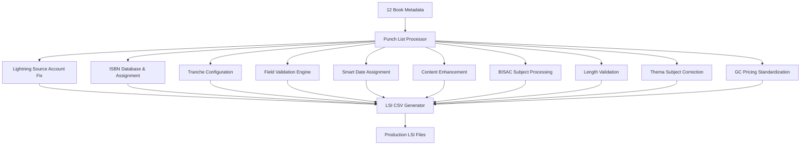

# Design Document

## Overview

The Xynapse Tranche 1 design addresses 15 specific punch list items to ensure successful LSI metadata generation for 12 xynapse traces books. The design focuses on targeted fixes for each identified issue rather than broad architectural changes, leveraging the existing LSI field enhancement infrastructure.

## Architecture

### Punch List Processing Pipeline



## Components and Interfaces

### 1. Lightning Source Account Manager

**Purpose**: Handle Lightning Source account configuration and field exclusions

**Key Features**:
- Set Lightning Source Account # to "6024045" for all books
- Exclude "Metadata Contact Dictionary" from CSV output
- Ensure Parent ISBN remains empty for this tranche

**Implementation**:
```python
class LightningSourceAccountManager:
    def set_account_number(self, metadata: CodexMetadata) -> None
    def exclude_metadata_contact_dictionary(self, csv_headers: List[str]) -> List[str]
    def clear_parent_isbn(self, metadata: CodexMetadata) -> None
```

### 2. ISBN Database Manager

**Purpose**: Initialize and manage ISBN database with real data

**Key Features**:
- Load ISBN database from real data source
- Assign unique ISBNs to each book in tranche
- Track ISBN assignment status
- Prevent duplicate ISBN assignments

**Implementation**:
```python
class ISBNDatabaseManager:
    def initialize_database(self, data_source: str) -> None
    def assign_unique_isbn(self, book_id: str) -> str
    def mark_isbn_assigned(self, isbn: str) -> None
    def validate_isbn_availability(self, isbn: str) -> bool
```

### 3. Tranche Configuration Manager

**Purpose**: Apply consistent configuration across all books in the tranche

**Key Features**:
- Load tranche-level configuration settings
- Override individual book settings with tranche settings
- Ensure consistency across all 12 books
- Handle configuration conflicts with tranche priority

**Implementation**:
```python
class TrancheConfigurationManager:
    def load_tranche_config(self, tranche_id: str) -> TrancheConfig
    def apply_tranche_settings(self, metadata: CodexMetadata, config: TrancheConfig) -> CodexMetadata
    def validate_consistency(self, metadata_list: List[CodexMetadata]) -> ValidationResult
```

### 4. Field Validation Engine

**Purpose**: Validate fields against LSI valid value lists

**Key Features**:
- Validate rendition booktype against lsi_valid_rendition_booktypes.txt
- Validate Contributor Role One against lsi_valid_contributor_codes.csv
- Provide specific error messages with valid options
- Support dynamic validation list updates

**Implementation**:
```python
class FieldValidationEngine:
    def load_valid_rendition_booktypes(self) -> List[str]
    def load_valid_contributor_codes(self) -> List[str]
    def validate_rendition_booktype(self, booktype: str) -> ValidationResult
    def validate_contributor_role(self, role: str) -> ValidationResult
```

### 5. Smart Publication Date Assigner

**Purpose**: Intelligently assign publication dates across Tuesdays

**Key Features**:
- Extract month/year from schedule.json
- Identify all Tuesdays in target month
- Distribute 12 books evenly across available Tuesdays
- Avoid date conflicts and ensure proper spacing

**Implementation**:
```python
class SmartPublicationDateAssigner:
    def extract_schedule_info(self, schedule_path: str) -> ScheduleInfo
    def find_tuesdays_in_month(self, year: int, month: int) -> List[datetime]
    def distribute_books_across_dates(self, books: List[CodexMetadata], dates: List[datetime]) -> Dict[str, datetime]
```

### 6. Enhanced Content Generator

**Purpose**: Generate enhanced annotations combining LLM results with boilerplate

**Key Features**:
- Combine LLM completion results with configuration boilerplate
- Source boilerplate strings from configuration dictionary
- Ensure proper formatting and content flow
- Handle content length limits appropriately

**Implementation**:
```python
class EnhancedContentGenerator:
    def load_boilerplate_dictionary(self, config_path: str) -> Dict[str, str]
    def combine_llm_and_boilerplate(self, llm_result: str, boilerplate: Dict[str, str]) -> str
    def format_annotation_content(self, content: str) -> str
```

### 7. BISAC Subject Processor

**Purpose**: Handle BISAC subject formatting and tranche-level overrides

**Key Features**:
- Format BISAC subjects as category names only (no codes)
- Apply consistent formatting to BISAC Subject, Subject 2, and Subject 3
- Support tranche-level BISAC subject overrides
- Validate BISAC category names against valid lists

**Implementation**:
```python
class BISACSubjectProcessor:
    def format_bisac_subject(self, subject: str) -> str
    def apply_tranche_bisac_override(self, metadata: CodexMetadata, override: str) -> CodexMetadata
    def validate_bisac_category_name(self, category: str) -> bool
```

### 8. Content Length Validator

**Purpose**: Validate and enforce content length limits

**Key Features**:
- Validate short description is ≤ 350 bytes
- Truncate content while preserving meaning
- Log original and truncated content for audit
- Report length violations in validation reports

**Implementation**:
```python
class ContentLengthValidator:
    def validate_short_description_length(self, description: str) -> ValidationResult
    def truncate_preserving_meaning(self, content: str, max_bytes: int) -> str
    def log_truncation(self, original: str, truncated: str) -> None
```

### 9. Thema Subject Corrector

**Purpose**: Correct truncated Thema subjects to full multi-letter codes

**Key Features**:
- Identify truncated single-letter Thema codes
- Restore full multi-letter Thema subject codes
- Validate corrected codes against Thema classification
- Handle multiple Thema subjects consistently

**Implementation**:
```python
class ThemaSubjectCorrector:
    def identify_truncated_codes(self, thema_code: str) -> bool
    def restore_full_thema_code(self, truncated_code: str) -> str
    def validate_thema_code(self, code: str) -> bool
```

### 10. GC Market Pricing Standardizer

**Purpose**: Standardize GC market pricing to match US List Price

**Key Features**:
- Identify all GC market price fields
- Set GC market prices equal to US List Price
- Ensure consistency across all GC markets
- Validate pricing consistency in final output

**Implementation**:
```python
class GCMarketPricingStandardizer:
    def identify_gc_market_fields(self, headers: List[str]) -> List[str]
    def standardize_gc_pricing(self, metadata: CodexMetadata, us_price: str) -> CodexMetadata
    def validate_gc_pricing_consistency(self, metadata: CodexMetadata) -> ValidationResult
```

## Data Models

### Punch List Item
```python
@dataclass
class PunchListItem:
    id: int
    description: str
    component: str
    priority: int
    validation_rule: Optional[str]
    fix_applied: bool = False
```

### Tranche Configuration
```python
@dataclass
class TrancheConfig:
    tranche_id: str
    lightning_source_account: str
    exclude_fields: List[str]
    bisac_subject_override: Optional[str]
    boilerplate_dictionary: Dict[str, str]
    publication_month: int
    publication_year: int
```

### Validation Result
```python
@dataclass
class ValidationResult:
    field_name: str
    is_valid: bool
    error_message: Optional[str]
    suggested_values: List[str]
    punch_list_item: int
```

## Error Handling

### Punch List Item Failures
- **Account Configuration Errors**: Clear error messages with configuration file references
- **ISBN Assignment Failures**: Detailed logging with available ISBN counts
- **Validation Failures**: Specific error messages with valid value lists
- **Date Assignment Conflicts**: Alternative date suggestions with conflict resolution

### Recovery Strategies
- **Partial Processing**: Continue with remaining punch list items when individual items fail
- **Fallback Values**: Use safe default values when preferred values are invalid
- **Manual Intervention**: Clear indicators when human review is required for specific items

## Testing Strategy

### Punch List Item Testing
- Test each of the 15 punch list items independently
- Verify fixes are applied correctly and consistently
- Test error handling for each punch list item
- Validate integration between related punch list items

### End-to-End Testing
- Process all 12 books with all punch list fixes applied
- Verify LSI CSV output meets all requirements
- Test batch processing consistency
- Validate final output against LSI specifications

## Implementation Priority

### Phase 1: Critical Infrastructure (Items 1-5)
1. Lightning Source Account # configuration
2. Metadata Contact Dictionary exclusion
3. Parent ISBN handling
4. ISBN database initialization and assignment
5. Tranche configuration system

### Phase 2: Validation and Content (Items 6-10)
6. Rendition booktype validation
7. Contributor role validation
8. Smart publication date assignment
9. Enhanced annotation generation
10. BISAC subject processing

### Phase 3: Content Quality (Items 11-15)
11. BISAC subject formatting
12. Tranche BISAC overrides
13. Short description length validation
14. Thema subject correction
15. GC market pricing standardization