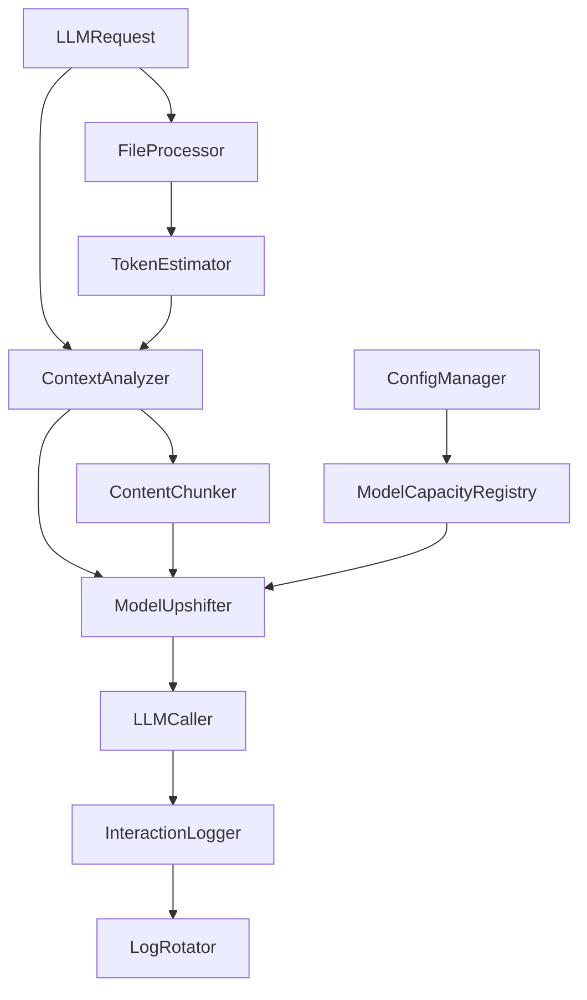

# Design Document

## Overview

The intelligent context management feature enhances nimble_llm_caller with comprehensive capabilities:

1. **Context-Size-Aware Safe Submit**: Automatically detects when request context exceeds model capacity and handles it via user-configurable preference for upshifting to more capable models or chunking content
2. **File Attachment Support**: Enables attaching files to LLM requests with automatic content processing and token estimation
3. **Interaction Logging**: Provides comprehensive logging of all LLM interactions for debugging and tracking
4. **Distribution Support**: Ensures the library can be distributed via private PyPI and Pyx

The design integrates seamlessly with the existing architecture, extending the `LLMRequest` model, `ConfigManager`, and `LLMCaller` classes without breaking backward compatibility.

## Architecture

### Core Components



### Component Responsibilities

- **ContextAnalyzer**: Calculates total context size including text and file content
- **ModelUpshifter**: Handles automatic model selection based on context requirements
- **FileProcessor**: Processes attached files and converts them to model-compatible formats
- **TokenEstimator**: Estimates token usage for different content types
- **ModelCapacityRegistry**: Maintains model capacity and priority information
- **InteractionLogger**: Logs all LLM requests and responses with detailed metadata
- **LogRotator**: Manages log file rotation and archiving when size limits are exceeded
- **ContentChunker**: Splits oversized content into manageable chunks based on user preference
- **ContextStrategy**: Manages user preference between upshifting and chunking approaches

## Components and Interfaces

### 1. Enhanced LLMRequest Model

```python
class FileAttachment(BaseModel):
    """Represents a file attachment."""
    file_path: str
    content_type: str
    processing_options: Dict[str, Any] = Field(default_factory=dict)
    estimated_tokens: Optional[int] = None

class LLMRequest(BaseModel):
    # Existing fields...
    attached_files: List[FileAttachment] = Field(default_factory=list)
    context_management: Dict[str, Any] = Field(default_factory=dict)
    allow_model_upshift: bool = Field(default=True)
    max_upshift_cost_multiplier: float = Field(default=3.0)
```

### 2. Context Analysis System

```python
class ContextAnalyzer:
    """Analyzes request context size and requirements."""
    
    def analyze_request(self, request: LLMRequest) -> ContextAnalysis:
        """Analyze total context requirements."""
        
    def estimate_tokens(self, content: str, model: str) -> int:
        """Estimate token count for content."""
        
    def estimate_file_tokens(self, file_attachment: FileAttachment, model: str) -> int:
        """Estimate tokens for file content."""

class ContextAnalysis(BaseModel):
    total_estimated_tokens: int
    text_tokens: int
    file_tokens: int
    exceeds_capacity: bool
    recommended_models: List[str]
```

### 3. Model Capacity Registry

```python
class ModelCapacity(BaseModel):
    model_name: str
    max_context_tokens: int
    provider: str
    cost_multiplier: float
    supports_vision: bool = False
    supports_files: List[str] = Field(default_factory=list)

class ModelCapacityRegistry:
    """Manages model capacity information and upshift priorities."""
    
    def get_model_capacity(self, model: str) -> Optional[ModelCapacity]:
        """Get capacity info for a model."""
        
    def find_suitable_models(self, required_tokens: int, current_model: str) -> List[str]:
        """Find models that can handle the required context size."""
        
    def get_upshift_priority(self, from_model: str) -> List[str]:
        """Get prioritized list of models for upshifting."""
```

### 4. File Processing System

```python
class FileProcessor:
    """Processes file attachments for LLM consumption."""
    
    def process_file(self, file_attachment: FileAttachment) -> ProcessedFile:
        """Process a file attachment."""
        
    def extract_text_content(self, file_path: str, content_type: str) -> str:
        """Extract text from various file types."""
        
    def process_image(self, file_path: str, target_model: str) -> ProcessedImage:
        """Process image files for vision models."""

class ProcessedFile(BaseModel):
    original_path: str
    content_type: str
    processed_content: Union[str, Dict[str, Any]]
    estimated_tokens: int
    processing_metadata: Dict[str, Any]
```

### 5. Enhanced LLMCaller

```python
class LLMCaller:
    def __init__(self, 
                 context_analyzer: Optional[ContextAnalyzer] = None,
                 model_registry: Optional[ModelCapacityRegistry] = None,
                 file_processor: Optional[FileProcessor] = None,
                 interaction_logger: Optional[InteractionLogger] = None):
        # Existing initialization...
        self.context_analyzer = context_analyzer or ContextAnalyzer()
        self.model_registry = model_registry or ModelCapacityRegistry()
        self.file_processor = file_processor or FileProcessor()
        self.interaction_logger = interaction_logger or InteractionLogger()
    
    def call(self, request: LLMRequest) -> LLMResponse:
        """Enhanced call method with context management."""
        # 1. Log the incoming request
        self.interaction_logger.log_request(request)
        
        # 2. Process file attachments
        processed_request = self._process_attachments(request)
        
        # 3. Analyze context requirements
        context_analysis = self.context_analyzer.analyze_request(processed_request)
        
        # 4. Handle context overflow based on user preference (upshift or chunk)
        final_request = self._handle_context_overflow(processed_request, context_analysis)
        
        # 5. Execute the call
        response = self._execute_call(final_request)
        
        # 6. Log the response
        self.interaction_logger.log_response(response)
        
        return response
```

### 6. Interaction Logging System

```python
class InteractionLogger:
    """Logs all LLM interactions for debugging and tracking."""
    
    def __init__(self, log_file_path: str = "llm_interactions.log", 
                 max_log_size: int = 100 * 1024 * 1024):  # 100MB default
        self.log_file_path = log_file_path
        self.max_log_size = max_log_size
        self.log_rotator = LogRotator(log_file_path, max_log_size)
    
    def log_request(self, request: LLMRequest) -> None:
        """Log an LLM request with all relevant details."""
        
    def log_response(self, response: LLMResponse) -> None:
        """Log an LLM response with all relevant details."""
        
    def get_recent_interactions(self, count: int = 10) -> List[Dict[str, Any]]:
        """Retrieve recent interactions from the log."""

class LogRotator:
    """Handles log file rotation and archiving."""
    
    def rotate_if_needed(self) -> None:
        """Rotate log file if it exceeds size limit."""
        
    def archive_log(self, log_path: str) -> str:
        """Archive a log file with timestamp."""

### 7. Content Chunking System

```python
class ContentChunker:
    """Handles chunking of oversized content."""
    
    def chunk_content(self, content: str, max_tokens: int, overlap_tokens: int = 100) -> List[str]:
        """Split content into chunks that fit within token limits."""
        
    def reassemble_responses(self, responses: List[LLMResponse], original_request: LLMRequest) -> LLMResponse:
        """Combine multiple chunked responses into a single response."""

class ContextStrategy:
    """Manages user preference for handling context overflow."""
    
    def __init__(self, strategy: str = "upshift_first"):  # "upshift_first", "chunk_first", "upshift_only", "chunk_only"
        self.strategy = strategy
    
    def should_upshift_first(self) -> bool:
        """Determine if upshifting should be tried before chunking."""
        
    def should_chunk_first(self) -> bool:
        """Determine if chunking should be tried before upshifting."""
```

## Data Models

### Configuration Extensions

```python
# Extended ModelConfig in config_manager.py
@dataclass
class ModelConfig:
    # Existing fields...
    max_context_tokens: Optional[int] = None
    supports_vision: bool = False
    supported_file_types: List[str] = field(default_factory=list)
    upshift_priority: List[str] = field(default_factory=list)
    cost_multiplier: float = 1.0
```

### Context Management Configuration

```python
@dataclass
class ContextConfig:
    """Configuration for context management features."""
    enable_auto_upshift: bool = True
    max_cost_multiplier: float = 3.0
    preferred_providers: List[str] = field(default_factory=list)
    file_processing_options: Dict[str, Any] = field(default_factory=dict)
    token_estimation_model: str = "gpt-4o"  # Model to use for token estimation
```

## Error Handling

### Custom Exceptions

```python
class ContextOverflowError(Exception):
    """Raised when context exceeds all available model capacities."""
    
class FileProcessingError(Exception):
    """Raised when file processing fails."""
    
class ModelUpshiftError(Exception):
    """Raised when model upshifting fails."""
    
class LoggingError(Exception):
    """Raised when interaction logging fails."""
    
class ChunkingError(Exception):
    """Raised when content chunking fails."""
```

### Error Recovery Strategies

1. **Context Overflow**: Apply user-configured strategy (upshift first, chunk first, or single approach)
2. **File Processing Failures**: Fall back to text extraction, then skip file if necessary
3. **Model Unavailability**: Skip to next model in priority list
4. **API Key Missing**: Continue with available models only
5. **Logging Failures**: Continue operation without logging, log the failure separately
6. **Chunking Failures**: Fall back to upshifting if configured, otherwise return error
7. **Upshifting Failures**: Fall back to chunking if configured, otherwise return error

## Testing Strategy

### Unit Tests

1. **ContextAnalyzer Tests**
   - Token estimation accuracy
   - File content analysis
   - Model capacity checking

2. **FileProcessor Tests**
   - Various file type processing
   - Error handling for corrupted files
   - Token estimation for processed content

3. **ModelUpshifter Tests**
   - Priority-based model selection
   - Cost constraint enforcement
   - Provider preference handling

### Integration Tests

1. **End-to-End Context Management**
   - Large context automatic upshifting
   - File attachment processing pipeline
   - Multi-modal content handling

2. **Configuration Integration**
   - Custom model capacity definitions
   - Priority tree configuration
   - Backward compatibility verification

### Performance Tests

1. **Token Estimation Performance**
   - Large file processing speed
   - Memory usage with multiple attachments
   - Concurrent request handling

2. **Model Selection Efficiency**
   - Upshift decision speed
   - Cache effectiveness for repeated requests

## Implementation Phases

### Phase 1: Core Context Analysis
- Implement `ContextAnalyzer` with basic token estimation
- Add model capacity registry with default configurations
- Extend `LLMRequest` model with context management fields

### Phase 2: Model Upshifting
- Implement `ModelUpshifter` with priority-based selection
- Add configuration support for model capacities and priorities
- Integrate upshifting logic into `LLMCaller`

### Phase 3: File Attachment Support
- Implement `FileProcessor` for common file types
- Add file attachment fields to `LLMRequest`
- Integrate file processing into the main call pipeline

### Phase 4: Logging and Distribution
- Implement `InteractionLogger` with rotation capabilities
- Add comprehensive error recovery mechanisms
- Prepare packaging for private PyPI and Pyx distribution

### Phase 5: Advanced Features
- Add vision model support for images
- Implement content chunking for oversized contexts
- Add performance optimizations and caching

## Backward Compatibility

- All new features are opt-in through configuration or request parameters
- Existing `LLMRequest` objects work unchanged
- Default behavior remains identical to current implementation
- New fields have sensible defaults that maintain current functionality