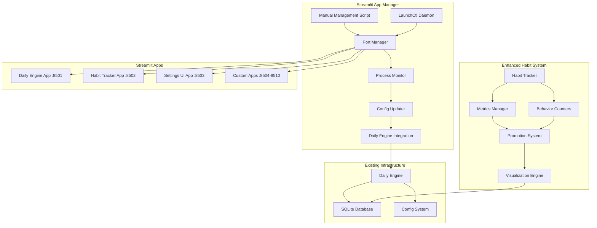

# Design Document

## Overview

The Streamlit App Manager is a comprehensive system that manages multiple Streamlit applications running on dedicated ports (8501-8510) with automatic monitoring, restart capabilities, and seamless integration with the existing daily_engine infrastructure. The system consists of three main components:

1. **Manual Management Script** - Command-line interface for direct app control
2. **LaunchCtl Daemon** - Automatic background management for macOS
3. **Enhanced Habit Tracking System** - Extended functionality for metrics, behavior counters, and visualizations

The design ensures zero disruption to existing functionality while adding robust app management and enhanced habit tracking capabilities.

## Architecture

### System Components



### Port Assignment Strategy

- **Port 8501**: Daily Engine (primary app)
- **Port 8502**: Habit Tracker with enhanced metrics
- **Port 8503**: Settings UI with app management
- **Ports 8504-8510**: Available for custom applications

### Data Flow

1. **App Management**: Manual script or daemon detects app requirements
2. **Port Allocation**: System assigns available ports from the range
3. **Process Monitoring**: Continuous health checks and automatic restarts
4. **Config Integration**: Updates daily_engine configuration with current URLs
5. **Habit Enhancement**: Extended tracking with metrics and behavior counters

## Components and Interfaces

### 1. Streamlit App Manager Core

#### StreamlitAppManager Class
```python
class StreamlitAppManager:
    def __init__(self, port_range=(8501, 8510), config_path="config/streamlit_apps.json")
    def start_app(self, app_name: str, app_path: str, port: int = None) -> Dict
    def stop_app(self, app_name: str) -> Dict
    def restart_app(self, app_name: str) -> Dict
    def get_app_status(self, app_name: str = None) -> Dict
    def health_check(self, app_name: str = None) -> Dict
    def update_daily_engine_config(self) -> None
```

#### Port Management
```python
class PortManager:
    def get_available_ports(self) -> List[int]
    def is_port_in_use(self, port: int) -> bool
    def assign_port(self, app_name: str) -> int
    def release_port(self, port: int) -> None
    def get_port_assignments(self) -> Dict[str, int]
```

### 2. LaunchCtl Daemon Integration

#### Daemon Configuration
```python
class LaunchCtlManager:
    def create_daemon_plist(self, app_config: Dict) -> str
    def install_daemon(self, app_name: str) -> bool
    def start_daemon(self, app_name: str) -> bool
    def stop_daemon(self, app_name: str) -> bool
    def get_daemon_status(self, app_name: str) -> Dict
```

### 3. Enhanced Habit Tracking System

#### Metrics Management
```python
class HabitMetricsManager:
    def add_metric_to_habit(self, habit_name: str, metric_name: str, data_type: str) -> None
    def log_metric_value(self, habit_name: str, metric_name: str, value: Any) -> None
    def get_metric_history(self, habit_name: str, metric_name: str, days: int = 30) -> List
    def validate_metric_value(self, data_type: str, value: Any) -> bool
```

#### Behavior Counters
```python
class BehaviorCounterManager:
    def create_positive_counter(self, name: str, description: str) -> None
    def create_negative_counter(self, name: str, description: str) -> None
    def increment_counter(self, counter_name: str, amount: int = 1) -> None
    def get_daily_counts(self, date: str = None) -> Dict
    def get_counter_trends(self, counter_name: str, days: int = 30) -> List
```

#### Enhanced Promotion System
```python
class EnhancedPromotionSystem(HabitPromotionSystem):
    def calculate_behavior_influence(self, habit_name: str) -> float
    def analyze_negative_behavior_streaks(self, behavior_name: str) -> Dict
    def integrate_metrics_in_promotion(self, habit_name: str) -> Dict
    def generate_behavior_insights(self) -> Dict
```

### 4. Visualization Engine

#### Chart Generation
```python
class HabitVisualizationEngine:
    def generate_metric_trend_chart(self, habit_name: str, metric_name: str) -> str
    def generate_behavior_counter_chart(self, counter_name: str) -> str
    def generate_correlation_chart(self, metric1: str, metric2: str) -> str
    def generate_habit_overview_dashboard(self) -> str
```

## Data Models

### App Configuration Schema
```json
{
  "apps": {
    "daily_engine": {
      "name": "Daily Engine",
      "path": "daily_engine.py",
      "port": 8501,
      "enabled": true,
      "auto_start": true,
      "restart_on_failure": true,
      "health_check_url": "/health",
      "environment": {}
    }
  },
  "daemon_config": {
    "check_interval": 30,
    "restart_delay": 5,
    "max_restart_attempts": 3,
    "log_level": "INFO"
  }
}
```

### Enhanced Database Schema

#### Habit Metrics Table
```sql
CREATE TABLE habit_metrics (
    id INTEGER PRIMARY KEY AUTOINCREMENT,
    habit_name TEXT NOT NULL,
    metric_name TEXT NOT NULL,
    data_type TEXT NOT NULL, -- 'int', 'float', 'string'
    value TEXT NOT NULL,
    date TEXT NOT NULL,
    timestamp TEXT DEFAULT CURRENT_TIMESTAMP,
    FOREIGN KEY (habit_name) REFERENCES habit_tracking(habit_name)
);
```

#### Behavior Counters Table
```sql
CREATE TABLE behavior_counters (
    id INTEGER PRIMARY KEY AUTOINCREMENT,
    counter_name TEXT NOT NULL,
    counter_type TEXT NOT NULL, -- 'positive', 'negative'
    description TEXT,
    date TEXT NOT NULL,
    count INTEGER DEFAULT 0,
    timestamp TEXT DEFAULT CURRENT_TIMESTAMP
);
```

#### App Status Table
```sql
CREATE TABLE streamlit_app_status (
    id INTEGER PRIMARY KEY AUTOINCREMENT,
    app_name TEXT NOT NULL,
    port INTEGER NOT NULL,
    status TEXT NOT NULL, -- 'running', 'stopped', 'error'
    pid INTEGER,
    start_time TEXT,
    last_health_check TEXT,
    restart_count INTEGER DEFAULT 0,
    error_message TEXT
);
```

## Error Handling

### App Management Errors
- **Port Conflicts**: Automatic reassignment to next available port
- **Process Crashes**: Automatic restart with exponential backoff
- **Configuration Errors**: Graceful degradation with logging
- **Permission Issues**: Clear error messages with resolution steps

### Habit System Errors
- **Invalid Metric Values**: Validation with user-friendly error messages
- **Database Constraints**: Proper error handling with rollback
- **Visualization Failures**: Fallback to text-based summaries

### Integration Errors
- **Daily Engine Connectivity**: Retry logic with timeout handling
- **Config Update Failures**: Backup and restore mechanisms
- **LaunchCtl Issues**: Platform-specific error handling

## Testing Strategy

### Unit Testing
- **App Manager Components**: Mock subprocess calls and file operations
- **Port Management**: Test port allocation and conflict resolution
- **Habit Metrics**: Validate data types and constraint handling
- **Behavior Counters**: Test increment operations and trend calculations

### Integration Testing
- **End-to-End App Lifecycle**: Start, monitor, restart, stop workflows
- **Database Operations**: Test all CRUD operations with rollback
- **Config Integration**: Verify daily_engine configuration updates
- **Daemon Integration**: Test launchctl operations on macOS

### Performance Testing
- **App Startup Time**: Measure time to fully operational state
- **Health Check Response**: Ensure sub-second response times
- **Database Query Performance**: Optimize for large datasets
- **Visualization Generation**: Test with extensive historical data

### User Acceptance Testing
- **Command Line Interface**: Test all CLI commands and options
- **Streamlit UI Integration**: Verify seamless user experience
- **Error Recovery**: Test system behavior under failure conditions
- **Data Migration**: Ensure existing data remains intact

## Security Considerations

### Process Management
- **Privilege Separation**: Run apps with minimal required permissions
- **Process Isolation**: Prevent cross-app interference
- **Resource Limits**: CPU and memory constraints per app

### Data Protection
- **Database Security**: Encrypted sensitive data storage
- **Config File Permissions**: Restrict access to configuration files
- **Log Security**: Sanitize logs to prevent information leakage

### Network Security
- **Port Binding**: Bind only to localhost by default
- **Health Check Security**: Secure health check endpoints
- **Inter-App Communication**: Secure communication channels

## Performance Optimization

### App Management
- **Lazy Loading**: Start apps only when needed
- **Resource Monitoring**: Track CPU and memory usage
- **Efficient Health Checks**: Lightweight status verification
- **Batch Operations**: Group multiple app operations

### Database Optimization
- **Indexing Strategy**: Optimize queries for habit and metric data
- **Data Archiving**: Archive old data to maintain performance
- **Connection Pooling**: Efficient database connection management
- **Query Optimization**: Use prepared statements and efficient joins

### Visualization Performance
- **Data Aggregation**: Pre-compute common visualizations
- **Caching Strategy**: Cache generated charts and trends
- **Incremental Updates**: Update only changed data
- **Lazy Chart Generation**: Generate charts on demand

## Deployment Strategy

### Development Environment
- **Local Testing**: Full functionality on developer machines
- **Mock Services**: Simulate external dependencies
- **Debug Logging**: Comprehensive logging for troubleshooting

### Production Deployment
- **Gradual Rollout**: Phase deployment of new features
- **Backup Strategy**: Automated backups before updates
- **Rollback Plan**: Quick rollback to previous version
- **Monitoring**: Comprehensive system monitoring and alerting

### Platform Considerations
- **macOS Optimization**: Leverage launchctl for daemon management
- **Cross-Platform**: Ensure core functionality works on Linux/Windows
- **Resource Requirements**: Document minimum system requirements
- **Dependency Management**: Clear dependency installation instructions