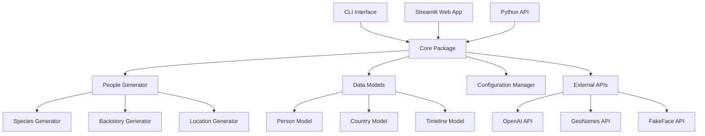

# Design Document

## Overview

The TrillionsOfPeople project will be transformed from a Streamlit application into a well-structured Python package suitable for PyPI distribution. The design focuses on creating a modular, testable, and maintainable codebase while preserving the core functionality of generating synthetic people data for historical, present, and future scenarios.

The package will support both programmatic usage as a library and command-line interface usage, with the Streamlit web interface as an optional component that can be launched separately.

## Architecture

### High-Level Architecture



### Package Structure

```
trillions_of_people/
├── __init__.py
├── core/
│   ├── __init__.py
│   ├── models.py          # Data models and schemas
│   ├── generator.py       # Main people generation logic
│   ├── config.py          # Configuration management
│   └── exceptions.py      # Custom exceptions
├── services/
│   ├── __init__.py
│   ├── openai_service.py  # OpenAI API integration
│   ├── geo_service.py     # Geographic data services
│   └── image_service.py   # Image generation services
├── utils/
│   ├── __init__.py
│   ├── data_loader.py     # Data loading utilities
│   ├── validators.py      # Input validation
│   └── formatters.py      # Output formatting
├── cli/
│   ├── __init__.py
│   └── main.py           # Command-line interface
├── web/
│   ├── __init__.py
│   └── streamlit_app.py  # Streamlit web interface
└── data/
    ├── countries.csv
    ├── word_lists/
    └── templates/
```

## Components and Interfaces

### Core Models

#### Person Model
```python
@dataclass
class Person:
    name: str
    birth_year: int
    gender: str
    species: str = "sapiens"
    timeline: str = "ours"
    realness: str = "synthetic"
    latitude: Optional[float] = None
    longitude: Optional[float] = None
    nearest_city: Optional[str] = None
    country: str = ""
    backstory: str = ""
    four_words_name: str = ""
    image_url: Optional[str] = None
    ocean_tuple: Optional[Tuple[float, ...]] = None
    source: str = "trillions_of_people"
    status: str = "active"
```

#### Configuration Model
```python
@dataclass
class Config:
    openai_api_key: Optional[str] = None
    default_country: str = "Random"
    default_year: int = 2100
    max_people_per_request: int = 5
    enable_image_generation: bool = True
    data_directory: str = "data"
    log_level: str = "INFO"
```

### Service Interfaces

#### People Generator Interface
```python
class PeopleGenerator:
    def __init__(self, config: Config):
        self.config = config
        self.openai_service = OpenAIService(config.openai_api_key)
        self.geo_service = GeoService()
        self.image_service = ImageService()
    
    def generate_people(
        self, 
        count: int, 
        year: int, 
        country: str,
        **kwargs
    ) -> List[Person]:
        """Generate synthetic people based on parameters."""
        pass
    
    def generate_single_person(
        self, 
        year: int, 
        country: str,
        **kwargs
    ) -> Person:
        """Generate a single synthetic person."""
        pass
```

#### External Service Interfaces
```python
class LLMService:
    def generate_backstory(self, prompt: str) -> str:
        """Generate person backstory using nimble-llm-caller package"""
        pass

class GeoService:
    def get_random_location(self, country_code: str) -> Tuple[float, float, str]:
        """Get random coordinates and nearest city for a country."""
        pass

class ImageService:
    def get_face_image_url(self, gender: str, age_range: Tuple[int, int]) -> str:
        """Get URL for generated face image."""
        pass
```

### Configuration Management

The configuration system will support multiple sources in order of precedence:
1. Command-line arguments
2. Environment variables
3. Configuration files (TOML format)
4. Default values

```python
class ConfigManager:
    def load_config(
        self, 
        config_file: Optional[str] = None,
        env_prefix: str = "TRILLIONS_"
    ) -> Config:
        """Load configuration from multiple sources."""
        pass
    
    def validate_config(self, config: Config) -> None:
        """Validate configuration values."""
        pass
```

## Data Models

### Person Data Schema

The Person model will include comprehensive validation and serialization:

```python
from pydantic import BaseModel, validator
from typing import Optional, Tuple
from enum import Enum

class Species(str, Enum):
    SAPIENS = "sapiens"
    NEANDERTHALENSIS = "neanderthalensis"
    DENISOVAN = "denisovan"
    FLORESIENSIS = "floresiensis"

class Timeline(str, Enum):
    OURS = "ours"
    RCP_85 = "RCP 8.5"
    EARTH_616 = "Earth-616"
    EARTH_1218 = "Earth-1218"
    ODNI2040 = "ODNI2040"

class Realness(str, Enum):
    SYNTHETIC = "synthetic"
    AUTHENTICATED = "authenticated"
    FICTIONAL = "fictional"

class Person(BaseModel):
    name: str
    birth_year: int
    gender: str
    species: Species = Species.SAPIENS
    timeline: Timeline = Timeline.OURS
    realness: Realness = Realness.SYNTHETIC
    latitude: Optional[float] = None
    longitude: Optional[float] = None
    nearest_city: Optional[str] = None
    country: str
    backstory: str = ""
    four_words_name: str = ""
    image_url: Optional[str] = None
    ocean_tuple: Optional[Tuple[float, float, float, float, float]] = None
    source: str = "trillions_of_people"
    status: str = "active"
    
    @validator('birth_year')
    def validate_birth_year(cls, v):
        if v < -233000 or v > 100000:
            raise ValueError('Birth year must be between -233000 and 100000')
        return v
    
    @validator('latitude')
    def validate_latitude(cls, v):
        if v is not None and (v < -90 or v > 90):
            raise ValueError('Latitude must be between -90 and 90')
        return v
    
    @validator('longitude')
    def validate_longitude(cls, v):
        if v is not None and (v < -180 or v > 180):
            raise ValueError('Longitude must be between -180 and 180')
        return v
```

### Data Export Formats

The package will support multiple export formats:
- CSV (for compatibility with existing data)
- JSON (for API integration)
- Parquet (for efficient storage)
- Excel (for business users)

## Error Handling

### Exception Hierarchy

```python
class TrillionsOfPeopleError(Exception):
    """Base exception for the package."""
    pass

class ConfigurationError(TrillionsOfPeopleError):
    """Raised when configuration is invalid."""
    pass

class APIError(TrillionsOfPeopleError):
    """Raised when external API calls fail."""
    pass

class ValidationError(TrillionsOfPeopleError):
    """Raised when input validation fails."""
    pass

class DataError(TrillionsOfPeopleError):
    """Raised when data operations fail."""
    pass
```

### Error Handling Strategy

1. **Graceful Degradation**: When external APIs fail, provide fallback options
2. **Retry Logic**: Implement exponential backoff for transient failures
3. **User-Friendly Messages**: Convert technical errors to actionable user messages
4. **Logging**: Comprehensive logging for debugging and monitoring

```python
class ErrorHandler:
    def __init__(self, logger: logging.Logger):
        self.logger = logger
    
    def handle_api_error(self, error: Exception, service: str) -> str:
        """Handle external API errors with fallback options."""
        self.logger.error(f"API error in {service}: {error}")
        return self._get_fallback_response(service)
    
    def handle_validation_error(self, error: ValidationError) -> Dict[str, str]:
        """Convert validation errors to user-friendly messages."""
        pass
```

## Testing Strategy

### Test Structure

```
tests/
├── unit/
│   ├── test_models.py
│   ├── test_generator.py
│   ├── test_services.py
│   └── test_utils.py
├── integration/
│   ├── test_api_integration.py
│   ├── test_data_flow.py
│   └── test_cli.py
├── fixtures/
│   ├── sample_data.json
│   ├── mock_responses.py
│   └── test_config.toml
└── conftest.py
```

### Testing Approach

1. **Unit Tests**: Test individual components in isolation
2. **Integration Tests**: Test component interactions and external API calls
3. **Property-Based Testing**: Use Hypothesis for testing edge cases
4. **Mock External Services**: Use responses library for API mocking
5. **Performance Tests**: Ensure acceptable performance for large datasets

### Test Coverage Goals

- Minimum 70% overall code coverage
- 90% coverage for core business logic
- 100% coverage for critical paths (data validation, API key handling)

### Continuous Integration

```yaml
# .github/workflows/test.yml
name: Tests
on: [push, pull_request]
jobs:
  test:
    runs-on: ubuntu-latest
    strategy:
      matrix:
        python-version: ["3.12", "3.13"]
    steps:
      - uses: actions/checkout@v3
      - name: Set up Python
        uses: actions/setup-python@v4
        with:
          python-version: ${{ matrix.python-version }}
      - name: Install dependencies
        run: |
          pip install -e .[dev]
      - name: Run tests
        run: |
          pytest --cov=trillions_of_people --cov-report=xml
      - name: Upload coverage
        uses: codecov/codecov-action@v3
```

## Security Considerations

### API Key Management

1. **Environment Variables**: Primary method for API key storage
2. **No Logging**: API keys never appear in logs or error messages
3. **Validation**: Verify API key format before use
4. **Secure Defaults**: Fail securely when API keys are missing

### Input Validation

1. **Sanitization**: Clean all user inputs
2. **Path Validation**: Prevent directory traversal attacks
3. **Rate Limiting**: Implement request throttling for API calls
4. **Data Validation**: Use Pydantic for comprehensive input validation

### Dependency Security

1. **Regular Updates**: Automated dependency updates via Dependabot
2. **Security Scanning**: Use safety and bandit for vulnerability detection
3. **Minimal Dependencies**: Keep dependency tree as small as possible
4. **Pinned Versions**: Use exact version pinning for reproducible builds

## Performance Optimization

### Caching Strategy

```python
from functools import lru_cache
import redis

class CacheManager:
    def __init__(self, redis_url: Optional[str] = None):
        self.redis_client = redis.from_url(redis_url) if redis_url else None
    
    @lru_cache(maxsize=1000)
    def get_country_data(self, country_code: str) -> Dict:
        """Cache country data in memory."""
        pass
    
    def cache_api_response(self, key: str, response: str, ttl: int = 3600):
        """Cache API responses in Redis if available."""
        pass
```

### Batch Processing

```python
class BatchProcessor:
    def __init__(self, batch_size: int = 10):
        self.batch_size = batch_size
    
    def generate_people_batch(
        self, 
        requests: List[PersonRequest]
    ) -> List[Person]:
        """Process multiple person generation requests efficiently."""
        pass
```

### Memory Management

1. **Streaming**: Process large datasets in chunks
2. **Lazy Loading**: Load data only when needed
3. **Resource Cleanup**: Proper cleanup of temporary files and connections
4. **Memory Profiling**: Regular memory usage monitoring

## Deployment and Distribution

### Package Build Configuration

```toml
# pyproject.toml
[build-system]
requires = ["hatchling"]
build-backend = "hatchling.build"

[project]
name = "trillions-of-people"
dynamic = ["version"]
description = "Generate synthetic people data for historical, present, and future scenarios"
readme = "README.md"
license = {file = "LICENSE"}
authors = [
    {name = "Fred Zimmerman", email = "fredz@trillionsofpeople.info"},
]
classifiers = [
    "Development Status :: 4 - Beta",
    "Intended Audience :: Developers",
    "Intended Audience :: Science/Research",
    "License :: OSI Approved :: MIT License",
    "Programming Language :: Python :: 3",
    "Programming Language :: Python :: 3.12",
    "Programming Language :: Python :: 3.13",
    "Topic :: Scientific/Engineering :: Artificial Intelligence",
    "Topic :: Sociology",
]
dependencies = [
    "pydantic>=2.0.0",
    "requests>=2.28.0",
    "pandas>=2.0.0",
    "click>=8.0.0",
    "python-dotenv>=1.0.0",
    "nimble-llm-caller>=0.1.0",
]

[project.optional-dependencies]
web = ["streamlit>=1.20.0"]
dev = [
    "pytest>=7.0.0",
    "pytest-cov>=4.0.0",
    "pytest-mock>=3.10.0",
    "black>=22.0.0",
    "isort>=5.10.0",
    "flake8>=5.0.0",
    "mypy>=1.0.0",
    "pre-commit>=2.20.0",
]

[project.scripts]
trillions = "trillions_of_people.cli.main:main"

[project.urls]
Homepage = "https://trillionsofpeople.info"
Repository = "https://github.com/username/trillions-of-people"
Documentation = "https://trillions-of-people.readthedocs.io"
```

### Release Process

1. **Version Management**: Use semantic versioning with automated bumping
2. **Changelog**: Automated changelog generation from commit messages
3. **Testing**: Full test suite on multiple Python versions
4. **Build**: Automated wheel and source distribution creation
5. **Upload**: Secure PyPI upload with API tokens
6. **Documentation**: Automated documentation deployment

### Monitoring and Analytics

1. **Usage Metrics**: Optional telemetry for understanding usage patterns
2. **Error Reporting**: Integration with error tracking services
3. **Performance Monitoring**: Track API response times and success rates
4. **User Feedback**: Mechanisms for collecting user feedback and bug reports

## Commerce Integration

### Subscription Management Architecture

The commerce system will be designed with a modular architecture to support the streamlit-vibe-multicommerce library integration:

```python
class CommerceManager:
    def __init__(self, config: Config):
        self.config = config
        self.commerce_client = None  # Will be injected when available
    
    def initialize_commerce(self, commerce_client):
        """Initialize commerce functionality when library is available."""
        self.commerce_client = commerce_client
    
    def check_subscription_status(self, user_id: str) -> SubscriptionStatus:
        """Check user's subscription status."""
        if not self.commerce_client:
            return SubscriptionStatus.FREE_TIER
        return self.commerce_client.get_subscription_status(user_id)
    
    def enforce_usage_limits(self, user_id: str, requested_count: int) -> bool:
        """Enforce usage limits based on subscription tier."""
        pass
```

### Subscription Tiers

The system will support multiple subscription tiers:

1. **Free Tier**: Limited generations per month, basic features
2. **Pro Tier**: Higher limits, advanced features, priority support
3. **Enterprise Tier**: Unlimited usage, custom features, dedicated support

### Integration Points

- **Web Interface**: Subscription status display and upgrade prompts
- **CLI Interface**: Usage limit enforcement and subscription checks
- **API Interface**: Rate limiting based on subscription tier
- **Configuration**: Commerce settings and API key management

The architecture ensures that the core functionality remains available even when commerce features are not enabled, with graceful degradation to free tier functionality.